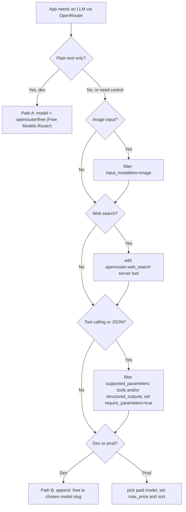

# OpenRouter — Model Selection and Configuration

This skill helps the agent pick the right OpenRouter model and produce the request body / config block to drop into an application that calls the OpenRouter API. It is recipe-driven: the agent queries the live `/models` endpoint, filters by capability, and picks a slug — never hardcodes "best model" lists.

## When to use this skill

- The user says "use OpenRouter" or wants the application to talk to OpenRouter.
- The agent needs to pick a model for: vision/image input, tool calling, structured output (JSON), web search, or just plain chat.
- The user mentions free models, `:free` / `:nitro` / `:floor` variants, or asks "which model should I use?".
- The agent is writing application config (env vars, request bodies, SDK calls) that target `https://openrouter.ai/api/v1/...`.

## Default rule: zero cost in development

In development, never spend tokens unless the user explicitly asks for a paid model. There are two paths to "free":

### Path A — `openrouter/free` (Free Models Router) — pure text only

For plain text chat / completion with no special capability requirements, set the model slug to `openrouter/free`. OpenRouter randomly selects an available free model and forwards the request. The response's `model` field reports which model actually ran.

```json
{ "model": "openrouter/free", "messages": [{ "role": "user", "content": "Hello" }] }
```

Use this when **all** of the following hold:
- Input is text only — no images, audio, or files.
- No `tools` array, no `response_format`, no structured-output schema.
- No web search.
- The application does not depend on a specific model family.

**Do not rely on the router to honor capability filters.** Despite what the docs claim about it filtering for vision/tools/structured outputs, empirically the router can return a model that lacks the requested capability. If your request needs anything beyond plain text, use Path B.

### Path B — pin a specific `:free` model slug

For anything that needs a specific capability (image input, web search, tool calling, structured output, a particular model family) **or** for predictable behavior in tests/CI, query `/models`, filter for the capability you need, append `:free` to the chosen base slug (or pick a slug that already ends in `:free`), and commit that exact slug to the application config.

```json
{ "model": "meta-llama/llama-3.3-70b-instruct:free" }
```

Caveats common to both paths:
- A `:free` variant does not exist for every model. Verify in `/models` before committing.
- Free tiers have lower rate limits and can be unavailable at peak times — wire a graceful fallback into the application (paid slug, retry, or clean error).
- Some `:free` variants do not support `tools`, `response_format`, or image input. Always cross-check `supported_parameters` and `architecture.input_modalities` in `/models`.

## Discovering models programmatically

OpenRouter exposes its full catalog at `GET https://openrouter.ai/api/v1/models`. The agent should query this endpoint at design-time (not bake a static list into the app) and filter by capability.

Useful query params:

| Filter | Value | Purpose |
|---|---|---|
| `input_modalities` | `image`, `audio`, `file` | Models that accept that modality as input |
| `output_modalities` | `image` | Models that produce images |
| `supported_parameters` | `tools`, `structured_outputs`, `response_format`, `reasoning`, `web_search` | Capability flags |
| `category` | `programming`, `roleplay`, etc. | Curated buckets |

The response is a list of objects with `id`, `name`, `pricing.prompt`, `pricing.completion`, `pricing.image`, `architecture.input_modalities`, `architecture.output_modalities`, `supported_parameters`, `context_length`, etc. **A model is "free" when `pricing.prompt == "0"` AND `pricing.completion == "0"`** (or its slug ends in `:free`).

### Recipe: cheapest free vision-capable model (curl + Python)

```bash
curl -s 'https://openrouter.ai/api/v1/models?input_modalities=image' \
  | jq -r '.data
      | map(select(.pricing.prompt == "0" and .pricing.completion == "0"))
      | sort_by(.context_length) | reverse
      | .[0].id'
```

```python
import requests

resp = requests.get(
    "https://openrouter.ai/api/v1/models",
    params={"input_modalities": "image"},
    timeout=30,
)
free_vision = [
    m for m in resp.json()["data"]
    if m["pricing"]["prompt"] == "0" and m["pricing"]["completion"] == "0"
]
free_vision.sort(key=lambda m: -int(m.get("context_length") or 0))
chosen = free_vision[0]["id"]
print(chosen)
```

The agent then drops `chosen` into the application config (env var, settings file, or request body), e.g. `OPENROUTER_MODEL=<chosen>`.

## Recipe: free multimodal (image-capable) model

When the application must analyze images:

1. Run the discovery recipe above (`input_modalities=image`, filter to free).
2. Pick a slug. If you want to also confirm a `:free` variant exists, look for IDs that already end in `:free`, or append `:free` and verify the resulting slug is present in `/models`.
3. Wire the request as a multipart message with an `image_url`:

```python
import requests, base64, pathlib

img_b64 = base64.b64encode(pathlib.Path("photo.jpg").read_bytes()).decode()

requests.post(
    "https://openrouter.ai/api/v1/chat/completions",
    headers={
        "Authorization": "Bearer $OPENROUTER_API_KEY",
        "HTTP-Referer": "https://your-app.example",
        "X-Title": "Your App",
        "Content-Type": "application/json",
    },
    json={
        "model": "<chosen-vision-model>:free",
        "messages": [{
            "role": "user",
            "content": [
                {"type": "text", "text": "Describe this image."},
                {"type": "image_url", "image_url": {"url": f"data:image/jpeg;base64,{img_b64}"}},
            ],
        }],
    },
)
```

Validate that the picked model still appears in `/models` at runtime — free variants come and go.

## Recipe: web search capability

Two paths, in order of preference:

### Preferred: `openrouter:web_search` server tool

Works with any model. Add it to the request's `tools` array; the model decides when to invoke it.

```json
{
  "model": "openai/gpt-5.2",
  "messages": [{ "role": "user", "content": "What did OpenRouter ship this week?" }],
  "tools": [{ "type": "openrouter:web_search" }]
}
```

OpenRouter also recognizes a plain `web_search` tool from clients (e.g., OpenAI SDKs) and hoists it to the server tool automatically. This means the agent can drop the `:online` suffix from any model slug — as long as `web_search` is exposed as a tool, web search still works.

### Legacy plugin (still supported)

For codebases already using the plugin form, the request looks like:

```json
{
  "model": "openai/gpt-5.2",
  "messages": [{ "role": "user", "content": "Latest AI news" }],
  "plugins": [
    { "id": "web", "engine": "exa", "max_results": 5 }
  ]
}
```

Customizable fields: `engine` (`native`, `exa`, `firecrawl`, `parallel`, or omit for auto), `max_results` (default 5), `search_prompt`, `include_domains`, `exclude_domains`. The `:online` model-slug shortcut is equivalent to attaching the `web` plugin and is **deprecated** — prefer the server tool.

### Pricing implications

- Native search (Anthropic, OpenAI, Perplexity, xAI): provider-passthrough, billed via context-size tiers (`low` / `medium` / `high`) on `web_search_options`.
- Exa / Parallel fallback: $4 per 1000 results (default 5 → ~$0.02/request) on top of LLM tokens.
- Firecrawl: BYOK — uses your Firecrawl credits, no OpenRouter markup.

For development, combine a `:free` model with the `web` plugin (Exa) or with the server tool — token spend is zero, only the search cost applies.

## Provider routing essentials

Most application configs only need the `provider` object on a few fields. Full reference in [reference.md](reference.md); the high-value subset:

| Field | Purpose | Common value |
|---|---|---|
| `sort` | Force ordering across providers | `"price"`, `"throughput"`, `"latency"` |
| `:floor` slug suffix | Shortcut for `sort: "price"` | `model-id:floor` |
| `:nitro` slug suffix | Shortcut for `sort: "throughput"` | `model-id:nitro` |
| `require_parameters` | Drop providers that don't support all requested params | `true` when sending `tools` or `response_format` |
| `max_price` | Hard ceiling, request fails if no provider qualifies | `{ "prompt": 1, "completion": 2 }` |
| `data_collection` | Privacy filter | `"deny"` to skip providers that may train on data |
| `zdr` | Zero-data-retention only | `true` |
| `only` / `ignore` | Allow / block list | `["azure"]`, `["deepinfra"]` |
| `order` | Try providers in this order | `["together", "openai"]` |
| `allow_fallbacks` | Pair with `order` to disable other providers | `false` |

Example: cheapest provider that supports tools, with a price ceiling:

```json
{
  "model": "meta-llama/llama-3.3-70b-instruct",
  "messages": [{ "role": "user", "content": "Hello" }],
  "tools": [/* ... */],
  "provider": {
    "sort": "price",
    "require_parameters": true,
    "max_price": { "prompt": 1, "completion": 2 }
  }
}
```

## Decision tree



## Common pitfalls

- **`openrouter/free` is text-only safe.** The Free Models Router can return a model that lacks the requested capability (vision, tools, structured output) even when the docs say it filters. Use it only for plain text; pin a specific `:free` slug for anything else.
- **`:free` variant does not exist for every model.** Always verify against `/models` before writing the slug into config.
- **Free rate limits hit fast.** Wire fallback or graceful failure into the application; do not assume infinite throughput.
- **Capability gaps on free tiers.** Some free variants drop `tools`, `response_format`, or vision support. Cross-check `supported_parameters` and `architecture.input_modalities`.
- **`:online` is deprecated.** Prefer the `openrouter:web_search` server tool. Do not ship new code that relies on `:online`.
- **Send identification headers.** Production requests should include `HTTP-Referer: <app-url>` and `X-Title: <app-name>` so usage attributes correctly.
- **`require_parameters` failure mode.** When you set `require_parameters: true` with an unusual parameter combo, all providers may be filtered out and the request fails. Loosen filters or add fallback models.
- **Quantization affects quality.** If using `provider.quantizations`, lower bit-widths (`int4`, `fp4`) trade accuracy for cost — measure before committing.

## More

For the full provider-routing field reference, percentile-based performance thresholds, X-search filters (xAI), Anthropic beta headers, BYOK behavior, and quantization details, see [reference.md](reference.md).
