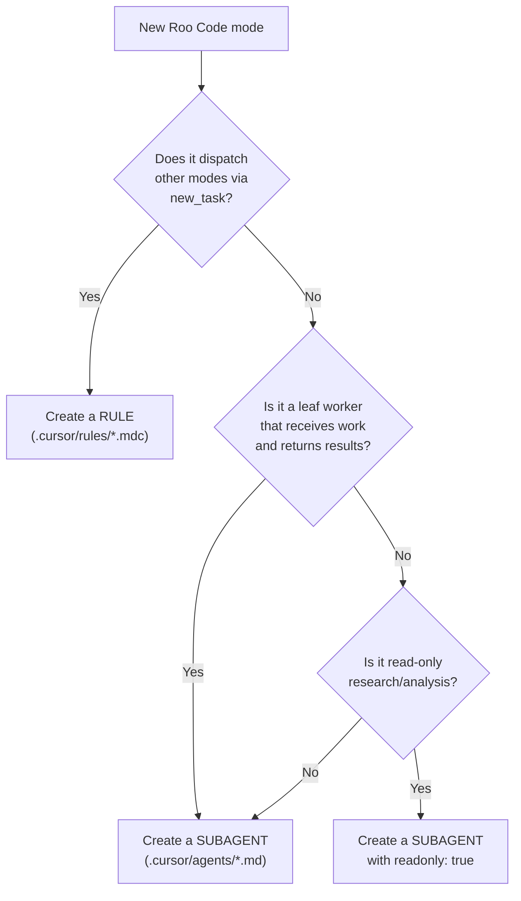

# Roo Code → Cursor Migration Protocol

A reference document for migrating Roo Code modes to their Cursor equivalents. Follow this protocol whenever a new mode is added to `.roomodes` and needs a corresponding Cursor artifact.

---

## 1. Decision Tree: Rule vs Subagent



**Decision criteria:**

- **Orchestrators** (dispatch other modes, manage workflows, make routing decisions) → Cursor **rule** with `alwaysApply: false`
- **Workers** (receive scoped work, produce output, return results) → Cursor **subagent**
- **Read-only investigators** (no writes needed) → Cursor **subagent** with `readonly: true`

**Why this distinction matters:** Cursor subagents cannot launch other subagents (no nesting). Orchestrators must become rules so the main chat agent acts as the orchestrator, dispatching leaf workers as subagents via the Task tool.

---

## 2. Migrating an Orchestrator Mode to a Rule

**Input:** A Roo Code mode from `.roomodes` that uses `new_task` to dispatch other modes.

### Steps

1. **Create** `cursor/.cursor/rules/{slug}.mdc`

2. **Add frontmatter:**

   ```yaml
   ---
   description: "[roleDefinition summary]. [whenToUse summary]. Dispatches subagents via Task tool."
   alwaysApply: false
   ---
   ```

3. **Add the role definition** from `.roomodes` as the opening section.

4. **Inline all files** from `roo-code/.roo/rules-{slug}/` in numbered order. Each file becomes a section in the rule.

5. **Add the Cursor Dispatch Protocol section:**

   ```markdown
   ## Cursor Dispatch Protocol

   You (the main chat agent) are the orchestrator.
   Dispatch work to specialized subagents using the Task tool.

   Translation from dispatch templates:
   - `new_task` → Use the Task tool to launch the named subagent
   - `attempt_completion` → The subagent returns its summary to you
   - Mode slugs map to subagent names (e.g., `sdlc-planner-prd` → `/sdlc-planner-prd`)
   ```

6. **Add a Path Translation subsection** to the dispatch protocol:

   ```markdown
   ### Path Translation
   Shared skills and dispatch templates use Roo Code paths. When reading or composing dispatch messages, translate:
   - `.roo/skills/` → `.cursor/skills/`
   - `common-skills/` → `.cursor/skills/`
   ```

7. **Reference the associated skill's dispatch templates** (e.g., `.cursor/skills/planning-hub/references/dispatch-templates/`).

8. **If the orchestrator uses the `sdlc-checkpoint` skill**, add a **Checkpoint Integration** section with:
   - Script paths using `.cursor/skills/sdlc-checkpoint/scripts/`
   - Write-ahead REQUIRE rules (before every dispatch, after every completion)
   - A resume protocol (check YAML, run verify.sh, follow recommendation)
   - Per-phase checkpoint call examples

9. **Verify** the rule's `description` field accurately summarizes when the agent should load it.

### Template

```markdown
---
description: "{one-line summary}. Use when {trigger}. Dispatches subagents via Task tool."
alwaysApply: false
---

# {Rule Title}

{roleDefinition from .roomodes}

## Cursor Dispatch Protocol

You (the main chat agent) are the orchestrator.
Dispatch work to specialized subagents using the Task tool.

- `new_task` → Task tool: `/subagent-name`
- `attempt_completion` → Subagent returns its final message to you
- Mode slugs map to subagent names

### Path Translation
- `.roo/skills/` → `.cursor/skills/`
- `common-skills/` → `.cursor/skills/`

Load dispatch templates from {skill path}.

## Workflow

{Inlined from roo-code/.roo/rules-{slug}/1_workflow.md}

## Best Practices

{Inlined from roo-code/.roo/rules-{slug}/2_best_practices.md}

## Decision Guidance

{Inlined from roo-code/.roo/rules-{slug}/4_decision_guidance.md}

## Error Handling

{Inlined from roo-code/.roo/rules-{slug}/6_error_handling.md}
```

---

## 3. Migrating a Worker Mode to a Subagent

**Input:** A Roo Code mode from `.roomodes` that receives work and produces output.

### Steps

1. **Create** `cursor/.cursor/agents/{slug}.md`

2. **Add YAML frontmatter:**

   ```yaml
   ---
   name: {slug}
   description: >-
     {.roomodes description}. {.roomodes whenToUse, condensed}.
     [If file-restricted: "Writes to {paths} only."]
   model: {inherit|fast}
   readonly: {true|false}
   ---
   ```

   Model selection:
   - `inherit` for complex work (planning, implementation, documentation writing)
   - `fast` for focused verification tasks (code review, QA, acceptance validation, research)

   Readonly:
   - `true` only for pure read/verify modes (plan-validator, code-reviewer, qa, acceptance-validator, project-research)

3. **Add the role definition** from `.roomodes` as the prompt body.

4. **Add File Restrictions** if the Roo mode has `fileRegex` restrictions:

   ```markdown
   ## File Restrictions
   You may ONLY write to: `{pattern from fileRegex}`
   Do not create or modify any other files.
   ```

5. **Inline rules (required):** Concatenate all files from `roo-code/.roo/rules-{slug}/` into the prompt body, each under its own heading. Cursor agents cannot reference `roo-code/` or `.roo/` at runtime — those paths don't exist in Cursor's world. All rule content must be inlined.

6. **For skill references**, use `.cursor/skills/{skill-name}/` (the symlink resolves to `common-skills/` in the registry). Never reference `common-skills/` directly in agent prompts.

7. **Replace all `attempt_completion` references** with: "Return your final summary to the parent agent with: [list completion contract items]"

8. **Add a Completion Contract** listing what the subagent must return.

### Model Selection

| Workload | Model | Rationale |
|---|---|---|
| Complex reasoning, planning, drafting | `inherit` | Needs full parent model capability |
| Focused verification, review, research | `fast` | Scoped task, speed over depth |

### Template

```markdown
---
name: {slug}
description: >-
  {one-line summary}. Use when {trigger}.
  [If file-restricted: "Writes to {paths} only."]
model: {inherit|fast}
readonly: {true|false}
---

You are the {Agent Name}, {roleDefinition from .roomodes}.

## Core Responsibility

{key responsibilities}

## Explicit Boundaries

{what the agent must NOT do}

## File Restrictions

You may ONLY write to: `{pattern}`
Do not create or modify any other files.

## Workflow

{Inlined from roo-code/.roo/rules-{slug}/1_workflow.md}

## Best Practices

{Inlined from roo-code/.roo/rules-{slug}/2_best_practices.md}

## Sparring Patterns

{Inlined from roo-code/.roo/rules-{slug}/3_sparring_patterns.md, if applicable}

## Self-Validation

{Inlined from roo-code/.roo/rules-{slug}/5_validation.md}

## Error Handling

{Inlined from roo-code/.roo/rules-{slug}/6_error_handling.md}

## Completion Contract

Return your final summary with:
1. {item 1}
2. {item 2}
3. ...
```

---

## 4. Migrating a New Skill

No migration needed. Skills use the same Agent Skills standard across Roo Code and Cursor.

1. Add the skill to `common-skills/{skill-name}/SKILL.md` in the registry.
2. It is automatically available to Cursor agents at `.cursor/skills/{skill-name}/` via the symlink.
3. It is automatically available to Roo Code agents at `.roo/skills/{skill-name}/` via their symlink.
4. If the skill's dispatch templates reference `new_task` or `attempt_completion`, the orchestrator rules' Cursor Dispatch Protocol handles the translation.

---

## 5. Checklist for Any Migration

Use this checklist for every Roo Code mode migrated to Cursor:

- [ ] Identify the mode in `roo-code/.roomodes` (slug, roleDefinition, whenToUse, groups, customInstructions)
- [ ] Decide: rule or subagent? (use decision tree above)
- [ ] Identify the associated `roo-code/.roo/rules-{slug}/` directory (source material to inline)
- [ ] Identify any associated skill in `common-skills/` (referenced at runtime as `.cursor/skills/`)
- [ ] Create the Cursor artifact (rule or subagent) following the template above
- [ ] Translate `new_task` → Task tool, `attempt_completion` → return message, `switch_mode` → N/A
- [ ] Translate `fileRegex` → prompt-level file restrictions ("You may ONLY write to...")
- [ ] Translate `groups` → `readonly: true` if read-only, otherwise omit (full access)
- [ ] Choose model: `inherit` for complex work, `fast` for focused tasks
- [ ] If orchestrator rule: add Cursor Dispatch Protocol section with Path Translation
- [ ] If orchestrator rule using checkpoints: add Checkpoint Integration section
- [ ] If subagent: add Completion Contract section
- [ ] Verify the description field accurately describes when to use this agent
- [ ] Test: invoke the new rule/subagent and verify it behaves as expected

---

## 6. Roo-to-Cursor Translation Reference

| Roo Code | Cursor Equivalent |
|---|---|
| `new_task(mode="X", message="Y")` | Task tool: `/X Y` or "Use the X subagent to Y" |
| `switch_mode(mode="X")` | Rules auto-load; or `/X` for explicit invocation |
| `attempt_completion(result="Z")` | Return final message with Z |
| `groups: [read]` | `readonly: true` in frontmatter |
| `groups: [read, command]` | `readonly: true` (commands available in readonly) |
| `groups: [read, edit, command, mcp]` | No restriction (default) |
| `fileRegex: (plan/prd\.md$)` | Prompt: "You may ONLY write to: `plan/prd.md`" |
| `whenToUse: "..."` | Merge into `description` field |
| `customInstructions: "..."` | Inline into prompt body or reference rule files |
| `rules-{slug}/*.md` (auto-loaded) | Inlined into subagent prompt or referenced via Read |
| `.roo/skills/{name}/` | `.cursor/skills/{name}/` (path translation in dispatch protocol) |
| `common-skills/{name}/` | `.cursor/skills/{name}/` (path translation in dispatch protocol) |

---

## 7. Architecture Differences

Understanding these differences helps avoid common migration mistakes:

| Aspect | Roo Code | Cursor |
|---|---|---|
| Nesting | 3+ levels (coordinator → hub → worker) | 1 level only (main agent → subagent) |
| Mode switching | `switch_mode` changes agent identity | Rules auto-load based on context |
| Permissions | Fine-grained `groups` + `fileRegex` | `readonly: true` or full access + prompt-level restrictions |
| Rule loading | Per-mode rules auto-load from `rules-{slug}/` | Rules load via `alwaysApply` or Cursor's intelligent matching |
| Skill access | Skill path in `.roo/skills/` | Skill path in `.cursor/skills/` (symlinked) |
| Orchestration | Orchestrator modes dispatch via `new_task` | Main agent loads orchestrator rules, dispatches via Task tool |

### The Nesting Problem

Roo Code supports multi-level dispatch:
```
Coordinator → Planner (hub) → PRD Agent (worker)
```

Cursor only allows:
```
Main Agent → Subagent (no further nesting)
```

**Solution:** Orchestrators become rules that teach the main agent how to coordinate. The main agent then dispatches leaf workers directly as subagents.

### Cursor Architecture Summary

```
cursor/
  .cursor/
    rules/                              # Orchestrator rules (loaded by main agent)
      sdlc-coordinator.mdc              # Phase routing: planning vs execution
      sdlc-planning-orchestrator.mdc    # 7-phase planning workflow
      sdlc-execution-orchestrator.mdc   # Implementation lifecycle
    agents/                             # Leaf-worker subagents (dispatched via Task tool)
      sdlc-planner-prd.md              # 10 planning subagents
      sdlc-planner-architecture.md
      sdlc-planner-stories.md
      sdlc-planner-hld.md
      sdlc-planner-security.md
      sdlc-planner-api.md
      sdlc-planner-data.md
      sdlc-planner-devops.md
      sdlc-planner-design.md
      sdlc-planner-testing.md
      sdlc-plan-validator.md            # Validator
      sdlc-implementer.md              # 4 execution subagents
      sdlc-code-reviewer.md
      sdlc-qa.md
      sdlc-acceptance-validator.md
      sdlc-project-research.md          # 2 utility subagents
      sdlc-documentation-writer.md
    skills -> ../../common-skills/      # Shared skills (symlink)
```

---

## 8. Examples

### Example: New Planning Agent (sdlc-planner-foo)

A new planning sub-agent added to `.roomodes`:

1. **Decision**: Does not dispatch other modes → **Subagent**
2. **Create**: `cursor/.cursor/agents/sdlc-planner-foo.md`
3. **Frontmatter**: `name: sdlc-planner-foo`, `model: inherit`
4. **Content**: Role definition + inlined rules from `roo-code/.roo/rules-sdlc-planner-foo/`
5. **File restrictions**: "You may ONLY write to: `plan/user-stories/US-NNN-name/foo.md`"
6. **Completion contract**: What the agent returns
7. **Update orchestrator**: Add the new agent to `sdlc-planning-orchestrator.mdc`'s sub-agents table and dispatch logic

### Example: New Orchestrator (sdlc-ops-coordinator)

A new orchestrator mode that dispatches deployment and monitoring agents:

1. **Decision**: Dispatches other modes via `new_task` → **Rule**
2. **Create**: `cursor/.cursor/rules/sdlc-ops-coordinator.mdc`
3. **Frontmatter**: `description: "...", alwaysApply: false`
4. **Content**: Role definition + inlined rules + Cursor Dispatch Protocol
5. **Dispatch Protocol**: Maps mode slugs to subagent names
6. **No file restrictions**: Orchestrators don't write directly

### Example: New Read-Only Agent (sdlc-security-auditor)

A new audit agent that reads code and reports findings:

1. **Decision**: Read-only, no writes → **Subagent with `readonly: true`**
2. **Create**: `cursor/.cursor/agents/sdlc-security-auditor.md`
3. **Frontmatter**: `name: sdlc-security-auditor`, `model: fast`, `readonly: true`
4. **Content**: Role definition + inlined rules
5. **No file restrictions needed**: readonly covers it
6. **Completion contract**: Audit report format
