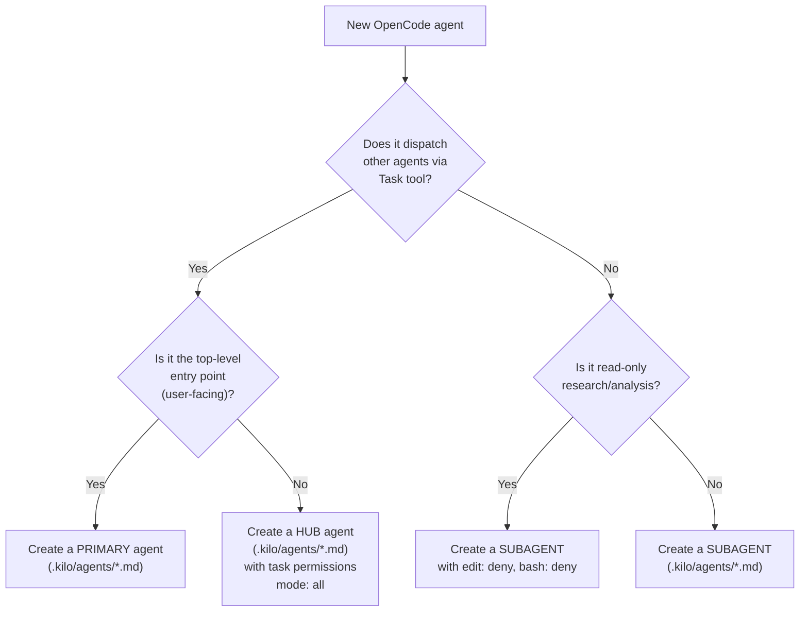

# OpenCode → Kilo Code Migration Protocol

A reference document for migrating OpenCode agents to their Kilo Code equivalents. Follow this protocol whenever a new agent is added to `.opencode/agents/` and needs a corresponding Kilo Code agent.

---

## 1. Decision Tree: Agent Classification



**Decision criteria:**

- **Top-level orchestrators** (user-facing entry point, Tab-switchable) → **primary** agent
- **Hub orchestrators** (dispatch workers, manage workflows) → agent with `mode: all` and `permission.task` allowlist
- **Workers** (receive scoped work, produce output, return results) → **subagent**
- **Read-only investigators** (no writes needed) → **subagent** with `edit: deny`, `bash: deny`

---

## 2. Kilo Code Agent Format

Agents are Markdown files with YAML frontmatter, placed in `.kilo/agents/`.

```markdown
---
description: "Short description. Use when..."
mode: primary|subagent|all
model: provider/model-id
permission:
  edit: deny|allow
  bash:
    "*": allow
    "git push*": deny
  task:
    "*": deny
    "allowed-agent": allow
---

Full agent prompt/instructions as markdown body...
```

The filename (minus `.md`) becomes the agent name. For example, `.kilo/agents/sdlc-coordinator.md` creates an agent named `sdlc-coordinator`.

---

## 3. Migration Steps per Agent

### From OpenCode `.opencode/agents/*.md` to Kilo `.kilo/agents/*.md`

1. **Copy** the OpenCode agent file to `kilo-code/.kilo/agents/` with the same filename.

2. **Frontmatter:**
   - `mode`: Keep as-is (`primary`, `subagent`, `all` — same semantics).
   - `model`: For commercial models (`openai/*`), keep in frontmatter. For local models (`lmstudio/*`), remove from frontmatter and configure in `kilo.jsonc` under the `agent` key.
   - `permission`: Direct copy — same format (edit, bash, task with glob patterns).
   - `description`: Keep as-is.

3. **Body (prompt) path translations:**
   - `.opencode/skills/` → `.kilo/skills/`
   - `.opencode/commands/` → remove or convert to `@sdlc-coordinator` usage notes

4. **Agent name references stay unchanged.** OpenCode and Kilo use the same naming convention (e.g., `sdlc-engineering-implementer`).

---

## 4. Configuration: kilo.jsonc

The `kilo.jsonc` file at `kilo-code/kilo.jsonc` consolidates:
- MCP server configuration (replaces legacy `.kilo/mcp.json`)
- Model routing for all agents (replaces per-agent `model:` in frontmatter for local models)
- Provider configuration (LM Studio, etc.)
- Global permissions
- Instructions (AGENTS.md reference)
- Agent-level overrides (model, permissions)

### Structure

```jsonc
{
  "$schema": "https://app.kilo.ai/config.json",
  "model": "openai/gpt-5.3-codex",
  "instructions": ["AGENTS.md"],
  "mcp": { ... },
  "provider": { ... },
  "permission": { ... },
  "agent": {
    "sdlc-coordinator": { "model": "openai/gpt-5.3-codex" },
    "sdlc-planner-stories": { "model": "lmstudio/qwen3.5-35b-a3b" },
    // ...
  }
}
```

---

## 5. Skills

No migration needed. Skills use the same format across all platforms.

1. Skills live in `common-skills/{skill-name}/SKILL.md` in the registry.
2. Available to Kilo agents at `.kilo/skills/{skill-name}/` via symlink.
3. The Kilo CLI discovers and loads skills on demand.

---

## 6. OpenCode-to-Kilo Translation Reference

| OpenCode | Kilo Code Equivalent |
|---|---|
| `opencode.json` | `kilo.jsonc` |
| `.opencode/agents/*.md` | `.kilo/agents/*.md` (same format) |
| `.opencode/skills/` | `.kilo/skills/` (symlink to `common-skills/`) |
| `.opencode/commands/*.md` | No equivalent — use `@sdlc-coordinator` mentions |
| `.opencode/plugins/*.ts` | No equivalent — Kilo logs natively |
| `opencode/AGENTS.md` | `kilo-code/AGENTS.md` (loaded via `instructions` in `kilo.jsonc`) |
| `model: lmstudio/X` in frontmatter | `agent.X.model` in `kilo.jsonc` |
| `"default_agent": "build"` | Override `code` agent in `kilo.jsonc` |
| `permission.task` (glob patterns) | Same format in both |
| Task tool dispatch `@agent-name` | Same syntax in both |

---

## 7. Architecture Differences

| Aspect | OpenCode | Kilo Code (new CLI) |
|---|---|---|
| Agent format | `.opencode/agents/*.md` (YAML frontmatter + body) | `.kilo/agents/*.md` (same format) |
| Config | `opencode.json` (JSON) | `kilo.jsonc` (JSONC — supports comments) |
| MCP config | `mcp` key in `opencode.json` | `mcp` key in `kilo.jsonc` |
| Model routing | `model:` in frontmatter or `agent` key in config | Same — both work, config takes lower precedence |
| Nesting | 3+ levels via `permission.task` on subagents | Same |
| Skills | `.opencode/skills/` via symlink | `.kilo/skills/` via symlink + `skills.paths` in config |
| Commands | `.opencode/commands/*.md` | No equivalent |
| Plugins | `.opencode/plugins/` (hook system) | Not supported |
| Entry points | `/sdlc` command or Tab to agent | `@sdlc-coordinator` mention or Tab to agent |
| Global instructions | `AGENTS.md` (loaded via `instructions`) | Same |

### Hierarchy Preservation

```
Coordinator (primary) → Engineering Hub (mode: all) → Implementer (subagent)
sdlc-coordinator → sdlc-engineering → sdlc-engineering-implementer
```

The `permission.task` system enables multi-level dispatch in both platforms.

---

## 8. Checklist for Any Migration

- [ ] Identify the agent in `opencode/.opencode/agents/` (description, mode, model, permission)
- [ ] Copy the agent markdown file to `kilo-code/.kilo/agents/`
- [ ] Replace `.opencode/skills/` → `.kilo/skills/` in all body content
- [ ] Remove `model:` from frontmatter for local models (configure in `kilo.jsonc`)
- [ ] Keep `model:` in frontmatter for commercial models
- [ ] Add model routing entry in `kilo.jsonc` under the `agent` key
- [ ] Verify `permission.task` references match agent filenames
- [ ] Verify the `description` accurately describes when to use this agent
- [ ] Test: `kilo agent list` shows the new agent

---

## 9. Kilo Code Architecture Summary

```
kilo-code/
  .kilo/
    agents/                              # Agent definitions (new CLI format)
      sdlc-coordinator.md               # PRIMARY: phase routing entry point
      sdlc-planner.md                   # HUB: 7-phase planning orchestrator
      sdlc-planner-prd.md               # 10 planning workers
      sdlc-planner-architecture.md
      sdlc-planner-stories.md
      sdlc-planner-hld.md
      sdlc-planner-security.md
      sdlc-planner-api.md
      sdlc-planner-data.md
      sdlc-planner-devops.md
      sdlc-planner-design.md
      sdlc-planner-testing.md
      sdlc-plan-validator.md            # Validator
      sdlc-engineering.md               # HUB: implementation lifecycle
      sdlc-engineering-implementer.md   # Execution workers
      sdlc-engineering-code-reviewer.md
      sdlc-engineering-qa.md
      sdlc-engineering-devops.md
      sdlc-engineering-acceptance-validator.md
      sdlc-engineering-semantic-reviewer.md
      sdlc-engineering-documentation-writer.md
      sdlc-project-research.md          # Utility agent
    skills/ -> ../../common-skills/     # Shared skills (symlink)
    rules-legacy/                       # Archived legacy rules (from .kilocodemodes era)
  kilo.jsonc                            # MCP, permissions, model routing, instructions
  AGENTS.md                             # Global instructions
  MODEL-ROUTING.md                      # Model tier documentation
  MIGRATION-PROTOCOL.md                 # This file
  .kilocodemodes.legacy                 # Archived legacy modes definition
```
