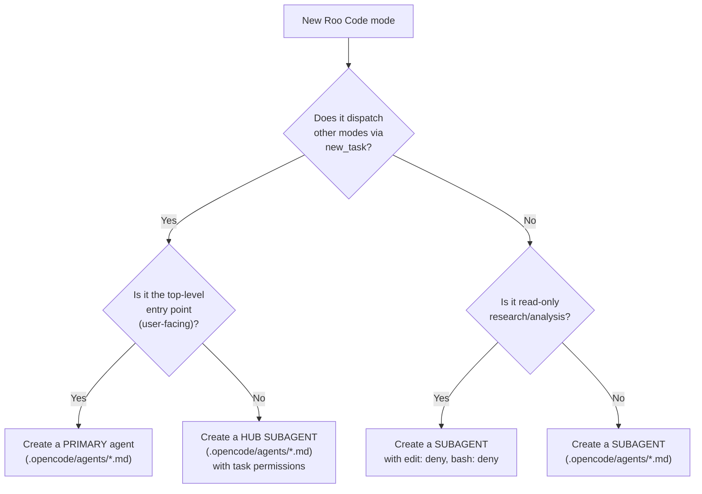

# Roo Code → OpenCode Migration Protocol

A reference document for migrating Roo Code modes to their OpenCode equivalents. Follow this protocol whenever a new mode is added to `.roomodes` and needs a corresponding OpenCode agent.

---

## 1. Decision Tree: Primary Agent vs Subagent



**Decision criteria:**

- **Top-level orchestrators** (user-facing entry point, Tab-switchable) → OpenCode **primary agent**
- **Hub orchestrators** (dispatch workers, manage workflows) → OpenCode **subagent** with `permission.task` allowlist
- **Workers** (receive scoped work, produce output, return results) → OpenCode **subagent**
- **Read-only investigators** (no writes needed) → OpenCode **subagent** with `edit: deny`, `bash: deny`

**Why this works:** Unlike Cursor (1-level nesting limit), OpenCode's `permission.task` system allows any agent to dispatch subagents. This preserves the Roo Code 3-level hierarchy:
```
Coordinator (primary) → Hub (subagent) → Worker (subagent)
```

---

## 2. Migrating a Primary Agent

**Input:** A Roo Code mode that serves as the user-facing entry point (e.g., `sdlc-coordinator`).

### Steps

1. **Create** `opencode/.opencode/agents/{slug}.md`

2. **Add frontmatter:**

   ```yaml
   ---
   description: "{roleDefinition summary}. {whenToUse summary}."
   mode: primary
   permission:
     edit: deny
     bash:
       "*": allow
     task:
       "allowed-subagent-1": allow
       "allowed-subagent-2": allow
       "*": deny
   ---
   ```

3. **Add the role definition** from `.roomodes` as the opening section.

4. **Add the OpenCode Dispatch Protocol section:**

   ```markdown
   ## OpenCode Dispatch Protocol

   You dispatch work to specialized subagents using the Task tool.

   - `new_task` in dispatch templates → Use the Task tool to invoke the named subagent
   - `attempt_completion` in dispatch templates → The subagent returns its final summary to you
   - Mode slugs map to subagent names (e.g., `sdlc-planner` → `@sdlc-planner`)

   ### Path Translation
   - `.roo/skills/` → `.opencode/skills/`
   - `common-skills/` → `.opencode/skills/`
   ```

5. **Inline all files** from `roo-code/.roo/rules-{slug}/` in numbered order.

6. **If the agent uses the `sdlc-checkpoint` skill**, reference `.opencode/skills/sdlc-checkpoint/scripts/`.

---

## 3. Migrating a Hub Subagent

**Input:** A Roo Code mode that dispatches other modes (e.g., `sdlc-planner`, `sdlc-engineering`).

### Steps

1. **Create** `opencode/.opencode/agents/{slug}.md`

2. **Add frontmatter** with `mode: subagent` and `permission.task` listing allowed workers:

   ```yaml
   ---
   description: "{description}. Use when {whenToUse condensed}."
   mode: subagent
   permission:
     edit: deny
     bash:
       "*": allow
     task:
       "worker-prefix-*": allow
       "specific-worker": allow
       "*": deny
   ---
   ```

3. **Add the role definition**, **OpenCode Dispatch Protocol**, and **Path Translation** sections.

4. **Add a table of dispatched subagents** showing name, skill, and output path.

5. **Inline all rules** from `roo-code/.roo/rules-{slug}/`.

6. **Add Checkpoint Integration** if the hub uses checkpoints.

7. **Add Completion Contract** listing what the hub returns to its parent.

---

## 4. Migrating a Worker Subagent

**Input:** A Roo Code mode that receives work and produces output.

### Steps

1. **Create** `opencode/.opencode/agents/{slug}.md`

2. **Add frontmatter:**

   ```yaml
   ---
   description: "{description}. Use when {whenToUse condensed}."
   mode: subagent
   permission:
     edit: deny    # or allow for implementer/documentation-writer
     bash:
       "*": allow  # or deny for pure read-only agents
   ---
   ```

3. **Add the role definition** from `.roomodes`.

4. **Add File Restrictions** if the Roo mode has `fileRegex`:

   ```markdown
   ## File Restrictions
   You may ONLY write to: `{pattern from fileRegex}`
   Do not create or modify any other files.
   ```

5. **Inline all rules** from `roo-code/.roo/rules-{slug}/`.

6. **Replace Roo-specific references:**
   - `new_task` → "Task tool dispatch to @subagent-name"
   - `attempt_completion` → "Return your final summary to the parent agent"
   - `switch_mode` → "Return to the parent agent"
   - `.roo/skills/` → `.opencode/skills/`
   - `common-skills/` → `.opencode/skills/`

7. **Add Completion Contract** listing what the worker returns.

---

## 5. Migrating a New Skill

No migration needed. Skills use the same format across all platforms.

1. Add the skill to `common-skills/{skill-name}/SKILL.md` in the registry.
2. It is available to OpenCode agents at `.opencode/skills/{skill-name}/` via the symlink.
3. The native `skill` tool discovers and loads skills on demand.

---

## 6. Migrating MCP Servers

Translate from Roo's `.roo/mcp.json` format to OpenCode's `opencode.json` format:

**Roo format:**
```json
{
  "mcpServers": {
    "context7": {
      "command": "npx",
      "args": ["-y", "@upstash/context7-mcp@latest"]
    }
  }
}
```

**OpenCode format:**
```json
{
  "mcp": {
    "context7": {
      "type": "local",
      "command": ["npx", "-y", "@upstash/context7-mcp@latest"]
    }
  }
}
```

Key differences:
- `command` + `args` → single `command` array
- `env` → `environment`
- `env: "${env:VAR}"` → `environment: "{env:VAR}"`
- Must add `"type": "local"` for local servers

---

## 7. Checklist for Any Migration

- [ ] Identify the mode in `roo-code/.roomodes` (slug, roleDefinition, whenToUse, groups, customInstructions)
- [ ] Decide: primary, hub subagent, or worker subagent? (use decision tree above)
- [ ] Identify the associated `roo-code/.roo/rules-{slug}/` directory
- [ ] Identify any associated skill in `common-skills/`
- [ ] Create the agent markdown file following the template above
- [ ] Set `mode:` to `primary` or `subagent`
- [ ] Set `permission.task` for orchestrators/hubs listing allowed subagents
- [ ] Translate `new_task` → Task tool, `attempt_completion` → return summary, `switch_mode` → return
- [ ] Translate `fileRegex` → prompt-level file restrictions
- [ ] Translate `groups` → `permission` (edit, bash, task)
- [ ] Replace `.roo/skills/` → `.opencode/skills/` in all inlined content
- [ ] If hub: add OpenCode Dispatch Protocol + Path Translation + subagent table
- [ ] If hub using checkpoints: reference `.opencode/skills/sdlc-checkpoint/scripts/`
- [ ] Add Completion Contract section
- [ ] Verify the `description` field accurately describes when to use this agent

---

## 8. Roo-to-OpenCode Translation Reference

| Roo Code | OpenCode Equivalent |
|---|---|
| `new_task(mode="X", message="Y")` | Task tool: `@X` with prompt Y |
| `switch_mode(mode="X")` | Tab-switch (primary) or `@X` mention (subagent) |
| `attempt_completion(result="Z")` | Subagent returns final message with Z |
| `groups: [read]` | `permission: { edit: "deny", bash: "deny" }` |
| `groups: [read, command]` | `permission: { edit: "deny", bash: "allow" }` |
| `groups: [read, edit, command, mcp]` | Default (all allowed) |
| `fileRegex: (plan/prd\.md$)` | Prompt: "You may ONLY write to: `plan/prd.md`" |
| `whenToUse: "..."` | Merge into `description` field |
| `customInstructions: "..."` | Inline into agent markdown body |
| `rules-{slug}/*.md` (auto-loaded) | Inlined into agent markdown body |
| `.roo/skills/{name}/` | `.opencode/skills/{name}/` (symlink to `common-skills/`) |
| `.roo/mcp.json` | `opencode.json` → `mcp` section |

---

## 9. Architecture Differences

| Aspect | Roo Code | OpenCode |
|---|---|---|
| Nesting | 3+ levels (coordinator → hub → worker) | 3+ levels via `permission.task` on subagents |
| Mode switching | `switch_mode` changes agent identity | Tab-switch (primary) or `@mention` (subagent) |
| Permissions | `groups` + `fileRegex` | Granular `permission` (edit, bash, task, skill) with glob patterns |
| Rule loading | Per-mode rules auto-load from `rules-{slug}/` | Rules inlined in agent markdown body |
| Skill access | `.roo/skills/` path | `.opencode/skills/` path + native `skill` tool |
| Orchestration | Hub modes dispatch via `new_task` | Hub subagents dispatch via Task tool |
| Entry points | Mode selection in UI | `/sdlc` command or Tab to `sdlc-coordinator` |
| Configuration | `.roomodes` (YAML) + `.roo/mcp.json` | `opencode.json` (JSON) + `.opencode/agents/*.md` |
| Logging | Manual | Plugin system (`tool.execute.before/after` hooks) |
| Custom commands | None | `.opencode/commands/*.md` |

### Hierarchy Preservation

Roo Code hierarchy:
```
Coordinator → Planner (hub) → PRD Agent (worker)
```

OpenCode hierarchy (preserved):
```
sdlc-coordinator (primary) → sdlc-planner (subagent) → sdlc-planner-prd (subagent)
```

Unlike the Cursor migration, no flattening is required. The `permission.task` system on subagents enables multi-level dispatch.

### OpenCode Advantages

1. **Terminal-native**: Runs without an IDE, good for CI/CD and remote development.
2. **Native skill tool**: Skills are first-class with on-demand discovery and loading.
3. **Custom commands**: `/sdlc` and `/sdlc-continue` as native entry points.
4. **Plugin system**: Hooks for logging dispatches, responses, and token usage.
5. **Granular permissions**: Per-command bash permissions, per-path edit permissions.
6. **AGENTS.md compatibility**: Works with existing Codex/Claude Code conventions.
7. **Compaction**: Automatic context management for long sessions.

---

## 10. OpenCode Architecture Summary

```
opencode/
  .opencode/
    agents/                              # Agent definitions
      sdlc-coordinator.md               # PRIMARY: phase routing entry point
      sdlc-planner.md                   # HUB: 7-phase planning orchestrator
      sdlc-planner-prd.md               # 10 planning workers
      sdlc-planner-architecture.md
      sdlc-planner-stories.md
      sdlc-planner-hld.md
      sdlc-planner-security.md
      sdlc-planner-api.md
      sdlc-planner-data.md
      sdlc-planner-devops.md
      sdlc-planner-design.md
      sdlc-planner-testing.md
      sdlc-plan-validator.md            # Validator
      sdlc-engineering.md                # HUB: implementation lifecycle
      sdlc-engineering-implementer.md    # execution workers
      sdlc-engineering-code-reviewer.md
      sdlc-engineering-qa.md
      sdlc-engineering-acceptance-validator.md
      sdlc-engineering-semantic-reviewer.md  # Semantic review
      sdlc-project-research.md               # 2 utility agents
      sdlc-engineering-documentation-writer.md
    commands/                            # SDLC entry points
      sdlc.md                           # /sdlc <project>
      sdlc-continue.md                  # /sdlc-continue
    skills/ -> ../../common-skills/     # Shared skills (symlink)
    plugins/                            # Logging and analytics
      sdlc-logger.ts
  opencode.json                         # MCP, permissions, model config
  AGENTS.md                             # Global instructions
  MIGRATION-PROTOCOL.md                 # This file
```
