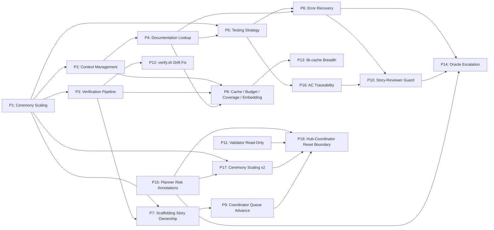

# SDLC Execution Pipeline — Improvement Proposals

**Origin:** Post-mortem analysis of sessions `ses_278b8ce55ffeKxlkK4NQaSyTHd` (US-001-scaffolding first run), `ses_264266feeffe804Vnge3sKB2DA` (US-001-scaffolding second run after P1–P6), `ses_2639886c2ffeMI2wLZcZ43UJrP` (scaffolding + US-002-local-persistence-foundation run to token exhaustion), and `ses_26105317cffeCAev1W8UP3BtK1` (US-002 + US-003-pwa-shell-baseline run to token exhaustion after P1–P8)
**Date:** 2026-04-13 (P1–P6) / 2026-04-17 (P7, P8) / 2026-04-18 (P9–P18)
**Scope:** `opencode/` agents, skills, and execution workflow. All proposals target the OpenCode SDLC system specifically.

---

## Active Proposals

Drafted from analysis of `ses_26105317cffeCAev1W8UP3BtK1`. Discussion and prioritization pending.

| ID | Title | Theme | Expected Primary Impact |
|----|-------|-------|-------------------------|
| [P12](./P12-verify-staging-drift-fix.md) | Fix `verify.sh` Staging-Doc Drift Heuristic | Tooling Noise | Eliminate false "staging doc is more current" warnings that confuse downstream agents |
| [P13](./P13-lib-cache-breadth-incentive.md) | Incentivize Comprehensive `lib-cache` Entries | Context / Cache | Raise cache quality bar; add cross-story cache promotion; cut doc queries 30–40% |
| [P14](./P14-oracle-escalation-threshold.md) | Budget-Aware Oracle Escalation on Complex Work | Model Routing | Route hard browser / CDP / type-system tasks to Oracle early; avoid 45-query-per-task failures |
| [P15](./P15-planner-task-risk-annotations.md) | Planner-Level Task Risk and Complexity Annotations | Planning Signal | Planner annotates task shapes (browser-automation, CDP, service-worker, etc.); feeds P14 proactive routing |
| [P16](./P16-per-task-ac-traceability.md) | Per-Task Reviewer AC Traceability and Evidence Binding | Review Quality | Bind tasks to ACs; per-task review verifies evidence; shifts catch-work from Phase 3 to Phase 2 |
| [P17](./P17-ceremony-scaling-feature-stories.md) | Ceremony Scaling Beyond Scaffolding — Task-Class Dispatch | Dispatch Efficiency | Three-tier (A/B/C) dispatch policy; skip redundant review on trivial tasks; expand review on high-risk tasks |
| [P18](./P18-hub-coordinator-reset-boundary.md) | Principled Hub ↔ Coordinator Reset Boundary | Dispatch Contract | End-to-end vs phase-boundary hub dispatch mode driven by P15 annotations; cut within-story round-trips from 4+ to 1–3; cap worst-case sub-session context |

### Rough Sequencing

Suggested dependency order (see each proposal's §9 for details):

1. **Foundational / tooling first** — P12 (P9 landed 2026-04-19; P10 and P11 landed 2026-04-21). Low-risk, high-unblock. Land before anything else.
2. **Review discipline cluster** — P16. Shifts catch-work earlier into Phase 2, reinforcing the Phase 3 cap P10 already established.
3. **Planning signals** — P15. Produces inputs for P14, P17, P18.
4. **Dispatch contracts** — P18 (and P17) strictly after P15 is in place. P15 is a prerequisite for P18; without P15 annotations the P18 selection rule has no input and the proposal collapses into "always end-to-end".
5. **Model-routing cluster** — P14 after P15. P15 produces the signals P14 consumes.
6. **Efficiency refinements** — P13, P17. Compound with the rest; lower individual urgency.

---

## Archived Proposals

Resolved proposals are kept as a permanent decision record. They explain why the agents and skills are shaped the way they are.

| ID | Title | Status | Primary Impact |
|----|-------|--------|----------------|
| [P1](./archive/P1-ceremony-scaling-and-scaffolding.md) | Ceremony Scaling & Scaffolding Strategy | Resolved | Reduce dispatch count and review cycles for simple tasks |
| [P2](./archive/P2-context-management-and-memory.md) | Context Management & Memory Architecture | Resolved | Eliminate redundant file reads across subagent sessions |
| [P3](./archive/P3-verification-pipeline.md) | Verification Pipeline & Command Batching | Resolved | Reduce bash calls from ~100 to ~30 per story |
| [P4](./archive/P4-documentation-lookup-strategy.md) | Documentation Lookup Strategy (context7/Tavily) | Resolved | Cache documentation lookups, prevent re-querying |
| [P5](./archive/P5-testing-strategy-scaffold-verification.md) | Testing Strategy & Scaffold Verification | Resolved | Eliminate low-value tests, scale testing intensity by phase |
| [P6](./archive/P6-type-safety-and-error-recovery.md) | Type Safety & Error Recovery Patterns | Resolved | Reduce compile-fix-compile iteration cycles |
| [P7](./archive/P7-scaffolding-story-ownership.md) | Scaffolding Story Ownership | Resolved | Make scaffolder own full story lifecycle; skip Phase 1/2/3 for scaffolding stories; cap reviewer severity escalation |
| [P8](./archive/P8-cache-budget-coverage-embedding.md) | Story-Level Cache, Query Budget, Coverage Parsing, Role-Aware Embedding | Resolved | Cut documentation queries ~3x; ban LLM reads of coverage artifacts; emit `COVERAGE:` lines from verify.sh; inventory-only source for implementers |
| [P9](./archive/P9-coordinator-story-queue-advance.md) | Coordinator Story-Queue Population and Auto-Advance | Resolved | `checkpoint.sh coordinator --sync` rebuilds `stories_remaining` from disk; `--story-done` auto-advances between stories; `pause_after` gates user reviews; `verify.sh` distinguishes `ACTIVE` / `PAUSED` / `IDLE` with self-heal on `ungated_on_disk` |
| [P10](./archive/P10-story-reviewer-severity-guard.md) | Story-Reviewer Severity-Escalation Guard and Iteration Cap | Resolved | Cap Phase 3 story-review iterations at 3; Coverage Matrix + New-vs-Rediscovered Audit; graduated Suggestion-only rule (iter 1 blocks, iter ≥2 approves); planning-gotchas sibling file for post-run human review |
| [P11](./archive/P11-acceptance-validator-readonly.md) | Acceptance Validator Scope Boundary — Path-Scoped Write Allowlist | Resolved | Path-scoped `edit:` allowlist (catch-all deny first, then allow for evidence, validation report, skill-gotchas); explicit bash-write prohibition in the validator spec; agent-side Pre-Completion Self-Check that runs `git status --porcelain` and reverts any off-allowlist writes before returning. Engineering hub is untouched to keep it compact; hub-side audit is a deferred follow-up if observability warrants it. |

---

## Context

A simple 4-task scaffolding story (React + Vite + PWA) consumed 2h56m, 1.4M input tokens, 33.6M cache-read tokens, 19 subagent dispatches, and 20 sessions to produce ~500 lines of code. The analysis identified six interconnected areas for improvement (P1–P6). A second run after those fixes revealed a seventh gap (P7): the engineering hub still entered Phase 1/2/3 after the scaffolder completed, duplicating the scaffolder's entire output and triggering adversarial review cycles on already-finished work. A third post-mortem, on the first feature story (US-002-local-persistence-foundation) run after P1–P7, exposed an eighth cluster (P8): the P4 cache was status-only instead of content-bearing (34 doc queries for one small story), coverage artifacts were read by the LLM directly rather than grepped from structured stdout, and source-file embedding was paid for by implementers but benefited only read-only roles. All eight have been addressed.

A fourth post-mortem covered `ses_26105317cffeCAev1W8UP3BtK1` — a 9h6m session that completed US-002 and approximately two thirds of US-003 before token exhaustion. That run exposed nine new problem clusters (P9–P17) spanning workflow (coordinator auto-advance broken by a missing `sync-coordinator.sh` script), review discipline (Phase 3 story-reviewer lacks severity escalation guards, creating a 4-iteration treadmill per story), role boundary (Phase 4 acceptance-validator ran 7h 15m and modified 32 files), tooling noise (`verify.sh` false-positive drift warnings on every run), context quality (lib-cache entries are minimally compliant rather than comprehensive, producing ~32 doc queries per story vs. P8's ≤10 target), model routing (no Oracle escalation for hard browser / CDP tasks), planning signal (no risk/complexity annotations to route from), review quality (ACs not bound to tasks, so Phase 3 discovers evidence gaps), and dispatch efficiency (flat ceremony across trivial and heavy tasks).

A fifth post-mortem extended that session with `ses_26105317cffeCAev1W8UP3BtK1-continued` (combined 25h13m, 129 child sessions, US-002 + US-003 + US-005 + US-008 partial). That continuation exposed one additional cluster (P18): the engineering hub and the coordinator round-trip 3–4 times per story because the coordinator's Phase 4 dispatch language asks the hub to "recommend next coordinator action", contradicting the hub's end-to-end completion contract. The hub complies with the dispatch wording rather than its own contract. In the worst case this produced a 7h53m hub sub-session with a nested 7h15m acceptance-validator over-run (the same event motivating P11) — P18 caps how much ambient context such long sub-sessions can inherit by drawing reset boundaries at named phases instead of ad-hoc slices. P18 does not address the long between-turn gaps observed in the transcript; those were user-side token-budget resets, not pipeline stalls.

---

## Dependency Graph

- **P1 → P2:** Ceremony scaling requires context management (fewer dispatches means less re-reading, but remaining dispatches need better context).
- **P1 → P3:** Scaffolding skill includes verification script templates.
- **P1 → P5:** Scaffold task type drives relaxed testing tier.
- **P1 → P7:** P1 created the scaffolder mini-hub but left a gap: the hub still entered Phase 1 after scaffold completion for scaffolding stories.
- **P2 → P4:** Library context caching is a specific instance of the general context management strategy.
- **P4 → P5:** Documentation lookup failures cause test approach failures (CSS import edge case).
- **P5 → P6:** Test failure escalation protocol connects to error recovery patterns.
- **P4 → P6:** Missing documentation leads to type errors from incorrect API usage.
- **P3 → P7:** P7's self-validation relies on the verify:full script established in P3.
- **P2 → P8:** P8's story-level lib-cache and role-aware source embedding refine P2's context-management model.
- **P3 → P8:** P8's coverage-emission rule is enforced inside the P3 `scripts/verify.sh` pipeline.
- **P4 → P8:** P8 tightens P4's documentation-lookup cache into a content-bearing artifact with a hard budget.
- **P3 → P12:** P12 fixes the staging-doc drift heuristic inside P3's `verify.sh` pipeline.
- **P7 → P9:** P9 adds `checkpoint.sh coordinator --sync` (replacing the never-shipped `sync-coordinator.sh`) that P7's post-scaffold handoff and all subsequent story completions depend on.
- **P6 → P10:** P10 ports the severity-escalation guard P6 added to the code-reviewer into the story-reviewer.
- **P16 → P10:** P10's Phase 3 iteration cap is only safe once P16 has front-loaded AC traceability into Phase 2.
- **P5 → P16:** P16 extends P5's testing-strategy conventions with AC-binding discipline.
- **P8 → P13:** P13 follows up P8's cache schema with a breadth incentive and cross-story cache promotion.
- **P6 → P14:** P6 introduced Oracle as an escalation pattern; P14 specifies quantitative thresholds that trigger it.
- **P10 → P14:** P10's iteration cap is the trigger that routes story-level escalations to Oracle in P14.
- **P15 → P14:** P15 produces the task-shape / risk annotations that P14 consumes for proactive Oracle routing.
- **P1 → P17:** P17 extends P1's ceremony scaling from scaffolding-only to general task classes (A/B/C).
- **P15 → P17:** P17's task-class inference consumes P15's shape/risk annotations.
- **P15 → P18:** P18's end-to-end vs phase-boundary mode selection consumes P15's story-level risk annotations (≤2 tasks and no risk shapes → end-to-end; otherwise phase-boundary).
- **P11 → P18:** P11 bounds the acceptance validator directly; P18 narrows the ambient context that validator inherits by resetting at the Phase 3→4 boundary. Defense in depth.
- **P17 → P18:** P17 scales task-level ceremony; P18 scales story-level dispatch mode. They share the same planner annotation input and should be designed together.
- **P9 → P18:** P9 handles the between-story boundary; P18 handles the within-story boundary. Neither subsumes the other; P9 lands first because it's foundational.

---

## Measured Impact (US-001 baseline → after all proposals)

| Metric | Before | After | Reduction |
|--------|--------|-------|-----------|
| Subagent dispatches per 4-task scaffold | 19 | ~8-10 | ~50% |
| Total input tokens per scaffold story | 1.4M | ~500-700K | ~50-65% |
| Cache-read tokens per scaffold story | 33.6M | ~15-20M | ~40-50% |
| Bash calls per scaffold story | 318 | ~80-100 | ~70% |
| Duration for scaffold story | ~3 hours | ~1-1.5 hours | ~50% |
| context7 calls per scaffold story | 44 | ~12-16 | ~65% |

---

## How to Add a New Proposal

1. Create `PN-short-title.md` in this folder (not in `archive/`).
2. Add a row to the Active Proposals table above.
3. Work through the proposal: discuss open questions, refine the approach, implement changes.
4. When resolved: move the file to `archive/`, update the row here to Resolved and move it to the Archived table.
