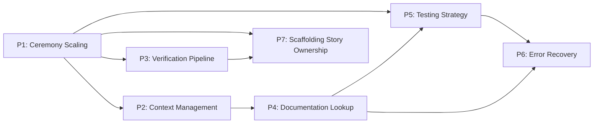

# SDLC Execution Pipeline — Improvement Proposals

**Origin:** Post-mortem analysis of sessions `ses_278b8ce55ffeKxlkK4NQaSyTHd` (US-001-scaffolding first run) and `ses_264266feeffe804Vnge3sKB2DA` (US-001-scaffolding second run after P1–P6)
**Date:** 2026-04-13 (P1–P6) / 2026-04-17 (P7)
**Scope:** `opencode/` agents, skills, and execution workflow. All proposals target the OpenCode SDLC system specifically.

---

## Active Proposals

No active proposals. Add new files here as improvement work begins.

---

## Archived Proposals

Resolved proposals are kept as a permanent decision record. They explain why the agents and skills are shaped the way they are.

| ID | Title | Status | Primary Impact |
|----|-------|--------|----------------|
| [P1](./archive/P1-ceremony-scaling-and-scaffolding.md) | Ceremony Scaling & Scaffolding Strategy | Resolved | Reduce dispatch count and review cycles for simple tasks |
| [P2](./archive/P2-context-management-and-memory.md) | Context Management & Memory Architecture | Resolved | Eliminate redundant file reads across subagent sessions |
| [P3](./archive/P3-verification-pipeline.md) | Verification Pipeline & Command Batching | Resolved | Reduce bash calls from ~100 to ~30 per story |
| [P4](./archive/P4-documentation-lookup-strategy.md) | Documentation Lookup Strategy (context7/Tavily) | Resolved | Cache documentation lookups, prevent re-querying |
| [P5](./archive/P5-testing-strategy-scaffold-verification.md) | Testing Strategy & Scaffold Verification | Resolved | Eliminate low-value tests, scale testing intensity by phase |
| [P6](./archive/P6-type-safety-and-error-recovery.md) | Type Safety & Error Recovery Patterns | Resolved | Reduce compile-fix-compile iteration cycles |
| [P7](./archive/P7-scaffolding-story-ownership.md) | Scaffolding Story Ownership | Resolved | Make scaffolder own full story lifecycle; skip Phase 1/2/3 for scaffolding stories; cap reviewer severity escalation |

---

## Context

A simple 4-task scaffolding story (React + Vite + PWA) consumed 2h56m, 1.4M input tokens, 33.6M cache-read tokens, 19 subagent dispatches, and 20 sessions to produce ~500 lines of code. The analysis identified six interconnected areas for improvement (P1–P6). A second run after those fixes revealed a seventh gap (P7): the engineering hub still entered Phase 1/2/3 after the scaffolder completed, duplicating the scaffolder's entire output and triggering adversarial review cycles on already-finished work. All seven have been addressed.

---

## Dependency Graph

- **P1 → P2:** Ceremony scaling requires context management (fewer dispatches means less re-reading, but remaining dispatches need better context).
- **P1 → P3:** Scaffolding skill includes verification script templates.
- **P1 → P5:** Scaffold task type drives relaxed testing tier.
- **P1 → P7:** P1 created the scaffolder mini-hub but left a gap: the hub still entered Phase 1 after scaffold completion for scaffolding stories.
- **P2 → P4:** Library context caching is a specific instance of the general context management strategy.
- **P4 → P5:** Documentation lookup failures cause test approach failures (CSS import edge case).
- **P5 → P6:** Test failure escalation protocol connects to error recovery patterns.
- **P4 → P6:** Missing documentation leads to type errors from incorrect API usage.
- **P3 → P7:** P7's self-validation relies on the verify:full script established in P3.

---

## Measured Impact (US-001 baseline → after all proposals)

| Metric | Before | After | Reduction |
|--------|--------|-------|-----------|
| Subagent dispatches per 4-task scaffold | 19 | ~8-10 | ~50% |
| Total input tokens per scaffold story | 1.4M | ~500-700K | ~50-65% |
| Cache-read tokens per scaffold story | 33.6M | ~15-20M | ~40-50% |
| Bash calls per scaffold story | 318 | ~80-100 | ~70% |
| Duration for scaffold story | ~3 hours | ~1-1.5 hours | ~50% |
| context7 calls per scaffold story | 44 | ~12-16 | ~65% |

---

## How to Add a New Proposal

1. Create `PN-short-title.md` in this folder (not in `archive/`).
2. Add a row to the Active Proposals table above.
3. Work through the proposal: discuss open questions, refine the approach, implement changes.
4. When resolved: move the file to `archive/`, update the row here to Resolved and move it to the Archived table.
