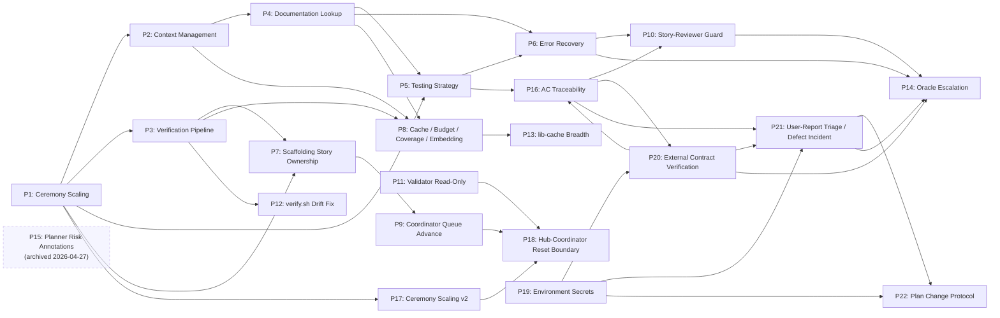

# SDLC Execution Pipeline — Improvement Proposals

**Origin:** Post-mortem analysis of sessions `ses_278b8ce55ffeKxlkK4NQaSyTHd` (US-001-scaffolding first run), `ses_264266feeffe804Vnge3sKB2DA` (US-001-scaffolding second run after P1–P6), `ses_2639886c2ffeMI2wLZcZ43UJrP` (scaffolding + US-002-local-persistence-foundation run to token exhaustion), `ses_26105317cffeCAev1W8UP3BtK1` (US-002 + US-003-pwa-shell-baseline run to token exhaustion after P1–P8), and `ses_24a319c81ffelunHGnCfk7KcBT` (US-004-photo-intake-identification finish + user validation revealing external-integration, credential, defect-handling, and plan-change protocol gaps)
**Date:** 2026-04-13 (P1–P6) / 2026-04-17 (P7, P8) / 2026-04-18 (P9–P18) / 2026-04-22 (P19–P22 + amendments to P14 and P16)
**Scope:** `opencode/` agents, skills, and execution workflow. All proposals target the OpenCode SDLC system specifically.

---

## Active Proposals

Drafted from analysis of `ses_26105317cffeCAev1W8UP3BtK1` (P13–P18) and `ses_24a319c81ffelunHGnCfk7KcBT` (P19–P22 + amendments). Discussion and prioritization pending.

| ID | Title | Theme | Expected Primary Impact |
|----|-------|-------|-------------------------|
| [P13](./P13-lib-cache-breadth-incentive.md) | Incentivize Comprehensive `lib-cache` Entries | Context / Cache | Raise cache quality bar; add cross-story cache promotion; cut doc queries 30–40% |
| [P16](./P16-per-task-ac-traceability.md) | Per-Task Reviewer AC Traceability and Evidence Binding (amended: `evidence_class: real/stub-only/static-analysis-only` per P20) | Review Quality | Bind tasks to ACs; per-task review verifies evidence; externally-bound ACs require real-provider evidence |
| [P17](./P17-ceremony-scaling-feature-stories.md) | Ceremony Scaling Beyond Scaffolding — Task-Class Dispatch | Dispatch Efficiency | Three-tier (A/B/C) dispatch policy; skip redundant review on trivial tasks; expand review on high-risk tasks |
| [P18](./P18-hub-coordinator-reset-boundary.md) | Principled Hub ↔ Coordinator Reset Boundary | Dispatch Contract | End-to-end vs phase-boundary hub dispatch mode driven by P15 annotations; cut within-story round-trips from 4+ to 1–3; cap worst-case sub-session context |
| [P19](./P19-environment-secrets-protocol.md) | Environment-Variable-Based Secrets Protocol | Credentials / Readiness | **Implemented 2026-04-23.** Planner declares `required_env` covering all external-service variables (API keys, BaaS credentials, DB URLs, storage, webhooks); hub gates Phase 0a on env presence; implementers halt instead of fabricating placeholders; validator downgrades to `ACCEPTED-STUB-ONLY` on missing creds. User-initiated mid-execution credential registration and pre-P19 project retrofit are routed by the coordinator to the planner hub, which loads the new `credential-registration` skill — the planner has the artifact context (`api.md`, architecture, cross-story scope) needed to detect scope-changes-in-disguise and escalate them to P22 rather than writing declarations blindly. Foundational for the P19–P22 cluster. |
| [P20](./P20-external-integration-contract-verification.md) | External Integration Contract Verification via Real-Traffic E2E | Testing / Evidence | Planner verifies external endpoints via curl at plan time; per-endpoint `test-mode: real` smoke tests at execution; reviewer conformance check; validator requires real-path evidence or emits stub-only verdict |
| [P21](./P21-user-reported-check-defect-triage.md) | User-Reported Check and Defect Triage Protocol | Coordinator Workflow | Coordinator classifies user reports into A/B/C/D (already implemented / future / defect incident / plan gap); defect-incident lifecycle primitive on engineering hub; Oracle routes via P14 trigger 5 |
| [P22](./P22-plan-change-protocol.md) | Plan Change Protocol (Within-Execution) | Planner Workflow | Plan-change-triage dispatch; planner produces blast-radius analysis; four classification classes (additive-within-story / new story / multi-story replan / foundational); `.sdlc/plan-changes/` audit trail |

### Rough Sequencing

Suggested dependency order (see each proposal's §9 for details):

1. **Foundational / tooling first** — done (P9 landed 2026-04-19; P10, P11, P12 landed 2026-04-21). Low-risk, high-unblock; landed before anything else.
2. **Review discipline cluster** — P16. Shifts catch-work earlier into Phase 2, reinforcing the Phase 3 cap P10 already established.
3. **Dispatch contracts** — P17 and P18. (Earlier sequencing assumed P15's task-shape annotations as input; P15 was archived 2026-04-27. P17 and P18 must therefore stand on their own input signal or be revisited.)
4. **Efficiency refinements** — P13. Compounds with the rest; lower individual urgency.
5. **Credentials foundation (P19)** — lands before P20/P21/P22 because their verification steps reference P19's env-var mechanism. Zero ongoing cost; unlocks the rest of the 2026-04-22 batch.
6. **External-integration verification (P20)** — strictly after P19 (real traffic needs credentials). Also depends on P16's amended `evidence_class` clause being in place.
7. **User-report triage (P21)** — after P19 (for defect reproduction against real endpoints) and after P16 (for AC→story inference during classification). Activates P14's trigger 5 and feeds P22 Category D.
8. **Plan-change protocol (P22)** — after P21 (consumes P21 Category D) and logically paired with P19/P20 (plan changes that touch integrations go through P19's `required_env` update and P20's `wire_format` re-verification).

---

## Archived Proposals

Resolved proposals are kept as a permanent decision record. They explain why the agents and skills are shaped the way they are.

| ID | Title | Status | Primary Impact |
|----|-------|--------|----------------|
| [P1](./archive/P1-ceremony-scaling-and-scaffolding.md) | Ceremony Scaling & Scaffolding Strategy | Resolved | Reduce dispatch count and review cycles for simple tasks |
| [P2](./archive/P2-context-management-and-memory.md) | Context Management & Memory Architecture | Resolved | Eliminate redundant file reads across subagent sessions |
| [P3](./archive/P3-verification-pipeline.md) | Verification Pipeline & Command Batching | Resolved | Reduce bash calls from ~100 to ~30 per story |
| [P4](./archive/P4-documentation-lookup-strategy.md) | Documentation Lookup Strategy (context7/Tavily) | Resolved | Cache documentation lookups, prevent re-querying |
| [P5](./archive/P5-testing-strategy-scaffold-verification.md) | Testing Strategy & Scaffold Verification | Resolved | Eliminate low-value tests, scale testing intensity by phase |
| [P6](./archive/P6-type-safety-and-error-recovery.md) | Type Safety & Error Recovery Patterns | Resolved | Reduce compile-fix-compile iteration cycles |
| [P7](./archive/P7-scaffolding-story-ownership.md) | Scaffolding Story Ownership | Resolved | Make scaffolder own full story lifecycle; skip Phase 1/2/3 for scaffolding stories; cap reviewer severity escalation |
| [P8](./archive/P8-cache-budget-coverage-embedding.md) | Story-Level Cache, Query Budget, Coverage Parsing, Role-Aware Embedding | Resolved | Cut documentation queries ~3x; ban LLM reads of coverage artifacts; emit `COVERAGE:` lines from verify.sh; inventory-only source for implementers |
| [P9](./archive/P9-coordinator-story-queue-advance.md) | Coordinator Story-Queue Population and Auto-Advance | Resolved | `checkpoint.sh coordinator --sync` rebuilds `stories_remaining` from disk; `--story-done` auto-advances between stories; `pause_after` gates user reviews; `verify.sh` distinguishes `ACTIVE` / `PAUSED` / `IDLE` with self-heal on `ungated_on_disk` |
| [P10](./archive/P10-story-reviewer-severity-guard.md) | Story-Reviewer Severity-Escalation Guard and Iteration Cap | Resolved | Cap Phase 3 story-review iterations at 3; Coverage Matrix + New-vs-Rediscovered Audit; graduated Suggestion-only rule (iter 1 blocks, iter ≥2 approves); planning-gotchas sibling file for post-run human review |
| [P11](./archive/P11-acceptance-validator-readonly.md) | Acceptance Validator Scope Boundary — Path-Scoped Write Allowlist | Resolved | Path-scoped `edit:` allowlist (catch-all deny first, then allow for evidence, validation report, skill-gotchas); explicit bash-write prohibition in the validator spec; agent-side Pre-Completion Self-Check that runs `git status --porcelain` and reverts any off-allowlist writes before returning. Engineering hub is untouched to keep it compact; hub-side audit is a deferred follow-up if observability warrants it. |
| [P12](./archive/P12-verify-staging-drift-fix.md) | Fix `verify.sh` Staging-Doc Drift Heuristic | Resolved | Replaced the broken `- [x]` regex with a convention-aware awk parser that walks `### Task` sections and recognises `✓`/`✅`/`complete`/`done` markers on headings and `**Status:**` lines (legacy `- [x]` still honoured). Drift warning is now three-way directional — silent on agreement, "staging ahead ... trusting staging doc" when staging is further, "checkpoint ahead ... inspect manually" otherwise. Added `tests/test-verify.sh` smoke suite with four fixture scenarios. Eliminates false "staging doc is more current" warnings that previously fired on every verify.sh invocation. |
| [P14](./archive/P14-oracle-escalation-threshold.md) | Count-Based Oracle Escalation on Complex Browser/Integration Work | Resolved (Implemented 2026-04-26) | Cost-arithmetic framing replaced with count-based triggers (doc queries, implementer attempts, reviewer iterations); cross-cutting governors (default-cycle precondition, per-task cap of 1/2/3-with-coordinator-approval, per-story soft cap of 3); hub-internal trigger evaluation with explicit decline logging; full Oracle dispatch envelope (failing AC/test, error symptoms, prior attempts verbatim, scope block); SCOPE COMPLIANCE check on Oracle output reverts out-of-scope edits; `dispatch-log.jsonl` schema extended with `counters`, `scope`, `decline_reason`. **Worker invariant (P14 §2.5):** implementer and code-reviewer agents are deliberately not modified — routing is hub-internal. Triggers 3 and 5 reference P15 / P21 and remain dormant until those land. |
| [P15](./archive/P15-planner-task-risk-annotations.md) | Planner-Level Task Risk and Complexity Annotations | Archived (Not Implemented, 2026-04-27) | Drafted, refined, and fully implemented; reverted on the same day after review. Pre-emptive task-shape labeling overlapped with three reactive systems already in place (Oracle Escalation Policy triggers 1+2 for runtime difficulty; planning-gotchas + skill iteration for category-level learning; library cache for per-task knowledge). Implementer-side `risk_upgrade_suggestion` also conflicted with P14's "workers do not route" governor. Token cost (~275-line taxonomy file read by planner + hub + validator on every story) for hypothesis-based content was not justified by measurable payoff. See archived proposal's "Why Archived" section for the full reasoning. Revisit only if multiple cycles produce evidence that the reactive stack is too slow. |

---

## Context

A simple 4-task scaffolding story (React + Vite + PWA) consumed 2h56m, 1.4M input tokens, 33.6M cache-read tokens, 19 subagent dispatches, and 20 sessions to produce ~500 lines of code. The analysis identified six interconnected areas for improvement (P1–P6). A second run after those fixes revealed a seventh gap (P7): the engineering hub still entered Phase 1/2/3 after the scaffolder completed, duplicating the scaffolder's entire output and triggering adversarial review cycles on already-finished work. A third post-mortem, on the first feature story (US-002-local-persistence-foundation) run after P1–P7, exposed an eighth cluster (P8): the P4 cache was status-only instead of content-bearing (34 doc queries for one small story), coverage artifacts were read by the LLM directly rather than grepped from structured stdout, and source-file embedding was paid for by implementers but benefited only read-only roles. All eight have been addressed.

A fourth post-mortem covered `ses_26105317cffeCAev1W8UP3BtK1` — a 9h6m session that completed US-002 and approximately two thirds of US-003 before token exhaustion. That run exposed nine new problem clusters (P9–P17) spanning workflow (coordinator auto-advance broken by a missing `sync-coordinator.sh` script), review discipline (Phase 3 story-reviewer lacks severity escalation guards, creating a 4-iteration treadmill per story), role boundary (Phase 4 acceptance-validator ran 7h 15m and modified 32 files), tooling noise (`verify.sh` false-positive drift warnings on every run), context quality (lib-cache entries are minimally compliant rather than comprehensive, producing ~32 doc queries per story vs. P8's ≤10 target), model routing (no Oracle escalation for hard browser / CDP tasks), planning signal (no risk/complexity annotations to route from), review quality (ACs not bound to tasks, so Phase 3 discovers evidence gaps), and dispatch efficiency (flat ceremony across trivial and heavy tasks).

A fifth post-mortem extended that session with `ses_26105317cffeCAev1W8UP3BtK1-continued` (combined 25h13m, 129 child sessions, US-002 + US-003 + US-005 + US-008 partial). That continuation exposed one additional cluster (P18): the engineering hub and the coordinator round-trip 3–4 times per story because the coordinator's Phase 4 dispatch language asks the hub to "recommend next coordinator action", contradicting the hub's end-to-end completion contract. The hub complies with the dispatch wording rather than its own contract. In the worst case this produced a 7h53m hub sub-session with a nested 7h15m acceptance-validator over-run (the same event motivating P11) — P18 caps how much ambient context such long sub-sessions can inherit by drawing reset boundaries at named phases instead of ad-hoc slices. P18 does not address the long between-turn gaps observed in the transcript; those were user-side token-budget resets, not pipeline stalls.

A sixth post-mortem covered `ses_24a319c81ffelunHGnCfk7KcBT` — the completion of US-004-photo-intake-identification and the user's first end-to-end validation against the shipped product. The story was checkpointed `completed_phases: [0,1,2,3,3b,4,5,6]` but failed on first real use: the `PhotoIntakeHarness` shipped with a hardcoded `demo-api-key` and mocked fetch plumbing, and after that was fixed the app still returned 401 because the planner's `api.md` described an invented internal-proxy envelope that placed the OpenRouter key in the request body instead of an `Authorization: Bearer` header. Every gate — implementer, code-reviewer, QA, story-reviewer, acceptance-validator — validated against the internal (wrong) contract; no test ever touched the real OpenRouter endpoint. The session also surfaced four interacting protocol gaps: (1) no agent has a protocol for user-reported behavior on a completed story, producing ad-hoc hub dispatches with no incident lifecycle; (2) no agent has a protocol for mid-execution plan changes (the user wanted to drop OpenAI and add a free-model selector, with no route for either); (3) no convention for sharing credentials with the pipeline (a key placed in `tests/resources/openrouter-free.key.txt` was masked by security-minded agents rather than consumed); and (4) no mechanism for ACs whose statements reference external-provider behavior to require real-traffic evidence before acceptance. P19–P22 address these four gaps as a single dependency-ordered batch, with amendments to P14 (Oracle handles external-contract defect incidents as first-line) and P16 (`evidence_class` field on AC traceability distinguishes real-traffic from stub-only evidence).

---

## Dependency Graph

- **P1 → P2:** Ceremony scaling requires context management (fewer dispatches means less re-reading, but remaining dispatches need better context).
- **P1 → P3:** Scaffolding skill includes verification script templates.
- **P1 → P5:** Scaffold task type drives relaxed testing tier.
- **P1 → P7:** P1 created the scaffolder mini-hub but left a gap: the hub still entered Phase 1 after scaffold completion for scaffolding stories.
- **P2 → P4:** Library context caching is a specific instance of the general context management strategy.
- **P4 → P5:** Documentation lookup failures cause test approach failures (CSS import edge case).
- **P5 → P6:** Test failure escalation protocol connects to error recovery patterns.
- **P4 → P6:** Missing documentation leads to type errors from incorrect API usage.
- **P3 → P7:** P7's self-validation relies on the verify:full script established in P3.
- **P2 → P8:** P8's story-level lib-cache and role-aware source embedding refine P2's context-management model.
- **P3 → P8:** P8's coverage-emission rule is enforced inside the P3 `scripts/verify.sh` pipeline.
- **P4 → P8:** P8 tightens P4's documentation-lookup cache into a content-bearing artifact with a hard budget.
- **P3 → P12:** P12 fixes the staging-doc drift heuristic inside P3's `verify.sh` pipeline.
- **P7 → P9:** P9 adds `checkpoint.sh coordinator --sync` (replacing the never-shipped `sync-coordinator.sh`) that P7's post-scaffold handoff and all subsequent story completions depend on.
- **P6 → P10:** P10 ports the severity-escalation guard P6 added to the code-reviewer into the story-reviewer.
- **P16 → P10:** P10's Phase 3 iteration cap is only safe once P16 has front-loaded AC traceability into Phase 2.
- **P5 → P16:** P16 extends P5's testing-strategy conventions with AC-binding discipline.
- **P8 → P13:** P13 follows up P8's cache schema with a breadth incentive and cross-story cache promotion.
- **P6 → P14:** P6 introduced Oracle as an escalation pattern; P14 specifies quantitative thresholds that trigger it.
- **P10 → P14:** P10's iteration cap is the trigger that routes story-level escalations to Oracle in P14.
- **P15 → P14 (severed):** P15 was archived 2026-04-27 without implementation. P14's trigger 3 (`oracle_preauthorize` flag) is dormant in practice — the planner contract does not produce the flag and the hub treats every task as `oracle_preauthorize: false`. P14's other triggers (1, 2, 4, 5) are unaffected.
- **P1 → P17:** P17 extends P1's ceremony scaling from scaffolding-only to general task classes (A/B/C).
- **P15 → P17 (severed):** P17 was originally specified to consume P15's shape/risk annotations for task-class inference. With P15 archived, P17 must either define its own task-class signal or be revisited.
- **P15 → P18 (severed):** P18 was originally specified to use P15's story-level risk roll-up for end-to-end vs phase-boundary mode selection. With P15 archived, P18 must define its own selection input or be revisited.
- **P11 → P18:** P11 bounds the acceptance validator directly; P18 narrows the ambient context that validator inherits by resetting at the Phase 3→4 boundary. Defense in depth.
- **P17 → P18:** P17 scales task-level ceremony; P18 scales story-level dispatch mode. They share the same planner annotation input and should be designed together.
- **P9 → P18:** P9 handles the between-story boundary; P18 handles the within-story boundary. Neither subsumes the other; P9 lands first because it's foundational.
- **P19 → P20:** Real-traffic verification at plan time and at QA time requires a real credential. P19's `required_env` declaration and Phase 0a gate are the mechanisms P20 consumes.
- **P19 → P21:** Reproducing a Category C defect against an external endpoint requires a real credential; P21's reproduce step routes through P19's `MISSING_CREDENTIALS` escalation when `required_env` is unset.
- **P19 → P22:** Plan changes that add or swap external providers update the `required_env` declaration and `.env.example` atomically in the PC-NNN artifact; the planner's partial-replan reads P19 state as part of blast-radius analysis.
- **P16 ↔ P20:** P16 §3.5 (amended) carries the `evidence_class` field that binds to P20's `external_integration_evidence`; P20's reviewer conformance check extends P16's reviewer contract. The two proposals cover different sides of the same real-evidence gate.
- **P20 → P21:** P21's defect-incident verify step re-runs P20's smoke tests. Incidents that turn out to be `wire_format` defects escalate from code-level fixes back into P20's plan-validation path.
- **P16 → P21:** P21's classification step (§3.1 step 2) consumes P16's AC→task map to identify candidate stories from a user's behavioral description.
- **P21 → P22:** P21 Category D (plan gap) hands off to P22's triage. Incidents whose scope grows beyond the one-or-two-AC threshold also escalate from P21 to P22.
- **P21 → P14:** P21 §3.3 introduces trigger 5 on P14 — defect incidents against external-integration ACs dispatch Oracle as first-line investigator rather than escalation.
- **P20 → P14:** P14 trigger 5's "external integration" condition is checked against P20's `wire_format` declaration; the two must stay aligned or the trigger misfires.

---

## Measured Impact (US-001 baseline → after all proposals)

| Metric | Before | After | Reduction |
|--------|--------|-------|-----------|
| Subagent dispatches per 4-task scaffold | 19 | ~8-10 | ~50% |
| Total input tokens per scaffold story | 1.4M | ~500-700K | ~50-65% |
| Cache-read tokens per scaffold story | 33.6M | ~15-20M | ~40-50% |
| Bash calls per scaffold story | 318 | ~80-100 | ~70% |
| Duration for scaffold story | ~3 hours | ~1-1.5 hours | ~50% |
| context7 calls per scaffold story | 44 | ~12-16 | ~65% |

---

## How to Add a New Proposal

1. Create `PN-short-title.md` in this folder (not in `archive/`).
2. Add a row to the Active Proposals table above.
3. Work through the proposal: discuss open questions, refine the approach, implement changes.
4. When resolved: move the file to `archive/`, update the row here to Resolved and move it to the Archived table.
