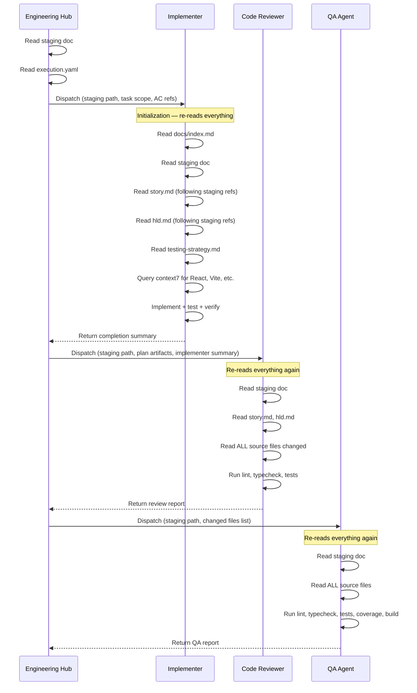

# P2: Context Management & Memory Architecture

**Status:** Agreed — implemented
**Relates to:** [P1 (Ceremony Scaling)](./P1-ceremony-scaling-and-scaffolding.md), [P4 (Documentation Lookup)](./P4-documentation-lookup-strategy.md)
**Scope:** `opencode/.opencode/agents/sdlc-engineering.md` (dispatch protocol), `opencode/.opencode/agents/sdlc-engineering-implementer.md` (initialization), `opencode/.opencode/agents/sdlc-engineering-code-reviewer.md` (initialization), staging document template, new task context document infrastructure
**Transcript evidence:** `ses_278b8ce55ffeKxlkK4NQaSyTHd` — 357 file reads, 33.6M cache-read tokens, same files read 10-20+ times across subagent sessions. `src/app/app.tsx` (19 lines) referenced 340 times.
**Implementation:** 2026-04-16

---

## 1. Problem Statement

Every subagent dispatch starts from near-zero context. Each implementer, reviewer, and QA agent re-reads the same plan artifacts, source files, and staging document. With 19 dispatches in a single story, this creates massive redundant I/O:

| What gets re-read | Times read | Size | Wasted tokens |
|-------------------|-----------|------|---------------|
| story.md, hld.md, testing-strategy.md | ~15x (each dispatch) | ~200 lines each | ~150K |
| staging doc (US-001-scaffolding.md) | ~19x | grows to ~200 lines | ~100K |
| Source files (app.tsx, routes.tsx, main.tsx, etc.) | 10-20x each | 19-116 lines each | ~200K |
| Skill files (architect-execution-hub, etc.) | ~10x | varies | ~100K |
| context7 results (React, Vite, Playwright docs) | re-queried per dispatch | large chunks | ~300K |

The staging document was designed to be the single source of truth, but it functions as an **index** (pointers to plan files by path and line range) rather than a **cache** (actual content). Every agent follows the pointers and re-reads the originals.

---

## 2. Current Context Flow



---

## 3. Proposed Solutions

### 3.1 Plan Context Cache (Materialized in Staging Doc)

**Status: Superseded by 3.4 (implemented as per-task context documents)**

The concern raised during discussion: materializing plan content into the staging doc risks summarization loss, and line-range reading instructions are not reliable (agents read entire files regardless). The solution adopted is verbatim extraction into per-task context docs (3.4), which is strictly superior — see 3.4 for the implemented approach.

**What:** After Phase 1 (context gathering + staging doc creation), the hub writes a `## Materialized Plan Context` section into the staging document that contains **verbatim excerpts** of every plan artifact relevant to this story. Not pointers — actual content.

**Contents:**
- Acceptance criteria (copied from story.md)
- Relevant HLD design units (copied from hld.md)
- API contracts if applicable (copied from api.md)
- Security controls if applicable (copied from security.md)
- Testing thresholds and AC traceability (copied from testing-strategy.md)
- Tech stack and external library list

**Who writes it:** The engineering hub during Phase 1b. This is a one-time materialization that subsequent agents read instead of following reference links.

**Who updates it:** Nobody. Plan artifacts are immutable during execution. If the plan changes, the story re-enters planning.

**Trade-off analysis:**
- PRO: Eliminates ~15 redundant file reads per story (plan artifacts across all dispatches).
- PRO: Zero new infrastructure — just a section in an existing file.
- PRO: Agents can trust it because the hub (higher-capability model) wrote it.
- CON: Increases staging doc size by ~200-400 lines.
- CON: If plan artifacts are ever updated mid-execution (unusual but possible), the cache is stale.
- CON: Does not solve source code re-reading (code changes between dispatches).

**Changes required:**
- `sdlc-engineering.md` Phase 1b: Add materialization step after recording plan references.
- `common-skills/project-documentation/references/staging-doc-template.md`: Add `## Materialized Plan Context` section template.
- `sdlc-engineering-implementer.md` initialization: Change step 2b from "Follow Plan References to read story.md, hld.md..." to "Read Materialized Plan Context section. Only follow original references if the section is missing or a specific detail is needed beyond what's materialized."
- `sdlc-engineering-code-reviewer.md` initialization: Same change — read materialized context first.
- `sdlc-engineering-qa.md` initialization: Same change.

### 3.2 Inline Code in Dispatch Messages

**What:** When the hub dispatches a reviewer or QA agent, it includes the **current contents** of all task-relevant files inline in the dispatch message body. Small files (<150 lines) go in verbatim. Larger files get the relevant sections with line ranges.

**Mechanism:** The hub already reads source files to prepare the dispatch. Instead of saying "review files: src/app/app.tsx, src/main.tsx, src/app/routes.tsx", it says:

```
## Source Files (current state)

### src/app/app.tsx
\`\`\`tsx
import type { ReactElement } from 'react';
// ... full file contents ...
\`\`\`

### src/main.tsx
\`\`\`tsx
// ... full file contents ...
\`\`\`
```

**Trade-off analysis:**
- PRO: Eliminates the reviewer's 6-10 file reads per dispatch.
- PRO: Guarantees the reviewer sees the exact state the hub intended (no race conditions).
- CON: Makes dispatch messages larger (but these are small files — 19-116 lines each).
- CON: For large files (>300 lines), this bloats the dispatch. Need a size threshold.
- CON: Adds hub-side logic to read and embed files before dispatch.

**Changes required:**
- `sdlc-engineering.md` dispatch protocol: Add step to read and inline source files in reviewer/QA dispatch messages.
- `sdlc-engineering-code-reviewer.md`: Update initialization to use inline code from dispatch first, only read files from disk if not provided or if checking for additional files.
- `sdlc-engineering-qa.md`: Same change.
- `common-skills/architect-execution-hub/`: Update dispatch templates to include inline source section.

### 3.3 Task-Scoped Library Context (Bridges to P4)

**What:** After the first implementer dispatch queries context7/Tavily, it writes a `## Library Context (Task N)` section to the staging doc with summarized findings. Re-dispatches of the implementer (after review remediation) read this section and skip re-querying.

**Detail:** See [P4 (Documentation Lookup Strategy)](./P4-documentation-lookup-strategy.md) for full specification of the context7 caching mechanism.

### 3.4 Context Document per Task (More Aggressive Option)

**Status: Agreed — implemented**

Chosen approach. Key decisions from discussion:
- **Verbatim extraction, not summarization:** The hub performs a "linker" role, copying exact lines from planning artifacts (which are produced by higher-capability models). No content is paraphrased.
- **Per-task files:** `docs/staging/US-NNN-name.task-N.context.md` — one per task, not one per story, to bound context doc size.
- **Staging doc remains execution journal only:** Status tracking, technical decisions, issues/resolutions. Plan content moves to context docs entirely.
- **Task-size gate:** Soft limit ~600 lines total, hard limit ~800 lines — triggers task splitting before dispatch. Hub logs `context_doc_lines` per dispatch for empirical threshold tuning.
- **Design references included:** Context doc includes paths/links to mockups, wireframes, component specs, and Figma links for UI tasks.
- **Changes-only response (7.4):** Implementer returns `CHANGES APPLIED` structured section enabling the hub to update the context doc without re-reading all source files.
- **QA reads disk:** QA uses context doc for plan context (AC, testing requirements) only. QA always reads source files fresh from disk for independent verification.

The CON "Agents may still read original files if they don't trust the context doc" is mitigated by the dispatch instructions explicitly forbidding reading plan artifacts directly when a context doc is present.

**What:** Instead of growing the staging doc with materialized context, create a companion file `docs/staging/US-001-scaffolding.task-N.context.md` that serves as the complete execution context for the current task. Updated by the hub before each dispatch.

**Contents:**
- Verbatim acceptance criteria (from story.md, exact lines)
- Verbatim design specification (from hld.md, relevant DU/IU sections)
- Verbatim API contract (from api.md, if applicable)
- Verbatim security controls (from security.md, if applicable)
- Design references (paths/URLs to mockups, wireframes, Figma)
- Testing requirements (AC traceability table, coverage thresholds)
- Current source file contents for the active task's files (hub-updated before dispatch)
- Library context summaries from context7 (same as 3.3, populated after first dispatch)
- Previous review findings verbatim (on re-dispatch)

**Implemented in:**
- `common-skills/project-documentation/references/task-context-template.md` — template for hub to fill
- `common-skills/project-documentation/references/staging-doc-template.md` — updated to clarify role boundary
- `opencode/.opencode/agents/sdlc-engineering.md` — Phase 1b creates context docs; Phase 2 updates before dispatch
- `common-skills/architect-execution-hub/references/implementer-dispatch-template.md` — REQUIRED CONTEXT and CHANGES APPLIED
- `common-skills/architect-execution-hub/references/reviewer-dispatch-template.md` — TASK CONTEXT DOCUMENT section
- `common-skills/architect-execution-hub/references/qa-dispatch-template.md` — TASK CONTEXT DOCUMENT (plan context only)
- `opencode/.opencode/agents/sdlc-engineering-implementer.md` — reads context doc first
- `opencode/.opencode/agents/sdlc-engineering-code-reviewer.md` — reads context doc first

---

## 4. Evaluation of External Memory Tools

### 4.1 Obsidian (Markdown Knowledge Graph)

**Assessment: Not suitable for this problem.**

Obsidian's value is `[[wikilinks]]` and graph visualization — these are human UX features. For an LLM agent, a markdown file with `[[links]]` is functionally identical to a markdown file with `[links](path)`. Obsidian doesn't provide semantic search, doesn't manage context windows, and doesn't solve the re-reading problem. The agent would still need to follow links and read files.

**Verdict:** No advantage over the current file-based approach. Skip.

### 4.2 GraphRAG (Microsoft)

**Assessment: Overkill, wrong access pattern.**

GraphRAG excels at entity extraction and relationship queries over large document corpora ("what are all security requirements affecting US-001 across 50 plan files?"). It's designed for read-heavy, write-light scenarios.

The current problem is the opposite: small number of documents (~10 files) that change frequently during execution. Building and updating a knowledge graph per task iteration would cost more tokens than it saves. The entity extraction step alone would consume significant compute.

**Potential future use:** When the project grows to 50+ stories with cross-story dependencies, GraphRAG could help the coordinator and planning hub reason about system-wide impacts. Not useful at the execution level.

**Verdict:** Wrong tool for the current problem. Revisit when cross-story reasoning becomes a bottleneck.

### 4.3 Cognee (https://github.com/topoteretes/cognee)

**Assessment: Interesting but premature.**

Cognee provides structured memory management with multiple memory types (episodic, semantic, procedural). Its graph-based storage could theoretically maintain execution context across subagent sessions.

**Concerns:**
- Adds an external service dependency. If cognee is down or slow, the SDLC pipeline breaks.
- Latency per memory read/write adds to each dispatch.
- The problem being solved (20 agents reading 10 small files) has simpler solutions.
- Integration effort is significant — every agent needs cognee client code, memory schemas need design, and the hub needs memory lifecycle management.

**Potential future use:** If the SDLC system scales to handle dozens of concurrent stories with shared context requirements, a memory service could provide cross-session state that files cannot. The "procedural memory" concept (learned patterns from past executions) is particularly interesting — e.g., "the last 3 PWA scaffolds all hit the Vitest CSS transform issue, so preemptively use readFileSync."

**Verdict:** Monitor but don't adopt now. The file-based solutions (3.1, 3.2, 3.3) address the immediate problem. Revisit cognee when cross-session and cross-story memory becomes a clear bottleneck.

---

## 5. Implementation Summary

After discussion, the decision was to skip 3.1 (materialized staging doc) and 3.2 (inline code in dispatches) in favor of 3.4 (per-task context documents), which strictly supersedes both:

- **3.4 implemented (2026-04-16):** Per-task context docs created at Phase 1b, updated by hub before each dispatch. Implementer and reviewer read context doc first; QA reads context doc for plan context only, disk for source files.
- **3.3 foundation built:** Context doc includes a "Library Documentation Cache" section — hub populates it from implementer's `context7 Lookups`. Full P4 integration follows the P4 proposal.
- **3.1 superseded:** Context docs contain verbatim plan excerpts. Staging doc is execution journal only.
- **3.2 superseded:** Source files are in context doc (hub-updated before each dispatch). Reviewer reads from context doc rather than independently re-reading changed files.
- **External memory tools (4.x):** Deferred. Reassess after measuring impact of 3.4 in production.

---

## 6. Expected Impact

| Solution | Estimated token savings per story | Implementation effort |
|----------|-----------------------------------|----------------------|
| Plan Context Cache (3.1) | ~150K input tokens (plan re-reads) | Low — staging doc template + agent init changes |
| Inline Code in Dispatch (3.2) | ~200K input tokens (source re-reads) | Medium — hub dispatch logic + agent init changes |
| Library Context Cache (3.3) | ~300K input tokens (context7 re-queries) | Medium — staging doc section + implementer changes |
| Combined 3.1 + 3.2 + 3.3 | ~650K input tokens (~45% reduction) | Medium overall |

---

## 7. Open Questions — Resolved

1. **Size threshold for inline code in dispatches.** Agreed: files <150 lines verbatim in Source Files section of context doc; files ≥150 lines include only relevant sections with surrounding context. Total context doc size governs task splitting (soft ~600 lines, hard ~800 lines), not individual section limits. Hub logs `context_doc_lines` per dispatch to enable empirical threshold tuning.

2. **Should the QA agent trust inline code from the dispatch, or always re-read from disk?** Agreed: QA reads from disk. QA's value is independent verification — using cached source files would compromise that independence. QA uses the context doc only for plan context (acceptance criteria, testing requirements). This is a conscious trade-off: QA retains some redundant reads, but maintains verification integrity.

3. **Hub token overhead.** Resolved: Yes, net win. Hub (gpt-5.3-codex) reads source files once and updates the context doc. This replaces 3+ independent reads per dispatch cycle by implementer, reviewer, and QA. For a 4-task story with 2 review cycles each, the hub spends ~20 additional file reads total but eliminates ~60+ redundant subagent reads.

4. **Staleness detection.** Agreed: implementer returns `CHANGES APPLIED` structured section in every completion contract. Hub parses this to update context doc without re-reading all files — only re-reads files where the before/after snippet is ambiguous or absent. In diagnostic scenarios (3+ identical review rejections), the hub reads from disk directly for ground-truth analysis. Hub also refreshes source files in context doc before every implementer re-dispatch as part of the standard update step.
