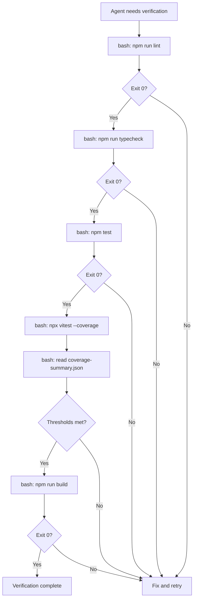

# P3: Verification Pipeline & Command Batching

**Status:** Implemented — decisions recorded, files created/modified
**Relates to:** [P1 (Ceremony Scaling)](./P1-ceremony-scaling-and-scaffolding.md), [P5 (Testing Strategy)](./P5-testing-strategy-scaffold-verification.md)
**Scope:** `opencode/.opencode/agents/sdlc-engineering-implementer.md`, `opencode/.opencode/agents/sdlc-engineering-qa.md`, `common-skills/verification-before-completion/`, scaffolding skill, project-level `Makefile` or verification script
**Transcript evidence:** `ses_278b8ce55ffeKxlkK4NQaSyTHd` — ~100 `npm run typecheck` calls, ~120 `npm run lint` calls, ~318 total bash commands. Each verification gate run as a separate bash invocation.

---

## 1. Problem Statement

The verification pipeline (lint, typecheck, test, coverage, build) is run by every agent role independently, as separate sequential bash commands. In the transcript:

- **Implementer:** runs lint, typecheck, test, coverage, build (5 bash calls)
- **Code Reviewer:** runs lint, typecheck, test (3 bash calls)
- **QA Agent:** runs lint, typecheck, test, coverage, build (5 bash calls)
- **Story Reviewer:** runs lint, typecheck, test (3 bash calls)
- **Story QA:** runs lint, typecheck, test, coverage, build (5 bash calls)
- **Acceptance Validator:** runs build, test (2 bash calls)

Per task: ~23 bash calls for verification alone. Across 4 tasks + story-level phases: **~100+ verification runs**.

Each bash call is a separate tool invocation with input/output token overhead, shell startup time, and reasoning tokens deciding what to run next. The commands themselves execute in <1 second each.

---

## 2. Current Verification Flow



Each box is a separate bash tool call with full round-trip overhead. The agent reasons about each result individually before deciding to proceed.

---

---

## Implementation Decisions (recorded after discussion)

### Silent Verification (key optimization beyond original proposal)

**Decision:** All verification scripts use silent output — each gate's stdout/stderr is captured internally and only printed on failure. On success, the script prints a single `=== ALL GATES PASSED ===` line and exits 0.

This reduces the token cost of a passing verification from ~500 tokens (full verbose output) to ~10 tokens (one line). Compounded across all roles (implementer, reviewer, QA), this brings per-story verification token overhead from ~48,000 tokens down to ~1,360 tokens.

### Script Structure

**Decision:** `scripts/verify.sh` + npm scripts (`verify:full`, `verify:quick`) for JS/TS. Makefile targets for Python (no package.json). Script is generated during Phase 0b scaffolding.

```bash
#!/usr/bin/env bash
set -euo pipefail

TIER="${1:-full}"

run_gate() {
  local name="$1"; shift
  local output
  if output=$("$@" 2>&1); then
    return 0
  else
    echo "=== ${name} FAILED ==="
    echo "$output"
    exit 1
  fi
}

run_gate "LINT"       pnpm lint
run_gate "TYPECHECK"  pnpm typecheck

if [ "$TIER" = "full" ]; then
  run_gate "TEST"  pnpm exec vitest run --coverage
  run_gate "BUILD" pnpm build
else
  run_gate "TEST"  pnpm test
fi

echo "=== ALL GATES PASSED ==="
```

- `verify:full` runs lint + typecheck + vitest (with coverage, enforcing `vitest.config.ts` thresholds) + build
- `verify:quick` runs lint + typecheck + test (no coverage, no build)
- No double test run: full tier uses `vitest run --coverage` instead of a separate test + coverage step

### Coverage Thresholds

**Decision:** Enforced via vitest's `coverage.thresholds` config in `vitest.config.ts`. A passing `verify:full` already confirms thresholds were met — no JSON parsing in the script or hub. Thresholds are NOT set during scaffold (scaffold smoke tests don't cover business logic); they are set as part of the first feature story.

### Hub Role Separation

**Decision:**
- **Hub as orchestrator (normal flow):** Structural gates only — `git diff --stat` (did files change?) and test file glob (do tests exist?). Hub does NOT run verification commands.
- **Hub C2b (coverage gate) removed:** Coverage is now enforced by `verify:full` at the implementer level and confirmed independently by QA.
- **Hub as self-implementer (escalation):** When the hub self-implements code (Diagnostic Analysis at iteration 3+, hard ceiling at 5, or post-Oracle fix), it runs `npm run verify:full` after editing — same as any implementer.

### Reviewer/QA Independence Preserved

**Decision:** Reviewer runs `verify:quick` (silent), QA runs `verify:full` (silent). The token cost is negligible (~50 tokens each on success), so independent verification is kept. The independence principle remains — prior agents' results are not trusted.

### E2E / Browser Verification

**Decision:** Kept separate from `verify:full` / `verify:quick`. Remains a conditional gate triggered by `BROWSER VERIFICATION` dispatch flag. E2E tests are slower and require browser infrastructure — they are not part of the standard verification tiers.

---

## 3. Proposed Solutions

### 3.1 Unified Verification Script

Create a single verification script that runs all gates and produces a structured output. Agents call it once instead of 5+ times.

**Location:** Generated as part of scaffolding (see [P1](./P1-ceremony-scaling-and-scaffolding.md)), or provided as a skill reference template.

**Implementation — Makefile approach:**

```makefile
.PHONY: verify verify-quick

# Full verification (implementer self-check, QA)
verify:
	@echo "=== LINT ===" && npm run lint && \
	echo "=== TYPECHECK ===" && npm run typecheck && \
	echo "=== TEST ===" && npm test && \
	echo "=== COVERAGE ===" && npx vitest run --coverage --coverage.reporter=json-summary && \
	echo "=== BUILD ===" && npm run build && \
	echo "=== ALL GATES PASSED ==="

# Quick verification (reviewer — no build, no coverage)
verify-quick:
	@echo "=== LINT ===" && npm run lint && \
	echo "=== TYPECHECK ===" && npm run typecheck && \
	echo "=== TEST ===" && npm test && \
	echo "=== ALL QUICK GATES PASSED ==="
```

**Alternative — npm script approach (no Makefile dependency):**

```json
{
  "scripts": {
    "verify": "npm run lint && npm run typecheck && npm test && npm run build",
    "verify:full": "npm run lint && npm run typecheck && npx vitest run --coverage --coverage.reporter=json-summary && npm run build",
    "verify:quick": "npm run lint && npm run typecheck && npm test"
  }
}
```

**Trade-off: Makefile vs npm scripts:**
- Makefile: More flexible, supports targets with dependencies, works across any language ecosystem. But adds a tool dependency and a file to maintain.
- npm scripts: Zero additional dependencies, already in the project, but limited to JS/TS projects and can't express target dependencies.
- **Recommendation:** Use npm scripts for JS/TS projects (most common case). Add Makefile guidance to the scaffolding skill for polyglot projects.

### 3.2 Verification Tiers

Not all agents need the same verification depth. Define tiers that agents call based on their role:

| Tier | Commands | Used by | npm script |
|------|----------|---------|------------|
| **Full** | lint + typecheck + test + coverage + build | Implementer (final check), QA | `npm run verify:full` |
| **Standard** | lint + typecheck + test + build | Implementer (mid-work check) | `npm run verify` |
| **Quick** | lint + typecheck + test | Code Reviewer | `npm run verify:quick` |
| **Build-only** | build | Acceptance Validator (if tests already passed) | `npm run build` |

**Changes required:**
- `sdlc-engineering-implementer.md` Self-Verification section: Replace 5 sequential bash calls with single `npm run verify:full`.
- `sdlc-engineering-code-reviewer.md` automated checks: Replace 3 sequential bash calls with single `npm run verify:quick`.
- `sdlc-engineering-qa.md` verification: Replace 5 sequential bash calls with single `npm run verify:full`.
- Scaffolding skill checklist: Include verification scripts in scaffold output.
- `common-skills/verification-before-completion/SKILL.md`: Update to reference verification tiers.

### 3.3 Verification Result Passing

When the implementer runs `verify:full` and all gates pass, the hub should include the verification results in the reviewer/QA dispatch. This allows downstream agents to **skip re-running gates that haven't changed** and focus on their actual role.

**Mechanism:** The implementer's completion summary already includes verification outputs. The hub should propagate these:

```
## Prior Verification Results (from implementer)
- lint: PASS (exit 0)
- typecheck: PASS (exit 0)  
- test: 15 passed, 0 failed (exit 0)
- coverage: lines 100%, branches 100%, functions 100%
- build: exit 0, 30 modules, 197KB gzip

## Reviewer Guidance
If you find no code issues, you may trust the prior verification.
If you request changes, the implementer will re-verify after remediation.
Re-run verification only if you suspect the prior results are invalid.
```

**Trade-off analysis:**
- PRO: Eliminates ~60% of redundant verification runs.
- CON: Reviewer/QA must trust implementer's self-reported results. This partially undermines the independence principle.
- **Compromise:** Reviewer runs `verify:quick` (fast, catches regressions). QA always runs `verify:full` (it's the independent verification gate). But both use a single command, not 5 sequential calls.

### 3.4 Dedicated Scaffolding Agent Consideration

The user raised the idea of a dedicated scaffolding agent (not just a skill). Analysis:

**Arguments for:**
- Could have deeply specialized templates and checklists for every project type.
- Would always include verification scripts in scaffold output.
- Could maintain a library of known-working project configurations.
- Single purpose = less prompt overhead (no SDLC ceremony instructions).

**Arguments against:**
- Scaffolding happens once per project. A dedicated agent amortizes its maintenance cost over very few invocations.
- The existing implementer + scaffolding skill combination can achieve the same result with less infrastructure.
- A dedicated agent needs its own dispatch protocol, completion contract, and hub integration — overhead for a narrow use case.
- Templates embedded in an agent become stale just like templates in a skill file. The maintenance burden doesn't disappear.

**Recommended compromise:**
- **Don't create a dedicated agent.** Instead, create an enriched scaffolding skill that the implementer loads for Phase 0b.
- **The skill should include verification script templates** (Makefile or npm scripts) that get installed during scaffolding.
- **The skill should include per-stack checklists** (see [P1](./P1-ceremony-scaling-and-scaffolding.md) Section 3.1).
- If scaffolding frequency increases significantly (e.g., a microservices architecture generating new services regularly), revisit the dedicated agent decision.

---

## 4. Affected Agents and Skills (as implemented)

| File | Change Type | Description |
|------|-------------|-------------|
| `sdlc-engineering-implementer.md` | Modified | Self-Verification: use `npm run verify:full` single silent command; completion contract updated to compact evidence format |
| `sdlc-engineering-code-reviewer.md` | Modified | Automated checks: use `npm run verify:quick` single silent command |
| `sdlc-engineering-qa.md` | Modified | Phase 3 + coverage check: use `npm run verify:full` single silent command |
| `sdlc-engineering.md` | Modified | Removed C2b coverage gate; added `verify:full` to self-implementation escalation paths (Diagnostic Analysis, hard ceiling, Oracle fix) |
| `sdlc-engineering-scaffolder.md` | Modified | Self-verification and implementer dispatch: require `scripts/verify.sh` + npm scripts; use `npm run verify:full` in self-implementation fallback |
| `sdlc-engineering-scaffold-reviewer.md` | Modified | Phase 2 gate suite: use `npm run verify:full`; check verify scripts exist as checklist item; updated completion contract gate table |
| `common-skills/verification-before-completion/SKILL.md` | Modified | Added Verification Tiers section (full/quick), silent mode guidance, updated common failures table and rationalization prevention |
| `common-skills/scaffold-project/SKILL.md` | Modified | Step 5: added verify script generation; Step 7: updated verification bash block to use `npm run verify:full` |
| `common-skills/scaffold-project/references/react-vite.md` | Modified | Added Verification Scripts section with full `scripts/verify.sh` template and npm scripts; updated Verification Gate |
| `common-skills/scaffold-project/references/nextjs.md` | Modified | Added Verification Scripts section (references react-vite template); updated Verification Gate |
| `common-skills/scaffold-project/references/pwa.md` | Modified | Added Verification Scripts section (extends react-vite); updated Verification Gate |
| `common-skills/scaffold-project/references/react-native.md` | Modified | Added Verification Scripts section with Jest-based `scripts/verify.sh` template; updated Verification Gate |
| `common-skills/scaffold-project/references/python-uv.md` | Modified | Added Verification Scripts section with Python (ruff/mypy/pytest) `scripts/verify.sh` template + Makefile targets; updated Verification Gate |
| `common-skills/scaffold-project/references/monorepo.md` | Modified | Added Verification Scripts section with Turborepo-based `scripts/verify.sh` template; updated Verification Gate |
| `common-skills/architect-execution-hub/references/reviewer-dispatch-template.md` | Modified | Verification note updated to reference `verify:quick` |
| `common-skills/architect-execution-hub/references/qa-dispatch-template.md` | Modified | COVERAGE EXPECTATIONS updated; added QUALITY GATE block referencing `verify:full` |

---

## 5. Expected Impact

| Metric | Before | After | Reduction |
|--------|--------|-------|-----------|
| Bash calls per task (verification) | ~23 | ~4 (1 verify:full + 1 verify:quick + 2 hub structural) | ~83% |
| Bash calls per story (4 tasks) | ~100+ | ~16 | ~84% |
| Token overhead per verification (pass) | ~500 tokens × 23 = ~11,500 | ~50 × 2 + ~20 × 2 = ~140 | ~99% |
| Token overhead per story (4 tasks) | ~48,000 | ~560 | ~99% |
| Reasoning tokens (deciding next command) | ~200 per decision × 20 = ~4K | ~200 × 2 = ~400 | ~90% |

The dominant saving is silent output: a passing verification produces 1 line (~10 tokens) instead of 200+ lines (~500 tokens). This compounds across all roles and all tasks.

Hub C2b removal eliminates one additional verbose bash call per task (~500 tokens, full test suite output).

---

## 6. Open Questions — All Resolved

1. **Should `verify:full` fail fast or run all gates?** **Resolved: Fail-fast.** The `scripts/verify.sh` script uses `run_gate()` which exits immediately on the first failure, printing only that gate's output. No cascading noise.

2. **E2E tests in the verification pipeline?** **Resolved: Separate.** E2E / browser verification remains a conditional gate triggered by `BROWSER VERIFICATION` dispatch flags. It is not part of `verify:full` or `verify:quick`. This keeps the standard tiers fast and infrastructure-independent.

3. **Should the scaffolding install a `Makefile` or npm scripts?** **Resolved: npm scripts + `scripts/verify.sh` for JS/TS; Makefile + `scripts/verify.sh` for Python.** Python has no `package.json`, so Makefile provides `make verify-full` and `make verify-quick` targets that call the same shell script.

4. **Should the hub run a verification gate before dispatching reviewer?** **Resolved: No (structural gates only).** The hub is an orchestrator, not a verifier. It runs `git diff --stat` and test file glob (structural gates). The C2b coverage gate was removed — coverage is enforced inside `verify:full` via vitest thresholds. Exception: when the hub self-implements code (escalation path), it runs `npm run verify:full` as any implementer would.

5. **Section 3.4 (dedicated scaffolding agent).** **Resolved by P1 implementation.** `sdlc-engineering-scaffolder` mini-hub was created in the P1 commit (`f2a6288`). See P1 proposal for architecture details.
