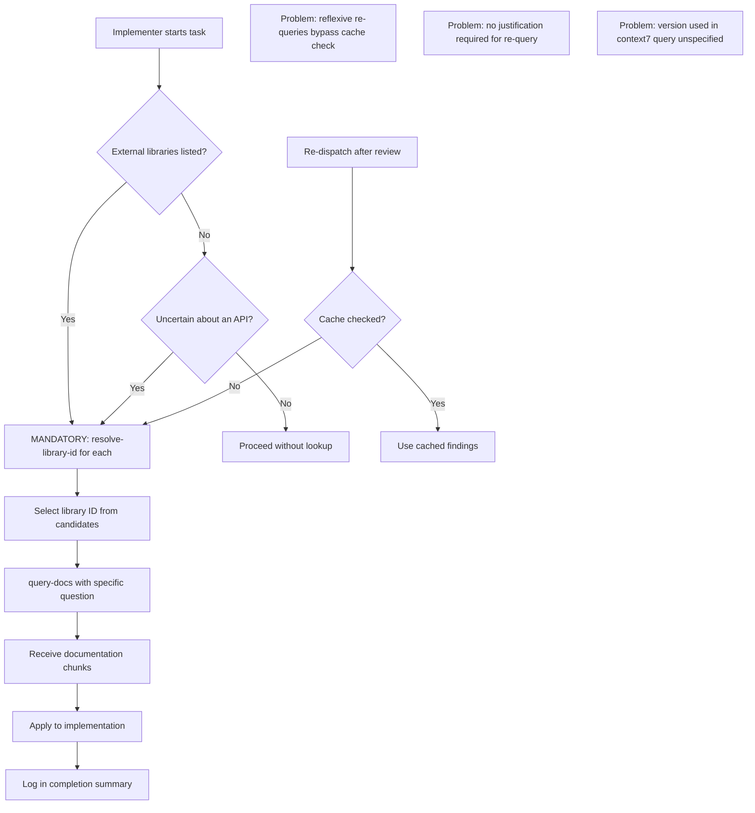
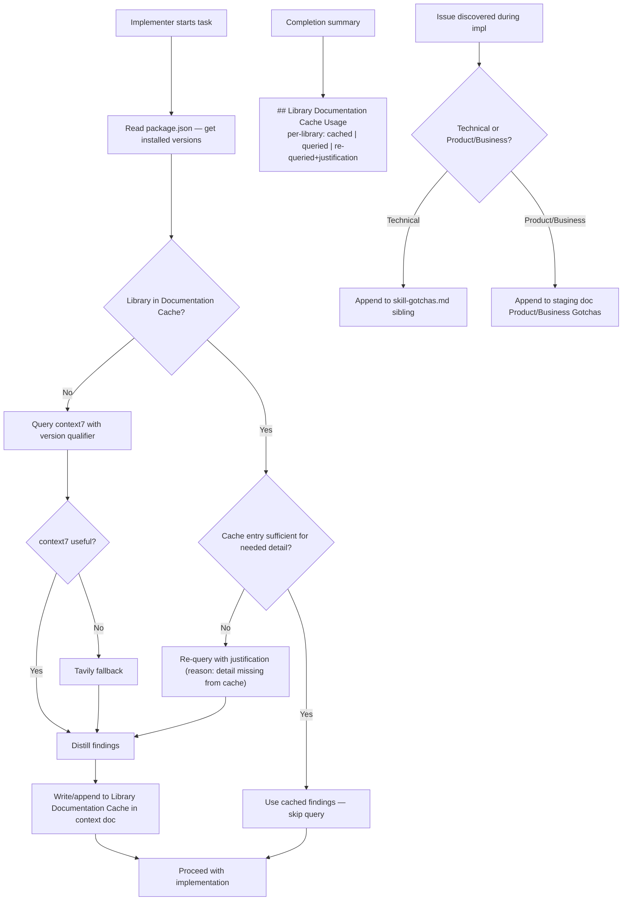

# P4: Documentation Lookup Strategy (context7 / Tavily)

**Status:** Resolved — cache protocol strengthened, gotcha classification added
**Relates to:** [P1 (Ceremony Scaling)](./P1-ceremony-scaling-and-scaffolding.md), [P2 (Context Management)](./P2-context-management-and-memory.md)
**Scope:** `opencode/.opencode/agents/sdlc-engineering-implementer.md` (documentation search section), `opencode/.opencode/agents/sdlc-engineering-code-reviewer.md` (documentation search recommendations), `opencode/.opencode/agents/sdlc-engineering.md` (hub cache propagation + staging file creation), `opencode/.opencode/agents/sdlc-engineering-documentation-writer.md` (gotcha consolidation), `common-skills/project-documentation/references/staging-doc-template.md`, `common-skills/project-documentation/references/task-context-template.md`, new `common-skills/project-documentation/references/skill-gotchas-template.md`
**Transcript evidence:** `ses_278b8ce55ffeKxlkK4NQaSyTHd` — 44 context7 calls (20 resolve-library-id + 21 query-docs + 3 others), 4 tavily calls. Multiple re-queries for the same libraries across dispatch boundaries.

---

## 0. Current Status

### What P1 and P2 already resolved

**Re-query elimination on re-dispatch (the biggest token cost).**
P2's per-task context document includes a `## Library Documentation Cache` section. The hub populates it from the implementer's `context7 Lookups` after the first dispatch, and the implementer is instructed to read that cache before querying context7/Tavily:

```
implementer (Documentation Search section):
"Library Documentation Cache (check first): Before querying context7 or Tavily, check
 the context document's Library Documentation Cache section. If the library is already
 documented there (populated from a prior dispatch), use those findings and skip re-querying."
```

This eliminates the transcript's worst pattern: 20+ `resolve-library-id` calls on the same libraries across re-dispatch boundaries.

**Cross-library interaction gotchas (failure mode that documentation cannot solve).**
P1 added a `## Known Gotchas` section to every per-stack scaffold reference file (`react-vite.md`, `pwa.md`, `nextjs.md`, `react-native.md`, `python-uv.md`, `monorepo.md`). The scaffolder dispatches these proactively as `KNOWN GOTCHAS TO PREVENT`, so the Vitest CSS transform issue, `dev-dist/` coverage contamination, PWA icon requirements, and path alias mismatches never reach the compile-fix-compile loop during scaffolding.

**DOCUMENTATION SEARCH directive propagation.**
Unchanged from before — the reviewer emits it, the hub propagates it, the implementer executes it. This was already working pre-P1.

### What this revision addresses

1. **Justification-required re-query protocol.** The "check first" instruction existed but was unenforced. Added: any re-query of an already-cached library requires a recorded justification. Missing justification = completion contract violation.

2. **Version pinning.** Resolved as a standing rule (see section 3, Resolved Items).

3. **Gotcha feedback loop.** Replaced the "static gotchas" model with a live classification directive: technical gotchas go to a sibling staging file for post-run human review; product/business gotchas go to the main staging doc for documentation-writer consolidation.

### Items closed as not worth implementing

- **Standard Library Whitelist.** Dropped. Correctness risk outweighs first-dispatch token savings. If `vitest`'s hoisting rules change or React's major version shifts API surface, the agent ships wrong code with no documentation to catch it. The cache already amortizes lookup cost across re-dispatches — the only irreducible cost is first-dispatch per story, which is bounded and acceptable.
- **Tavily-first routing for cross-library queries.** Dropped. No evidence from the transcript that the current fallback order (context7 primary, Tavily fallback) produced wrong answers. Premature optimization.

---

## 1. Problem Statement

The documentation lookup system has two opposing failure modes:

**Failure mode A: No lookup, stupid mistakes.** When context7 was optional/recommended, agents skipped lookups and made avoidable API errors (wrong function signatures, missing required parameters, deprecated patterns). This caused multi-cycle remediation.

**Failure mode B: Mandatory lookup, massive waste.** When context7 was made mandatory, agents queried documentation for standard boilerplate that any model knows from training data (React `createRoot`, Vite `defineConfig`). Each query involves a resolve-library-id call (selecting from 5+ candidates) followed by a query-docs call (returning large documentation chunks). Across 19 dispatches, the same libraries were re-queried by different subagent sessions.

A third, subtler failure mode:

**Failure mode C: Cache exists but is bypassed.** The implementer re-queries context7 for a library that already has a cache entry — either reflexively, without checking, or because the cached summary was too thin to answer the specific question. Without a justification requirement, there is no signal to improve weak cache entries or to detect reflex re-queries.

The transcript shows all three:
- The implementer correctly used context7 for `vite-plugin-pwa` manifest icon requirements (useful — this is version-specific knowledge).
- The implementer also used context7 to learn how to write `createRoot(document.getElementById('root')).render(<App />)` (wasteful — standard React boilerplate).
- When context7 returned correct `?raw` documentation for Vite, the actual problem was a Vitest-specific CSS transform interaction that no documentation source covered.

---

## 2. Current Documentation Lookup Flow



---

## 3. Resolved Items

### 3.1 Cache-First Protocol with Justification-Required Re-query

**First dispatch for a task:**

1. Implementer reads `package.json` to get the installed major.minor for each library in `EXTERNAL LIBRARIES`.
2. Checks the `## Library Documentation Cache` section in the task context document.
3. If the library is documented there: use the cached findings. No context7 query.
4. If the library is NOT documented: query context7 with the installed version as the version qualifier (`resolve-library-id` with version hint, then `query-docs`). If context7 returns no useful results, fall back to Tavily. Write distilled findings + source URL + version into the cache entry.

**Re-dispatch (after review remediation):**

1. Read the `## Library Documentation Cache` from the task context doc.
2. A context7/Tavily query is permitted ONLY IF:
   - (a) The library is not in the cache at all, OR
   - (b) The cached summary is missing the specific API detail needed to resolve the review finding, OR
   - (c) The reviewer/hub issued a `DOCUMENTATION SEARCH` directive for this library.
3. In all three cases: record the justification inline in the completion summary. Append findings to the cache entry.
4. Re-querying a cached library WITHOUT a recorded justification is a completion contract violation.

**Cache entry format (in the task context document):**

```markdown
## Library Documentation Cache

### vite-plugin-pwa (v1.2.0 — installed from package.json)
- Query: "manifest icon requirements for PWA installability"
- Key findings:
  - Chrome requires raster PNG icons at 192x192 and 512x512 for installability
  - Maskable icon recommended at 512x512 with `purpose: "any maskable"`
  - `registerType: 'autoUpdate'` for automatic service worker updates
  - `devOptions.enabled: true` for development-time PWA testing
- Source: docs/guide/pwa-minimal-requirements.md (via /vite-pwa/vite-plugin-pwa)

### @vitejs/plugin-basic-ssl (v1.2.0 — installed from package.json)
- Query: "basic SSL plugin for secure local development"
- Key findings:
  - Plugin enables HTTPS on localhost for browser APIs requiring secure context
  - No configuration required — `basicSsl()` in plugins array
- Source: docs/config/server-options.md (via /vitejs/vite)
```

**Completion summary requirement (`## Library Documentation Cache Usage`):**

For every library in `EXTERNAL LIBRARIES`, the implementer's completion summary must include one of:
- `cached (skipped re-query)` — cache had sufficient detail.
- `queried (first time) — cache updated` — no prior cache entry.
- `re-queried (justification: <reason>) — cache updated` — cache existed but was insufficient for a specific reason.

Missing `## Library Documentation Cache Usage` section = completion contract violation.

### 3.2 Version Pinning in context7 Queries (Resolved)

**Rule:** Before any `resolve-library-id` call, the implementer reads `package.json` (or `pyproject.toml`, `Cargo.toml`, as applicable) to get the installed version. The installed major.minor is passed as the version qualifier to `resolve-library-id`. The version is recorded in every cache entry.

**Why this is not optional:** The transcript showed context7 returning docs for multiple React versions. Without version pinning, an agent may implement against a newer API that is not installed, or against a deprecated one. The `package.json` read is a one-time cost per dispatch, not per library.

**Fallback:** If the library is not in `package.json` (peer dep, implicit dep), query without a version qualifier and record "version unknown — unspecified" in the cache entry. Flag as a low-confidence entry.

### 3.3 Gotcha Classification and Staged Feedback Loop

Cross-library interaction edge cases are discovered empirically and cannot be reliably queried from documentation. The transcript's CSS test failure (Vitest + Vite CSS transforms) is a canonical example: no documentation source covers "what happens when Library A processes a file before Library B's query suffix takes effect."

**Classification directive:**

When an implementer or reviewer discovers an issue whose root cause is an unexpected behavior (not a simple coding mistake), classify it:

- **Technical gotcha** — library/framework/language quirk, cross-library interaction, tooling edge case. Examples: Vitest CSS transform interaction, `dev-dist/` coverage contamination, path alias mismatch between Vite and TypeScript. Append to the sibling file `docs/staging/US-NNN-name.skill-gotchas.md` with fields:
  - `symptom`: what manifested (error message, test failure, unexpected output)
  - `root_cause`: the actual library or interaction responsible
  - `workaround`: the fix applied during this run
  - `suggested_skill_target`: which skill file this should be promoted to (e.g., `scaffold-project/references/react-vite.md`)
  - `discovered_in`: task ID and dispatch number

- **Product/business gotcha** — domain rule or business constraint discovered during implementation that was not in the plan. Append to the main staging doc under `### Product/Business Gotchas` with fields:
  - `domain_area`: which part of the domain this affects
  - `rule`: the constraint or invariant discovered
  - `resolution`: how it was handled
  - `suggested_doc_target`: which project doc this should be added to (e.g., `docs/domain/rules.md`)

**No automated promotion.** Agents write to these two locations only. They never modify skill files or permanent project docs during a story run. Post-run, the human reviews `skill-gotchas.md` alongside the run transcript and promotes entries into skill files manually. The documentation-writer consolidation pass reads only the `### Product/Business Gotchas` subsection from the main staging doc.

---

## 4. Changes Applied

| File | Change Type | Description |
| ---- | ----------- | ----------- |
| `opencode/.opencode/agents/sdlc-engineering-implementer.md` | Modified | Documentation Search section: version pinning, justification-required re-query, mandatory cache write-back, gotcha classification directive, two new completion summary sections |
| `opencode/.opencode/agents/sdlc-engineering-code-reviewer.md` | Modified | DOCUMENTATION SEARCH recommendation must include cache-insufficiency reason; GOTCHA CLASSIFICATION recommendation for cross-library/platform defects |
| `opencode/.opencode/agents/sdlc-engineering.md` | Modified | C1a cache-copy step: merge justified re-query entries back into context doc; re-dispatch protocol: propagate justifications; staging file creation: create `skill-gotchas.md` sibling alongside main staging doc |
| `opencode/.opencode/agents/sdlc-engineering-documentation-writer.md` | Modified | End-of-story consolidation: read Product/Business Gotchas from main staging doc; skill-gotchas sibling is not consolidation input |
| `common-skills/project-documentation/references/staging-doc-template.md` | Modified | Add sibling file link, Library Documentation Cache per task, Product/Business Gotchas subsection |
| `common-skills/project-documentation/references/skill-gotchas-template.md` | Created | Template for the sibling `US-NNN-name.skill-gotchas.md` file |
| `common-skills/project-documentation/references/task-context-template.md` | Modified | Library Documentation Cache entry format: version field + source URL field |

---

## 5. Revised Documentation Lookup Flow



---

## 6. Expected Impact

| Metric | Before | After |
| ------ | ------ | ----- |
| context7 calls per 4-task story (first dispatch) | ~12–16 (mandatory for all EXTERNAL LIBRARIES) | ~12–16 (unchanged — first dispatch always queries) |
| context7 calls on re-dispatch | Full re-query of all libraries | 0 for cached libraries; targeted query only with justification |
| Re-query traceability | None — no signal when cache is bypassed | Justification recorded; hub can detect and improve weak cache entries |
| Version mismatch in docs | Possible — context7 returns any version | Eliminated — installed version pinned in every query |
| Cross-library gotcha retention | Lost in free-form prose or never recorded | Captured in machine-readable sibling file for post-run human review |
| Product/business rule retention | Ad hoc | Structured subsection, consumed by documentation-writer at story end |

---

## 7. Open Questions

*(All prior open questions resolved or closed.)*

1. **Who maintains the standard library whitelist?** — Closed. Whitelist dropped; correctness risk exceeds savings.
2. **Raw vs. distilled findings in cache?** — Resolved: distilled findings with source URL and version. Raw snippets too large; the source pointer lets agents re-fetch if needed.
3. **Version pinning in context7 queries.** — Resolved (section 3.2).
4. **Tavily-first for cross-library queries.** — Closed. Current fallback order is working; no evidence of a problem.
