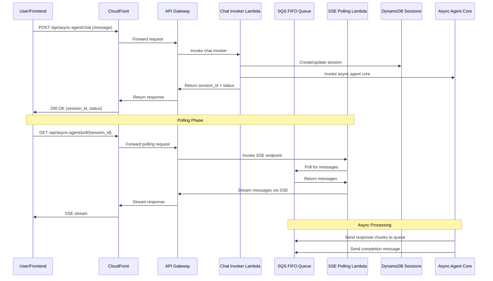

# SQS Polling Approach (Archived)

**Status**: ❌ **ABANDONED**  
**Date**: January 2025  
**Reason**: SQS FIFO MessageGroupId filtering limitations

## Overview

This document archives the original SQS polling approach that was designed for async chat processing. The approach was abandoned due to technical limitations in AWS SQS FIFO queues.

## Original Design

The SQS polling approach was designed to:
- Use SQS FIFO queues for message ordering
- Implement Server-Sent Events (SSE) for real-time updates
- Handle long-running agent operations asynchronously
- Maintain session-based message grouping

## Technical Limitations

### SQS FIFO MessageGroupId Filtering
**Issue**: Cannot filter messages by MessageGroupId in `receive_message` API
**Impact**: Cannot implement session-based message filtering
**Workaround**: Would require polling all messages and filtering client-side

### Polling Overhead
**Issue**: SSE polling creates unnecessary complexity
**Impact**: Higher latency and resource usage
**Alternative**: WebSocket bidirectional communication

## Original Architecture

## Original Implementation Files

### Design Documents
- `docs/specs/async-chat-polling/design.md` – Original SQS polling design
- `docs/specs/async-chat-polling/tasks.md` – Original SQS polling tasks

### Staging Documentation
- `docs/staging/T-047-chat-message-polling-with-async-agents.md` – Implementation progress

## Lessons Learned

1. **SQS FIFO Limitations**: MessageGroupId filtering not supported in receive_message
2. **Polling Complexity**: SSE polling creates unnecessary overhead
3. **Real-time Communication**: WebSocket approach provides better user experience
4. **AWS Service Research**: Always verify service limitations before implementation

## Migration to WebSocket

The SQS polling approach was successfully replaced with:
- AWS API Gateway WebSocket APIs
- Direct agent integration without message queuing
- Real-time bidirectional communication
- Simplified architecture with fewer moving parts

## References

- [WebSocket Implementation](../specs/async-chat-websocket/design.md)
- [WebSocket Tasks](../specs/async-chat-websocket/tasks.md)
- [WebSocket Staging](../staging/T-047-chat-message-polling-with-async-agents.md)

---

**Note**: This approach is archived for historical reference and learning purposes. The current implementation uses WebSocket-based real-time communication.
