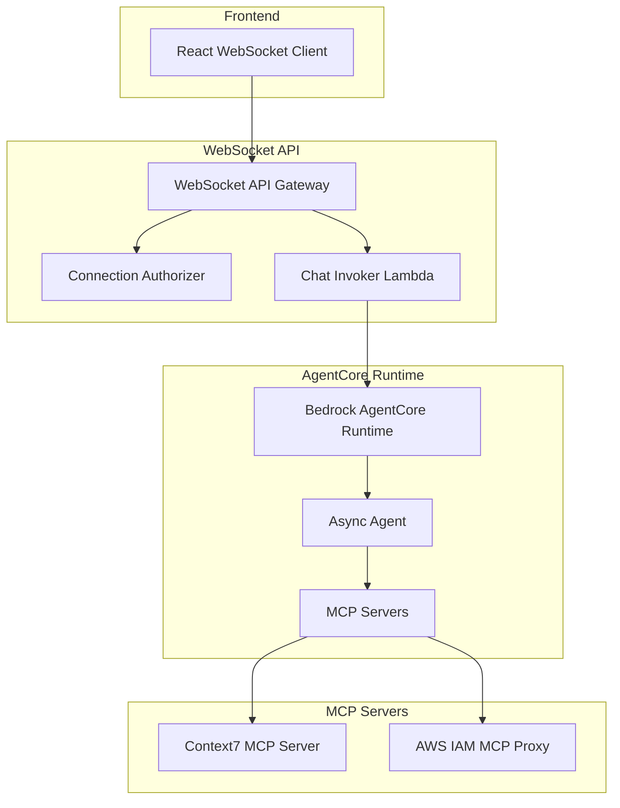

# AWS Bedrock AgentCore Integration

## Overview

This document describes the integration with AWS Bedrock AgentCore Runtime for async agent processing. The integration uses script-based deployment since CDK constructs are not yet available for this preview feature.

## Architecture



## AgentCore Runtime Configuration

### Runtime Setup

The AgentCore runtime is deployed using script-based deployment located in `agents-core/`:

**Key Files**:
- `agents-core/aws_iam_mcp/helper/deploy_mcp.py` - MCP server deployment
- `agents-core/my_agent_async/helper/deploy_agent.py` - Agent deployment
- `agents-core/aws_iam_mcp/Makefile` - Deployment automation
- `agents-core/my_agent_async/Makefile` - Agent deployment automation

### Deployment Process

#### 1. MCP Server Deployment

**Location**: `agents-core/aws_iam_mcp/`

**Deployment Command**:
```bash
cd agents-core/aws_iam_mcp
make deploy
```

**What it does**:
- Builds Docker container with MCP server
- Pushes to ECR repository
- Creates AgentCore runtime with MCP server
- Updates runtime configuration with JWT authentication

**Key Configuration**:
- **MCP Server**: AWS IAM policy analysis tools
- **Container**: FastMCP-based stateless HTTP server
- **Authentication**: JWT bearer token validation
- **Runtime**: Bedrock AgentCore Runtime (preview)

#### 2. Async Agent Deployment

**Location**: `agents-core/my_agent_async/`

**Deployment Command**:
```bash
cd agents-core/my_agent_async
make deploy
```

**What it does**:
- Builds FastAPI-based async agent
- Pushes to ECR repository
- Creates AgentCore runtime with agent logic
- Configures WebSocket integration

**Key Configuration**:
- **Agent**: FastAPI-based async processing
- **WebSocket**: Direct integration with API Gateway
- **MCP Integration**: Context7 and AWS IAM MCP servers
- **Streaming**: Real-time message delivery

### Runtime Configuration

#### Environment Variables

**MCP Server Runtime**:
```bash
CONTEXT7_API_KEY=your_context7_key
AWS_REGION=us-east-1
LOG_LEVEL=INFO
```

**Async Agent Runtime**:
```bash
WEBSOCKET_API_ENDPOINT=https://{api-id}.execute-api.{region}.amazonaws.com/{stage}
SESSION_TABLE_NAME=testmeout-sessions-{env}
LOG_LEVEL=INFO
```

#### IAM Permissions

**AgentCore Runtime Role**:
```json
{
  "Version": "2012-10-17",
  "Statement": [
    {
      "Effect": "Allow",
      "Action": [
        "bedrock:InvokeModel",
        "bedrock:InvokeAgent"
      ],
      "Resource": "*"
    },
    {
      "Effect": "Allow",
      "Action": [
        "dynamodb:GetItem",
        "dynamodb:PutItem",
        "dynamodb:UpdateItem",
        "dynamodb:Query"
      ],
      "Resource": "arn:aws:dynamodb:*:*:table/testmeout-sessions-*"
    },
    {
      "Effect": "Allow",
      "Action": [
        "execute-api:ManageConnections"
      ],
      "Resource": "arn:aws:execute-api:*:*:*/*/POST/@connections/*"
    }
  ]
}
```

## MCP Server Integration

### Context7 MCP Server

**Purpose**: Documentation and knowledge retrieval
**Location**: `agents-core/aws_iam_mcp/`

**Configuration**:
```python
# agents-core/aws_iam_mcp/src/mcp_server.py
@mcp.tool(structured_output=False)
def get_role_policies(role_arn: str) -> str:
    """Get all policies attached to an IAM role and analyze their permissions."""
    # Implementation for IAM policy analysis
```

**Deployment**:
- Containerized FastMCP server
- Stateless HTTP for AgentCore compatibility
- JWT authentication integration

### AWS IAM MCP Proxy

**Purpose**: IAM policy analysis and AWS resource inspection
**Location**: `agents-core/aws_iam_mcp/aws_iam_mcp_proxy/`

**Features**:
- Stdio communication with Cursor
- Dual authentication (IAM + JWT)
- Server-Sent Events support
- Production-ready error handling

**Usage**:
```bash
# Install via uvx
uvx aws-iam-mcp-proxy iam arn:aws:bedrock-agentcore:us-east-1:123456789012:runtime/your-runtime
```

## WebSocket Integration

### Connection Flow

1. **Frontend Connection**: React WebSocket client connects to API Gateway
2. **JWT Authentication**: Connection authorizer validates JWT token
3. **Message Routing**: WebSocket chat invoker processes messages
4. **Agent Invocation**: Async agent processes via AgentCore runtime
5. **Real-time Response**: Agent sends messages back via WebSocket

### Message Handling

**WebSocket Chat Invoker** (`lambdas/websocket_chat_invoker/src/handler.py`):
- Validates WebSocket messages
- Invokes AgentCore runtime
- Manages session state
- Handles error responses

**Async Agent** (`agents-core/my_agent_async/src/agent.py`):
- Processes user messages
- Integrates with MCP servers
- Sends real-time updates via WebSocket
- Manages conversation context

## Deployment Scripts

### MCP Server Deployment

**File**: `agents-core/aws_iam_mcp/Makefile`

**Key Targets**:
- `deploy` - Full deployment pipeline
- `build` - Build Docker container
- `push` - Push to ECR
- `create-runtime` - Create AgentCore runtime
- `update-runtime` - Update existing runtime

**Example Usage**:
```bash
# Deploy MCP server
make deploy

# Update existing runtime
make update-runtime

# Check deployment status
make status
```

### Agent Deployment

**File**: `agents-core/my_agent_async/Makefile`

**Key Targets**:
- `deploy` - Deploy async agent
- `build` - Build agent container
- `test` - Run agent tests
- `logs` - View agent logs

**Example Usage**:
```bash
# Deploy async agent
make deploy

# View logs
make logs

# Run tests
make test
```

## Monitoring and Debugging

### CloudWatch Logs

**MCP Server Logs**:
```
/aws/bedrock-agentcore/runtime/{runtime-id}/mcp-server
```

**Async Agent Logs**:
```
/aws/bedrock-agentcore/runtime/{runtime-id}/agent
```

### Debugging Tools

**MCP Server Testing**:
```bash
cd agents-core/aws_iam_mcp
python helper/invoke_mcp.py tools/list
```

**Agent Testing**:
```bash
cd agents-core/my_agent_async
python helper/test_agent.py
```

### Health Checks

**Runtime Health**:
- Check CloudWatch logs for errors
- Verify ECR image availability
- Test MCP server connectivity
- Validate WebSocket integration

## Configuration Management

### Environment-Specific Settings

**Development**:
```bash
ENVIRONMENT=dev
LOG_LEVEL=DEBUG
RUNTIME_TIMEOUT=300
```

**Production**:
```bash
ENVIRONMENT=prod
LOG_LEVEL=INFO
RUNTIME_TIMEOUT=600
```

### Secret Management

**MCP Server Secrets**:
- Context7 API key stored in SSM Parameter Store
- JWT validation keys from Cognito
- AWS credentials via IAM roles

**Agent Secrets**:
- WebSocket API endpoint configuration
- DynamoDB table names
- CloudWatch log group names

## Troubleshooting

### Common Issues

#### 1. Runtime Creation Fails
**Symptoms**: AgentCore runtime creation fails
**Solutions**:
- Check ECR image availability
- Verify IAM permissions
- Ensure region compatibility

#### 2. MCP Server Connection Issues
**Symptoms**: MCP server not responding
**Solutions**:
- Check container logs
- Verify JWT token format
- Test with invoke_mcp.py script

#### 3. WebSocket Integration Problems
**Symptoms**: Agent not sending WebSocket messages
**Solutions**:
- Check API Gateway permissions
- Verify connection ID validity
- Review agent logs for errors

### Debug Commands

**Check Runtime Status**:
```bash
aws bedrock-agentcore list-runtimes --region us-east-1
```

**Test MCP Server**:
```bash
cd agents-core/aws_iam_mcp
python helper/invoke_mcp.py tools/list
```

**View Agent Logs**:
```bash
aws logs tail /aws/bedrock-agentcore/runtime/{runtime-id}/agent --follow
```

## Future Enhancements

### CDK Integration
When CDK constructs become available:
- Migrate from script-based to CDK deployment
- Integrate with existing CDK stacks
- Add proper CloudFormation outputs

### Additional MCP Servers
- Document processing MCP server
- Legal research MCP server
- Case law analysis MCP server

### Performance Optimization
- Runtime connection pooling
- MCP server caching
- WebSocket connection management

## References

- [AgentCore Implementation](../staging/T-046-aws-agentcore-mcp-deployment.md)
- [WebSocket Chat System](./websocket-chat.md)
- [MCP Server Documentation](../backend/mcp-integration.md)
- [Deployment Scripts](../../agents-core/aws_iam_mcp/Makefile)
