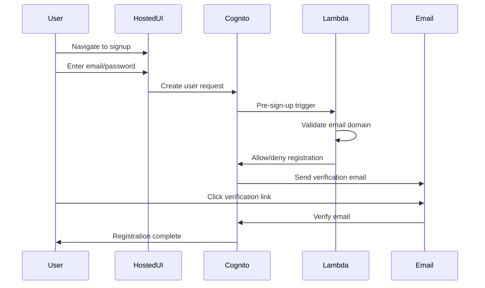
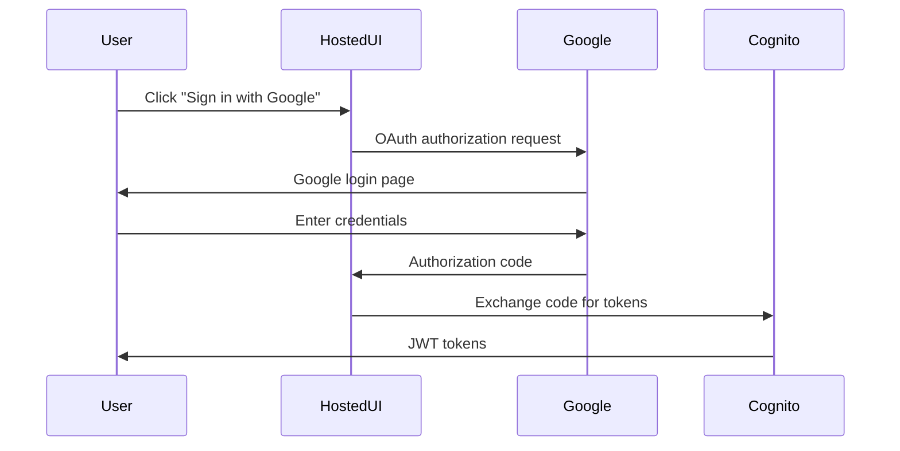
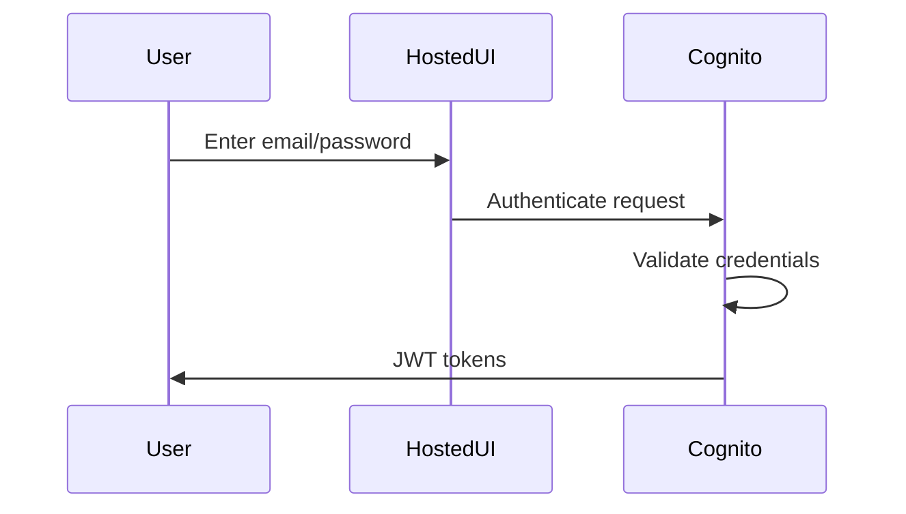

# Backend Authentication & Authorization

## Overview

The backend implements a comprehensive authentication and authorization system using AWS Cognito for user management and JWT tokens for API access control. The system supports both user authentication and service-to-service authorization with enterprise-grade security features including WAF protection, email domain restrictions, and multi-factor authentication.

## Authentication Architecture

### Components
1. **AWS Cognito User Pool** - Central user directory with custom attributes
2. **JWT Token Validation** - Token verification in Lambda authorizers
3. **Combined Authorizer Lambda** - Centralized authorization logic
4. **CloudFront Verification** - Additional security layer for API access
5. **Email Validation Lambda** - Pre-sign-up trigger for domain restrictions
6. **Google Identity Provider** - OAuth integration for Google sign-in
7. **WAF Protection** - IP-based access control for User Pool

### Stack Structure

The authentication infrastructure is defined in `infra/stacks/application/auth_stack.py`:

```
AuthStack
├── EmailValidationLambda (conditional)
├── UserPool
│   ├── Standard Attributes (email, given_name, family_name)
│   ├── Custom Attributes (role, organization)
│   └── Lambda Triggers (pre_sign_up)
├── UserPoolClient
│   ├── OAuth Configuration
│   └── Token Validity Settings
├── UserPoolDomain (Hosted UI)
├── GoogleProvider (conditional)
└── WAF WebACL (conditional)
```

## Configuration

### Environment-Specific Settings

The authentication system supports environment-specific configuration through `infra/config.json`:

- **Email Domain Restrictions**: Configurable allowed domains per environment
- **Password Policies**: Environment-specific password requirements
- **MFA Settings**: Optional in development, required in production
- **Token Validity**: Configurable token expiration times
- **OAuth Configuration**: Callback URLs and logout URLs per environment
- **Google OAuth**: Conditional Google sign-in integration
- **WAF Protection**: IP allowlisting for production environments

### Production vs Development Settings

| Setting | Development | Production |
|---------|-------------|------------|
| MFA | Optional | Required |
| Password Policy | Standard | Enhanced |
| Email Domain Restriction | Limited | Strict |
| WAF Protection | Disabled | Enabled |
| Token Validity | Short | Extended |

## Authentication Flows

### 1. Email/Password Registration

The registration flow includes email domain validation via Lambda trigger:



**Implementation Steps:**
1. User navigates to Cognito hosted UI signup
2. User enters email/password credentials
3. Cognito triggers pre-sign-up Lambda function
4. Lambda validates email domain against allowed domains
5. Registration proceeds or is blocked based on validation
6. Verification email sent to user
7. User confirms email to complete registration

### 2. Google OAuth Flow

Google OAuth integration provides alternative authentication:



**Implementation Steps:**
1. User clicks "Sign in with Google" on hosted UI
2. Redirect to Google OAuth authorization
3. User authenticates with Google
4. Google returns authorization code
5. Cognito exchanges code for tokens
6. User receives JWT tokens for API access

### 3. Email/Password Sign-in

Standard email/password authentication:



**Implementation Steps:**
1. User enters credentials on hosted UI
2. Cognito validates credentials
3. MFA challenge if enabled
4. JWT tokens returned to user
5. Tokens used for API authentication

## Security Features

### 1. Email Domain Restriction

The system includes a Lambda function that validates email domains during user registration:

**Implementation**: `lambdas/auth/src/handler.py`

**Configuration**: Set `allowed_email_domains` in environment config

**Validation Logic**:
- Extracts domain from email address
- Compares against allowed domains list
- Blocks registration for unauthorized domains
- Logs validation attempts for audit

### 2. WAF (Web Application Firewall) Protection

IP-based access control for the Cognito User Pool:

**Configuration**: Set `waf.enabled` and `waf.allowed_ip_ranges` in environment config

**Features**:
- Regional WAF WebACL
- IP allow list rule
- CloudWatch metrics enabled
- Sampled requests for analysis

### 3. Multi-Factor Authentication (MFA)

Configurable MFA settings per environment:

**Development**: MFA optional
**Production**: MFA required

**Supported Methods**:
- SMS (Text message)
- TOTP (Time-based One-Time Password)

### 4. Password Policies

Environment-specific password requirements:

**Standard Policy**: 8+ characters, mixed case, digits
**Enhanced Policy**: 12+ characters, mixed case, digits, symbols

## User Attributes

### Standard Attributes

| Attribute | Required | Mutable | Description |
|-----------|----------|---------|-------------|
| email | Yes | Yes | Primary identifier for sign-in |
| given_name | Yes | Yes | User's first name |
| family_name | Yes | Yes | User's last name |

### Custom Attributes

| Attribute | Type | Mutable | Description |
|-----------|------|---------|-------------|
| role | String | Yes | User role (admin, user, etc.) |
| organization | String | Yes | User's organization |

## Token Management

### Token Types

1. **Access Token** - Short-lived token for API access
2. **ID Token** - Contains user identity information
3. **Refresh Token** - Long-lived token for obtaining new access tokens

### Token Validity Configuration

Configurable per environment with typical settings:
- Access Token: 1 hour
- ID Token: 1 hour
- Refresh Token: 30 days

### Security Features

- **Prevent User Existence Errors** - Prevents username enumeration attacks
- **Token Encryption** - All tokens encrypted at rest and in transit
- **Automatic Token Rotation** - Refresh tokens rotated on use

## OAuth Configuration

### Supported Flows

1. **Authorization Code Grant with PKCE** - Required for single-page applications
2. **Implicit Grant** - Disabled for security reasons

### Implementation Details

The frontend implements OAuth 2.0 Authorization Code Flow with PKCE (Proof Key for Code Exchange) for enhanced security:

- **Code Verifier**: Cryptographically random string generated client-side
- **Code Challenge**: SHA-256 hash of the code verifier
- **State Parameter**: Random value to prevent CSRF attacks

For detailed implementation, see [Frontend Authentication Documentation](../frontend/authentication.md).

### Scopes

- `email` - Access to user's email address
- `openid` - OpenID Connect identity information
- `profile` - Access to user's profile information

### Callback URLs

Configured per environment with standardized `/auth/callback` path:

**Development Environment:**
```yaml
oauth:
  callback_urls:
    - "http://localhost:3000/auth/callback"
  logout_urls:
    - "http://localhost:3000/"
```

**Production Environment:**
```yaml
oauth:
  callback_urls:
    - "https://app.testmeout.com/auth/callback"
  logout_urls:
    - "https://app.testmeout.com/"
```

### Cognito User Pool Settings

Required configuration in AWS Cognito:

1. **App Client Settings**
   - Authorization code grant flow ✓
   - Implicit grant flow ✗ (disabled)
   - PKCE enabled (default for public clients)

2. **OAuth Scopes**
   - openid
   - email
   - profile

3. **Token Validity Settings**
   - Access Token: 1 hour
   - ID Token: 1 hour
   - Refresh Token: 30 days

## Google OAuth Integration

### Configuration

Google OAuth integration is configured per environment:

```yaml
google_oauth:
  enabled: true
  client_id: "your-google-client-id"
  client_secret: "your-google-client-secret"
```

### Setup Requirements

1. Create Google OAuth 2.0 credentials in Google Cloud Console
2. Configure authorized redirect URIs
3. Add client ID and secret to environment configuration
4. Enable Google provider in Cognito User Pool

### Scopes

- `email` - Access to user's email
- `profile` - Access to user's profile information
- `openid` - OpenID Connect identity

### Implementation

The Google OAuth integration is implemented in `infra/stacks/application/auth_stack.py`:

1. **Conditional Provider Creation**: Google provider only created when enabled
2. **Secret Management**: Client secret stored in AWS Secrets Manager
3. **Domain Configuration**: Google provider configured with Cognito domain
4. **Attribute Mapping**: Google profile attributes mapped to Cognito attributes

## Hosted UI

### Available Endpoints

1. **Login URL** - `/oauth2/authorize`
2. **Signup URL** - `/signup`
3. **Logout URL** - `/logout`

### URL Structure

```
https://{domain-prefix}.auth.{region}.amazoncognito.com/{endpoint}
```

### Customization

- Custom domain prefix per environment
- Configurable callback and logout URLs
- Branded email templates for verification

### Implementation

The hosted UI is configured in `infra/stacks/application/auth_stack.py`:

1. **Domain Configuration**: Custom domain prefix per environment
2. **Email Templates**: Customizable verification email content
3. **Branding**: Configurable UI branding and styling
4. **Security**: HTTPS enforcement and security headers

## JWT Token Validation

### Token Structure

JWT tokens contain user claims and metadata in a standardized format with header, payload, and signature sections.

### Validation Process

The JWT validation is implemented in `lambdas/combined_authorizer/src/jwt_validator.py`:

1. Extract token from request headers
2. Decode unverified header to get key ID
3. Fetch public keys from Cognito JWKS endpoint
4. Construct public key for verification
5. Verify token signature and claims
6. Validate expiration and token use
7. Return user claims for authorization

## Combined Authorizer Lambda

### Handler Implementation

The main authorizer logic is in `lambdas/combined_authorizer/src/handler.py`:

1. Extract JWT token from request
2. Validate CloudFront headers if WAF enabled
3. Validate JWT token and extract claims
4. Generate IAM policy with user context
5. Return allow/deny policy to API Gateway

### Policy Generation

Authorization policies are generated in `lambdas/combined_authorizer/src/policies.py` with user context including:
- Username and email
- User role and permissions
- CloudFront validation status
- User ID for tracking

## CloudFront Verification

### CloudFront Validator

Additional security layer implemented in `lambdas/combined_authorizer/src/cloudfront_validator.py`:

1. Retrieve CloudFront secret from AWS Secrets Manager
2. Validate custom header from CloudFront
3. Ensure requests originate from trusted CDN
4. Block requests without valid CloudFront headers

## Role-Based Access Control (RBAC)

### User Roles

The system supports hierarchical user roles:
- **user** - Standard user access
- **admin** - Administrator privileges
- **mod** - Moderator permissions
- **readonly** - Read-only access

### Permission Checking

Role-based permissions are enforced in Lambda functions with hierarchical access control.

## Cognito Integration

### User Pool Lambda Triggers

#### Pre-Authentication Lambda

Email domain validation is handled in `lambdas/auth/src/handler.py`:

1. Extract user email from registration request
2. Parse domain from email address
3. Check against allowed domains list
4. Allow or block registration based on validation
5. Log validation attempts for audit trail

#### Post-Confirmation Lambda

User profile creation after email confirmation:

1. Extract user attributes from confirmation event
2. Create user profile in database
3. Set default user role and permissions
4. Initialize user preferences and settings

## API Key Authentication

### API Key Management

Service-to-service authentication using API keys stored in DynamoDB with:
- Key validation and metadata retrieval
- Usage tracking and rate limiting
- Expiration management
- Active/inactive status control

## Security Best Practices

### Token Security
1. **Short Expiration Times**: Access tokens expire in 1 hour
2. **Refresh Token Rotation**: Refresh tokens rotated on use
3. **Secure Storage**: Never log or store tokens in plaintext
4. **HTTPS Only**: Tokens only transmitted over HTTPS

### Secret Management

Secrets are managed through AWS Secrets Manager with secure retrieval patterns.

### Rate Limiting

Request rate limiting implemented with Redis-based tracking per user.

## Testing Authentication

### Unit Tests

Authentication components are tested in `tests/unit/test_combined_authorizer.py` and related test files.

### Integration Tests

End-to-end authentication testing with real JWT tokens and Cognito integration.

## Monitoring and Auditing

### Authentication Metrics

CloudWatch metrics track:
- Authentication attempts and success rates
- WAF blocked requests
- Lambda function performance
- Token refresh patterns

### Audit Logging

Comprehensive logging for security audit trail:
- Authentication events with user context
- Failed login attempts with IP addresses
- Token usage and refresh patterns
- Administrative actions and role changes

## Environment Variables

### Required Environment Variables

```bash
# Cognito Configuration
COGNITO_USER_POOL_ID=your-user-pool-id
COGNITO_USER_POOL_CLIENT_ID=your-client-id
COGNITO_REGION=il-central-1

# Google OAuth (if enabled)
GOOGLE_CLIENT_ID=your-google-client-id
GOOGLE_CLIENT_SECRET=your-google-client-secret

# Email Domain Restriction
ALLOWED_EMAIL_DOMAINS=company.com,partner.org
```

### Lambda Environment Variables

```bash
# Email Validation Lambda
ALLOWED_EMAIL_DOMAINS=company.com,partner.org
LOG_LEVEL=INFO
```

## CloudFormation Outputs

The AuthStack provides the following outputs:

| Output Name | Description | Export Name |
|-------------|-------------|-------------|
| UserPoolId | Cognito User Pool ID | `{project}-{env}-UserPoolId` |
| UserPoolClientId | User Pool Client ID | `{project}-{env}-UserPoolClientId` |
| UserPoolArn | User Pool ARN | `{project}-{env}-UserPoolArn` |
| HostedUIDomain | Hosted UI domain URL | `{project}-{env}-HostedUIDomain` |
| LoginURL | Complete login URL | `{project}-{env}-LoginURL` |
| LogoutURL | Complete logout URL | `{project}-{env}-LogoutURL` |
| SignupURL | Complete signup URL | `{project}-{env}-SignupURL` |
| UserPoolWebACLArn | WAF WebACL ARN | `{project}-{env}-UserPoolWebACLArn` |

## Troubleshooting

### Common Issues

1. **Email Domain Validation Failing**
   - Check `ALLOWED_EMAIL_DOMAINS` environment variable
   - Verify Lambda function permissions
   - Check CloudWatch logs for validation errors

2. **Google OAuth Not Working**
   - Verify Google OAuth credentials
   - Check authorized redirect URIs
   - Ensure Google provider is enabled in User Pool

3. **WAF Blocking Legitimate Users**
   - Review allowed IP ranges
   - Check WAF logs for blocked requests
   - Temporarily disable WAF for testing

4. **Token Expiration Issues**
   - Verify token validity settings
   - Check refresh token configuration
   - Review application token handling

### Debug Commands

```bash
# Check User Pool status
aws cognito-idp describe-user-pool --user-pool-id {USER_POOL_ID}

# Test email validation Lambda
aws lambda invoke --function-name {LAMBDA_NAME} --payload file://test-event.json response.json

# Check WAF WebACL
aws wafv2 get-web-acl --name {WEBACL_NAME} --scope REGIONAL --region {REGION}
```

## Integration Examples

### Frontend Integration

For detailed frontend authentication implementation, see [Frontend Authentication Documentation](../frontend/authentication.md).

### API Gateway Integration

JWT token verification patterns for Lambda functions:

1. Extract token from request headers
2. Validate token using Cognito public keys
3. Extract user claims and permissions
4. Apply role-based access control
5. Process request with user context

## Future Enhancements

### Planned Features

1. **SAML Integration** - Enterprise SSO support
2. **Custom Claims** - Additional user attributes
3. **Advanced MFA** - Hardware token support
4. **Risk-Based Authentication** - Adaptive authentication
5. **Audit Logging** - Comprehensive security logging

### Security Improvements

1. **Advanced WAF Rules** - Rate limiting, bot detection
2. **Behavioral Analysis** - User behavior monitoring
3. **Geolocation Restrictions** - Location-based access control
4. **Device Fingerprinting** - Device-based security

## Related Documentation

- [Frontend Authentication](../frontend/authentication.md) - Frontend OAuth implementation
- [API Reference](./api.md) - API endpoint documentation
- [Lambda Functions](./lambda-functions.md) - Function-specific details
- [Infrastructure Architecture](../other/cdk-architecture.md) - CDK stack documentation