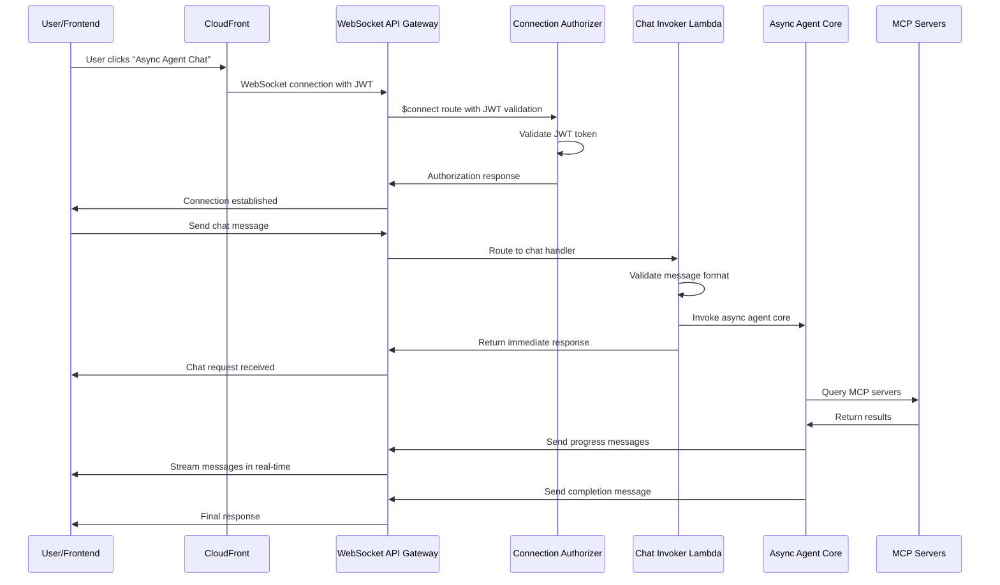

# WebSocket Chat System

## Overview

The WebSocket chat system provides real-time bidirectional communication for async agent interactions, eliminating API Gateway timeout limitations while maintaining session management and authentication.

## Architecture



## WebSocket API Gateway

### Connection Endpoint

**URL**: `wss://{websocket-api-id}.execute-api.{region}.amazonaws.com/{stage}`

**Authentication**: JWT token in query parameter
```
wss://abc123.execute-api.us-east-1.amazonaws.com/dev?token=eyJhbGciOiJSUzI1NiIs...
```

### Route Configuration

| Route Key | Purpose | Integration | Description |
|-----------|---------|-------------|-------------|
| `$connect` | Connection establishment | Connection Authorizer Lambda | JWT validation, connection setup |
| `chat` | Chat message processing | Chat Invoker Lambda | Process chat requests and invoke agent |
| `$default` | Fallback | Chat Invoker Lambda | Handle unknown message types with backward compatibility |

**Route Selection Expression**:
```json
{
  "routeSelectionExpression": "$request.body.action"
}
```

**Note**: The route selection expression is maintained for backward compatibility, but the Chat Invoker Lambda now uses `route_key` from the WebSocket event context for primary routing decisions.

## Lambda Functions

### Connection Authorizer Lambda

**File**: `lambdas/connection_authorizer/src/handler.py`

**Purpose**: JWT authentication for WebSocket connections

**Responsibilities**:
- Validate JWT token from query parameter
- Extract user information from token
- Return IAM policy for connection authorization
- Handle both authorizer and integration calls

**Environment Variables**:
- `USER_POOL_CLIENT_ID`: Cognito User Pool Client ID
- `USER_POOL_ID`: Cognito User Pool ID
- `AWS_REGION`: AWS region for JWKS fetching

**JWT Validation Process**:
1. Extract JWT token from query parameters
2. Fetch JWKS from Cognito User Pool
3. Validate token signature and claims
4. Extract user_id and client_id
5. Return IAM policy for connection authorization

### Chat Invoker Lambda

**File**: `lambdas/websocket_chat_invoker/src/handler.py`

**Purpose**: Process chat messages and invoke async agent

**Responsibilities**:
- Validate chat message format
- Create or retrieve session from DynamoDB
- Invoke async agent core
- Send initial response via WebSocket
- Handle error cases and timeouts

**Environment Variables**:
- `SESSION_TABLE_NAME`: DynamoDB sessions table
- `ASYNC_AGENT_ARN`: Bedrock Agent Core runtime ARN
- `WEBSOCKET_API_ENDPOINT`: WebSocket API endpoint for responses

**Message Processing Flow**:
1. Extract `route_key` from WebSocket event context
2. Route to appropriate handler based on `route_key`:
   - `chat` route → Direct chat message processing
   - `$default` route → Backward compatibility with action-based routing
   - `$connect`/`$disconnect` → Connection lifecycle handling
3. Parse WebSocket message from event body
4. Validate message format and required fields
5. Extract user_id from connection context
6. Create or update DynamoDB session
7. Invoke async agent core with message
8. Return immediate acknowledgment
9. Agent core sends responses via WebSocket

## Routing Implementation

### Route-Based Routing (New)

The WebSocket handler now uses `route_key` from the WebSocket event context for primary routing decisions, following AWS best practices:

**Primary Routes**:
- `chat` - Direct chat message processing
- `$default` - Fallback with backward compatibility
- `$connect` - Connection establishment (handled by authorizer)
- `$disconnect` - Connection cleanup

**Benefits**:
- More efficient than message body parsing
- Follows AWS WebSocket API best practices
- Better security (route-based vs message-based)
- Cleaner separation of concerns

### Backward Compatibility

The `$default` route maintains backward compatibility by checking for the `action` field in message bodies:

```python
# $default route handler
action = body.get('action')
if action == 'chat':
    return handle_chat_message(connection_id, body, user_id)
```

This ensures existing frontend implementations continue working without changes.

## Message Format

### Client to Server

```typescript
interface ChatMessage {
  action: 'chat';
  message: string;
  session_id?: string;
  includeHistory?: boolean;
}
```

**Example**:
```json
{
  "action": "chat",
  "message": "What are my AWS IAM permissions?",
  "session_id": "session_1234567890_user@example.com",
  "includeHistory": true
}
```

### Server to Client

```typescript
interface ServerMessage {
  type: 'start' | 'content' | 'trace' | 'complete' | 'error' | 'done';
  session_id: string;
  message_id?: string;
  content?: string;
  trace_data?: any;
  timestamp: string;
  sequence: number;
  metadata?: {
    model?: string;
    processing_time?: number;
    total_tokens?: number;
  };
}
```

**Message Types**:
- `start` - Initial message indicating processing has begun
- `content` - Agent response content chunks
- `trace` - Agent reasoning and tool execution traces
- `complete` - Indicates the agent has finished processing
- `done` - Final message indicating the entire response is complete
- `error` - Error occurred during processing

## Frontend Integration

### WebSocket Client Hook

**File**: `frontend/src/features/chat/hooks/useAsyncChat.ts`

**Features**:
- Automatic reconnection with exponential backoff
- Message queuing during connection establishment
- Error handling and retry logic
- Session management integration

**Usage**:
```typescript
const {
  sendChatMessage,
  lastMessage,
  readyState,
  isProcessing,
  isConnected,
  canSendMessage
} = useAsyncChat();

// Send message
await sendChatMessage("What are my AWS permissions?", sessionId);
```

### Chat Interface Component

**File**: `frontend/src/features/chat/components/AsyncAgentChatInterface.tsx`

**Features**:
- Real-time message display
- Connection status indicators
- Error handling and user feedback
- Session management integration

## Session Management

### DynamoDB Integration

**Table**: `testmeout-sessions-{env}`

**Session Structure**:
```json
{
  "session_id": "session_1234567890_user@example.com",
  "user_id": "user@example.com",
  "created_at": 1704110400,
  "expires_at": 1706702400,
  "session_data": {
    "session_type": "async_agent",
    "messages": [...],
    "agent_metadata": {
      "agent_type": "async_agent",
      "mcp_servers": ["context7", "aws_iam"],
      "conversation_context": "User is learning about AWS IAM",
      "session_state": {...}
    }
  },
  "session_name": "AWS IAM Discussion"
}
```

### Session Lifecycle

1. **Connection Establishment**: User connects via WebSocket
2. **Session Creation**: New session created in DynamoDB
3. **Message Processing**: Messages added to session history
4. **Context Persistence**: Agent maintains conversation context
5. **Session Cleanup**: TTL-based automatic cleanup

## Error Handling

### Connection Errors

**Authentication Failures**:
- Invalid JWT token format
- Expired or invalid token
- Missing required claims

**Connection Issues**:
- WebSocket connection drops
- Network timeouts
- API Gateway limits

### Message Errors

**Validation Errors**:
- Invalid message format
- Missing required fields
- Malformed JSON

**Processing Errors**:
- Agent runtime failures
- MCP server unavailability
- DynamoDB access issues

### Error Response Format

```json
{
  "type": "error",
  "session_id": "session_123",
  "error": {
    "code": "AUTHENTICATION_FAILED",
    "message": "Invalid JWT token",
    "details": {
      "reason": "token_expired"
    }
  },
  "timestamp": "2024-01-01T12:00:00Z",
  "sequence": 1
}
```

## Security Considerations

### Authentication

1. **JWT Validation**: All connections require valid Cognito JWT
2. **Connection Authorization**: Users can only access their own connections
3. **Message Validation**: All incoming messages validated for format
4. **Rate Limiting**: Implemented per connection

### Data Protection

1. **Message Encryption**: All WebSocket messages encrypted in transit
2. **Session Isolation**: Users can only access their own sessions
3. **Connection Cleanup**: Automatic cleanup of stale connections
4. **Audit Logging**: All WebSocket events logged for monitoring

## Monitoring and Observability

### CloudWatch Metrics

**WebSocket API Metrics**:
- `ConnectionCount` - Number of active connections
- `MessageCount` - Number of messages sent/received
- `IntegrationError` - Errors from Lambda integrations
- `ClientError` - Client-side errors (4XX responses)

**Custom Metrics**:
- `ChatSessions` - Number of active chat sessions
- `AgentProcessingTime` - Time taken by async agent
- `ConnectionDuration` - Average connection lifetime
- `MessageLatency` - End-to-end message delivery time

### Logging

**Connection Events**:
- Connect/disconnect with user context
- Authentication success/failure
- Connection errors and timeouts

**Chat Messages**:
- All chat messages with session context
- Agent responses and processing steps
- Error events with detailed context

### Alerts

**High Error Rate**: >5% error rate for 5 minutes
**Connection Failures**: >20% connection failure rate
**Agent Timeouts**: >10% timeout rate
**Message Latency**: >5 second average latency

## Performance Considerations

### Connection Limits

- **API Gateway**: 10,000 concurrent connections per region
- **Lambda Concurrency**: Auto-scaling based on demand
- **DynamoDB**: On-demand scaling for session storage

### Message Throughput

- **WebSocket**: High throughput for real-time messaging
- **Lambda**: 1,000 concurrent executions per region
- **DynamoDB**: High throughput for session management

### Latency Optimization

- **WebSocket**: Low latency for real-time communication
- **Lambda**: Cold start mitigation with provisioned concurrency
- **DynamoDB**: Single-digit millisecond latency

## Testing

### Unit Tests

**Connection Authorizer**:
```python
def test_jwt_validation_success():
    # Test valid JWT token validation
    
def test_jwt_validation_failure():
    # Test invalid JWT token handling
```

**Chat Invoker**:
```python
def test_message_processing():
    # Test message format validation
    
def test_agent_invocation():
    # Test async agent invocation
```

### Integration Tests

**WebSocket Connection**:
- Test connection lifecycle
- Test message flow
- Test error handling

**Agent Integration**:
- Test agent invocation
- Test MCP server integration
- Test session management

### Load Tests

**Connection Limits**:
- Test maximum concurrent connections
- Test message processing capacity
- Test error recovery under load

## Troubleshooting

### Common Issues

#### 1. Connection Fails
**Symptoms**: WebSocket connection not established
**Solutions**:
- Check JWT token validity
- Verify API Gateway configuration
- Check CloudWatch logs for errors

#### 2. Messages Not Received
**Symptoms**: Agent not sending responses
**Solutions**:
- Check agent runtime status
- Verify WebSocket permissions
- Review agent logs for errors

#### 3. Session Issues
**Symptoms**: Session not persisting
**Solutions**:
- Check DynamoDB permissions
- Verify session table configuration
- Review session creation logic

### Debug Commands

**Test WebSocket Connection**:
```bash
wscat -c "wss://{api-id}.execute-api.{region}.amazonaws.com/{stage}?token={jwt_token}"
```

**Check Lambda Logs**:
```bash
aws logs tail /aws/lambda/{function-name} --follow
```

**Test Agent Runtime**:
```bash
cd agents-core/my_agent_async
python helper/test_agent.py
```

## Migration from Function URLs

### Current State

- Function URLs still in use for streaming endpoints
- WebSocket implemented for async agent chat
- Dual architecture pattern

### Future Migration

1. **Phase 1**: Migrate all streaming endpoints to WebSocket
2. **Phase 2**: Remove Function URL infrastructure
3. **Phase 3**: Consolidate to single WebSocket architecture

### Migration Benefits

- Eliminate API Gateway timeout limitations
- Unified real-time communication pattern
- Simplified infrastructure management
- Better user experience

## References

- [WebSocket Design Document](../specs/async-chat-websocket/design.md)
- [AgentCore Integration](./agentcore-integration.md)
- [Frontend WebSocket Client](../../frontend/src/features/chat/hooks/useAsyncChat.ts)
- [Connection Authorizer](../../lambdas/connection_authorizer/src/handler.py)
- [Chat Invoker](../../lambdas/websocket_chat_invoker/src/handler.py)
