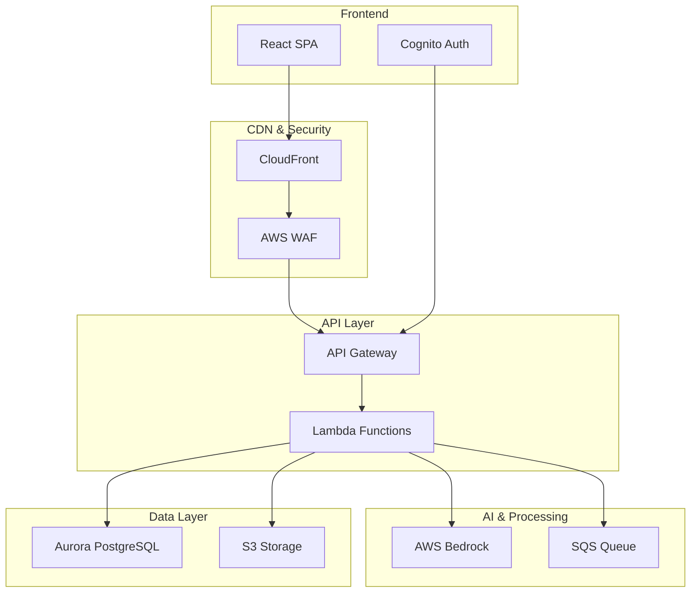

# Legal Information System Documentation

## Overview

The Legal Information System (testmeout) is a comprehensive legal document management and AI-powered chat application built on AWS infrastructure. It enables users to interact with legal documents through an intelligent conversational interface, leveraging AWS Bedrock for AI capabilities and a modern React frontend for an intuitive user experience.

### Core Components

The application consists of three main architectural layers:

1. **Frontend** - A React/TypeScript single-page application with Hebrew/English support
2. **Backend** - Serverless AWS Lambda functions with API Gateway and AWS Bedrock integration
3. **Infrastructure** - AWS CDK-managed cloud resources including VPC, Aurora PostgreSQL, and Cognito

### Purpose and Goals

This documentation suite serves as the primary knowledge base for development, deployment, and maintenance of the system. It is structured to provide:

- Clear separation of concerns between frontend, backend, and infrastructure
- Context-specific information for different development roles
- Comprehensive technical references for all components
- Troubleshooting guides and best practices

## Documentation Structure

### 📱 [Frontend Documentation](./frontend/index.md)
Everything related to the React application and user interface:
- [Technology Stack](./frontend/technology.md) - React, TypeScript, Vite, and UI libraries
- [Project Structure](./frontend/project-structure.md) - Directory organization and component architecture
- [Setup & Deployment](./frontend/setup-and-deployment.md) - Development environment and build processes
- [Authentication Flow](./frontend/authentication.md) - OAuth 2.0/PKCE implementation with Cognito
- [Styling System](./frontend/styles.md) - Tailwind CSS, Ant Design, and RTL support
- [Chat Interface](./frontend/chat-interface.md) - Real-time messaging and streaming responses
- [Internationalization](./frontend/internationalization.md) - Hebrew/English language support
- [State Management](./frontend/state-management.md) - Zustand stores and data flow

### 🚀 [Backend Documentation](./backend/index.md)
Server-side implementation and API details:
- [Technology Stack](./backend/technology.md) - Python, AWS Lambda, Bedrock, and services
- [Project Structure](./backend/project-structure.md) - Lambda functions and code organization
- [API Reference](./backend/api.md) - Endpoints, request/response formats, and OpenAPI spec
- [Authentication & Authorization](./backend/authentication.md) - JWT validation and security
- [Database Design](./backend/database.md) - PostgreSQL schema with pgvector extension
- [Lambda Functions](./backend/lambda-functions.md) - Function-specific documentation
- [Bedrock Integration](./backend/bedrock-integration.md) - AI model configuration and streaming
- [Message Queue](./backend/message-queue.md) - SQS configuration for async processing

### 🏗️ [Infrastructure & Other](./other/index.md)
Supporting documentation for deployment and operations:
- [CDK Architecture](./other/cdk-architecture.md) - Infrastructure as Code with AWS CDK
- [VPC Configuration](./other/vpc-configuration.md) - Network setup and security groups
- [CloudFront & WAF](./other/cloudfront-waf.md) - Content delivery and security
- [Environment Configuration](./other/environment-config.md) - Managing dev/staging/prod settings
- [Deployment Guide](./other/deployment-guide.md) - Step-by-step deployment instructions
- [Monitoring & Observability](./other/monitoring.md) - CloudWatch, metrics, and logging
- [Troubleshooting Guide](./other/troubleshooting.md) - Common issues and solutions
- [Cost Optimization](./other/cost-optimization.md) - Resource sizing and cost management

## Quick Start Guides

### For Frontend Developers
1. Start with [Frontend Setup & Deployment](./frontend/setup-and-deployment.md)
2. Review [Frontend Project Structure](./frontend/project-structure.md)
3. Understand [Authentication Flow](./frontend/authentication.md)
4. Explore [Chat Interface](./frontend/chat-interface.md) for real-time features

### For Backend Developers
1. Begin with [Backend Technology Stack](./backend/technology.md)
2. Set up environment using [Backend Project Structure](./backend/project-structure.md)
3. Review [API Reference](./backend/api.md) for endpoint specifications
4. Study [Lambda Functions](./backend/lambda-functions.md) for serverless patterns

### For DevOps/Infrastructure Engineers
1. Start with [CDK Architecture](./other/cdk-architecture.md)
2. Configure environments using [Environment Configuration](./other/environment-config.md)
3. Deploy using [Deployment Guide](./other/deployment-guide.md)
4. Set up monitoring with [Monitoring & Observability](./other/monitoring.md)

## System Architecture Overview

## Key Features

### User Experience
- **Bilingual Support**: Full Hebrew and English interface with RTL support
- **Real-time Chat**: Streaming responses with thought process visualization
- **Document Management**: Upload, process, and query legal documents
- **Secure Authentication**: OAuth 2.0 with PKCE and MFA support

### Technical Capabilities
- **Serverless Architecture**: Auto-scaling Lambda functions with pay-per-use model
- **Vector Search**: pgvector extension for semantic document search
- **AI Integration**: Multiple AWS Bedrock models for intelligent responses
- **Infrastructure as Code**: Fully automated deployment with AWS CDK

### Security & Compliance
- **WAF Protection**: IP allowlisting and DDoS protection
- **JWT Authentication**: Secure token-based API access
- **Encryption**: Data encrypted at rest and in transit
- **Audit Logging**: Comprehensive CloudWatch logging

## Development Workflow

1. **Local Development**: Use provided setup guides for frontend and backend
2. **Testing**: Run unit and integration tests before deployment
3. **Deployment**: Use CDK commands with environment-specific configurations
4. **Monitoring**: Check CloudWatch dashboards and logs for system health

## Contributing

When adding new features or updating existing ones:
1. Update relevant documentation in the appropriate section
2. Maintain clear separation between frontend, backend, and infrastructure docs
3. Include code examples and configuration snippets where helpful
4. Update troubleshooting guides with any new issues discovered

## Additional Resources

- [AWS CDK Documentation](https://docs.aws.amazon.com/cdk/)
- [React Documentation](https://react.dev/)
- [AWS Bedrock Guide](https://docs.aws.amazon.com/bedrock/)
- [PostgreSQL with pgvector](https://github.com/pgvector/pgvector)

## Support

For questions or issues:
- Check the [Troubleshooting Guide](./other/troubleshooting.md)
- Review environment-specific configurations
- Consult team documentation in the project repository