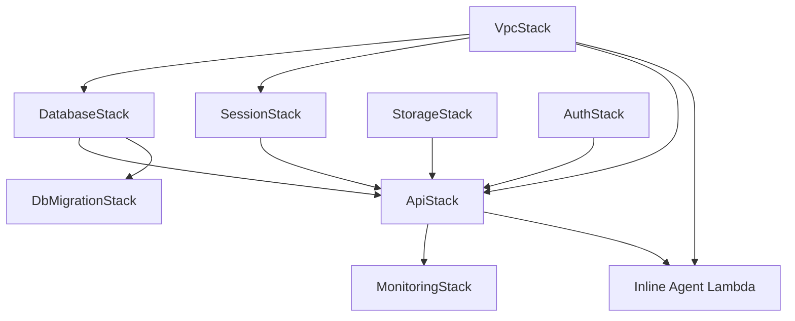

# CDK Architecture Documentation

## Overview

The Legal Information System infrastructure is built using AWS Cloud Development Kit (CDK) v2, implementing Infrastructure as Code (IaC) principles for repeatable, version-controlled deployments across multiple environments. The architecture follows a modular stack design with clear separation of concerns and proper dependency management.

## Architecture Principles

### Modular Stack Design
- **Single Responsibility**: Each stack has one clear purpose
- **Loose Coupling**: Stacks communicate via CloudFormation exports
- **Environment Parity**: Consistent architecture across environments
- **Cost Optimization**: Environment-specific resource sizing
- **Security First**: Least privilege IAM policies and proper VPC isolation

## Stack Organization

The infrastructure is organized into focused, single-responsibility stacks that can be deployed independently while maintaining proper dependencies. Stacks are organized into logical categories using a structured folder hierarchy.

### Directory Structure
```
infra/stacks/
├── core/                    # Foundation infrastructure
│   ├── __init__.py         # Exports: VpcStack, BaseStack
│   ├── base_stack.py       # Base class for all stacks
│   ├── vpc_stack.py        # VPC, subnets, security groups
│   └── config_utils.py     # Configuration utilities
├── storage/                 # Data and storage services
│   ├── __init__.py         # Exports: DatabaseStack, StorageStack  
│   ├── database_stack.py   # Aurora PostgreSQL with pgvector
│   └── storage_stack.py    # S3 buckets, SQS queues
├── application/             # Business logic and APIs
│   ├── __init__.py         # Exports: ApiStack, AuthStack
│   ├── api_stack.py        # Lambda functions, API Gateway
│   ├── auth_stack.py       # Cognito User Pool
│   └── db_migration_stack.py # Database migration handler
├── monitoring/              # Observability and monitoring
│   └── __init__.py         # Future monitoring stacks
└── __init__.py             # Main exports using organized imports
```

### Stack Categories

#### 1. Core Stacks (`stacks/core/`)
Long-lived foundation infrastructure that rarely changes:
- **BaseStack**: Common functionality and configuration for all stacks
- **VpcStack**: VPC, subnets, security groups
- **ConfigUtils**: Configuration loading and validation utilities

#### 2. Storage Stacks (`stacks/storage/`)
Stateful services that persist data:
- **DatabaseStack**: Aurora PostgreSQL with pgvector extension
- **StorageStack**: S3 buckets, SQS queues, data storage
- **SessionStack**: DynamoDB session storage for chat conversations

#### 3. Application Stacks (`stacks/application/`)
Stateless services implementing business functionality:
- **AuthStack**: Cognito User Pool and authentication services
- **ApiStack**: Lambda functions, API Gateway, business logic
- **DbMigrationStack**: Database migration handler

#### 4. Monitoring Stacks (`stacks/monitoring/`)
Observability and operational monitoring services:
- **MonitoringStack**: CloudWatch dashboards, alarms, and custom metrics for Bedrock chat

#### 5. Inline Agent Infrastructure
Advanced AI capabilities with MCP server integration:
- **Inline Agent Lambda**: Dedicated Lambda for AWS Bedrock inline agent operations
- **MCP Server Integration**: Context7 and Custom AWS MCP server Implementation
- **Cross-Region Inference**: Claude Sonnet 4 access via inference profiles

#### 6. AgentCore Integration
AWS Bedrock AgentCore Runtime integration for async agent processing:
- **AgentCore Runtime**: Preview feature for async agent processing
- **MCP Server Deployment**: Script-based deployment for MCP servers
- **WebSocket Integration**: Real-time communication with async agents
- **Script-based Deployment**: Manual deployment using Makefiles and helper scripts

## Stack Dependencies



## Inline Agent Infrastructure

### Architecture Overview
The inline agent infrastructure extends the existing API stack to provide advanced AI capabilities with MCP (Model Context Protocol) server integration. This architecture enables the system to leverage AWS Bedrock's inline agent capabilities while maintaining security and performance.

### Key Design Decisions

#### 1. Dedicated Inline Agent Project
**Choice**: Extract inline agent into separate `lambdas/bedrock_inline_agent/` project
**Rationale**: 
- Better separation of concerns
- Dedicated infrastructure and deployment
- Easier maintenance and development
- Avoids conflicts with main bedrock chat functionality

#### 2. Cross-Region Inference Profile
**Choice**: Use inference profile ARN instead of direct model ID
**Rationale**:
- Enables cross-region model access
- Better cost management and control
- Consistent with enterprise AWS patterns
- Required for Claude Sonnet 4 access

#### 3. Function URL for Agent Endpoints
**Choice**: Use Lambda Function URLs instead of API Gateway for agent calls
**Rationale**:
- Simpler configuration for long-running agent calls
- Better streaming support
- Reduced API Gateway complexity
- Direct Lambda invocation for agent operations

#### 4. MCP Server Integration via Local Container Installation
**Choice**: Implement MCP server integration using local installation in Lambda container
**Rationale**:
- **Local Installation**: Install MCP servers directly in Lambda container using npm
- **StdioServerParameters**: Use standard input/output communication for reliable interaction
- **Lambda Compatibility**: Local installation provides better compatibility and performance
- **Container-Based**: Leverages Docker container to include Node.js runtime alongside Python
- **Direct Integration**: MCP client directly integrated into action groups for seamless tool access
- **No External Dependencies**: Eliminates need for external MCP server infrastructure

#### 5. Dual MCP Server Architecture
**Choice**: Implement support for both Context7 (stdio) and AWS Knowledge (HTTP) MCP servers
**Rationale**:
- **Flexibility**: Easy switching between MCP servers via environment variable
- **Context7 Preservation**: Keep existing stdio-based Context7 implementation unchanged
- **AWS Knowledge Integration**: Add HTTP-based AWS Knowledge MCP server for AWS documentation
- **Transport Optimization**: Use appropriate transport method for each server type
- **Future Extensibility**: Architecture supports adding more MCP servers easily

### MCP Server Integration Implementation

#### Context7 MCP Server Integration ✅ COMPLETED
**Implementation Status**: Successfully implemented and working
**Source**: Based on [AWS Bedrock Agent Samples](https://github.com/awslabs/amazon-bedrock-agent-samples/blob/main/src/InlineAgent/README.md)

**Key Components**:
- **Local MCP Server Installation**: Context7 installed locally in Lambda container via npm
- **StdioServerParameters**: Standard input/output communication with MCP server
- **Action Group Integration**: MCP client integrated directly into action groups
- **Direct Tool Access**: Seamless access to documentation and knowledge retrieval

#### AWS Knowledge MCP Server Integration ✅ COMPLETED
**Implementation Status**: Successfully implemented and ready for testing
**Source**: Based on [AWS Knowledge MCP Server documentation](https://awslabs.github.io/mcp/servers/aws-knowledge-mcp-server)

**Key Components**:
- **mcp-remote Proxy Integration**: AWS Knowledge MCP server accessed via mcp-remote proxy utility
- **HTTP Transport**: Uses `StdioServerParameters` with mcp-remote command
- **Environment Variable Control**: `MCP_SERVER_TYPE` for easy switching between servers
- **Dynamic MCP Client Creation**: Automatic selection between Context7 and AWS Knowledge

### Infrastructure Configuration

#### Environment Variables
```python
# MCP server selection - "aws-knowledge" or "context7"
MCP_SERVER_TYPE = os.environ.get("MCP_SERVER_TYPE", "aws-knowledge")

# Inline agent configuration
ENABLE_INLINE_AGENT = "true"
INLINE_AGENT_TIMEOUT_SECONDS = "900"
```

#### IAM Permissions
The inline agent Lambda requires additional permissions beyond standard Bedrock access:
- `bedrock:InvokeInlineAgent` - Core inline agent functionality
- `bedrock:GetInferenceProfile` - Cross-region inference profile access
- `bedrock:ListInferenceProfiles` - Inference profile enumeration
- `bedrock:UseInferenceProfile` - Inference profile usage

#### Docker Container Setup
```dockerfile
# From lambdas/bedrock_inline_agent/Dockerfile
FROM --platform=linux/amd64 public.ecr.aws/lambda/python:3.12

# Install Node.js and npm on Amazon Linux
RUN curl -fsSL https://rpm.nodesource.com/setup_20.x | bash -
RUN dnf install -y nodejs

# Install Context7 MCP locally for better Lambda compatibility
RUN npm install @upstash/context7-mcp

# Install mcp-remote for AWS Knowledge MCP server proxy
RUN npm install mcp-remote
```

### What This Enables

1. **AWS Documentation Access**: Agent can access comprehensive AWS documentation through AWS Knowledge MCP server
2. **Best Practices**: Real-time access to AWS best practices and architectural guidance
3. **API References**: Up-to-date API documentation and parameter information
4. **Getting Started**: Quick access to AWS service getting started guides
5. **Latest Information**: Access to new AWS service announcements and features
6. **Proper HTTP Transport**: Uses the correct streamable HTTP transport method as specified in MCP specification

### Current Status
**✅ Infrastructure Complete**: Inline agent infrastructure is deployed and running
**✅ MCP Integration**: Context7 MCP server successfully integrated and working
**✅ Dual Architecture**: Support for both Context7 and AWS Knowledge MCP servers
**✅ Cross-Region Access**: Claude Sonnet 4 access via inference profiles
**🔄 Ready for Frontend**: Backend infrastructure complete, frontend integration pending

### File References
- `lambdas/bedrock_inline_agent/` – Dedicated inline agent project
- `infra/stacks/application/api_stack.py` – Inline agent Lambda creation and permissions
- `lambdas/bedrock_inline_agent/src/inline_agent_client.py` – MCP server integration client
- `lambdas/bedrock_inline_agent/Dockerfile` – Container with Node.js + Python runtimes

## AgentCore Integration

### Architecture Overview
The AgentCore integration provides async agent processing capabilities using AWS Bedrock AgentCore Runtime (preview feature). This integration enables real-time agent interactions through WebSocket connections while maintaining security and performance.

### Key Design Decisions

#### 1. Script-based Deployment
**Choice**: Use Makefiles and helper scripts for AgentCore deployment
**Rationale**:
- CDK constructs not yet available for AgentCore Runtime
- Preview feature requires manual CloudFormation management
- Scripts provide deployment automation and consistency
- Easy to migrate to CDK when constructs become available

#### 2. WebSocket Integration
**Choice**: Use WebSocket API Gateway for real-time communication
**Rationale**:
- Eliminates API Gateway timeout limitations
- Provides true bidirectional communication
- Better user experience for long-running agent operations
- Consistent with modern real-time application patterns

#### 3. MCP Server Integration
**Choice**: Deploy MCP servers as separate AgentCore runtimes
**Rationale**:
- MCP servers require different runtime configuration
- Separation allows independent scaling and updates
- Better isolation between different MCP server types
- Easier debugging and monitoring

### Infrastructure Components

#### AgentCore Runtime Deployment
**Location**: `agents-core/aws_iam_mcp/` and `agents-core/my_agent_async/`

**Deployment Process**:
1. **MCP Server Runtime**: Deploy Context7 and AWS IAM MCP servers
2. **Async Agent Runtime**: Deploy FastAPI-based async agent
3. **WebSocket Integration**: Connect agent to WebSocket API Gateway
4. **Session Management**: Integrate with DynamoDB session storage

**Key Files**:
- `agents-core/aws_iam_mcp/Makefile` - MCP server deployment automation
- `agents-core/my_agent_async/Makefile` - Async agent deployment automation
- `agents-core/aws_iam_mcp/helper/deploy_mcp.py` - MCP server deployment script
- `agents-core/my_agent_async/helper/deploy_agent.py` - Agent deployment script

#### WebSocket API Gateway
**Integration**: WebSocket API Gateway in ApiStack
**Routes**:
- `$connect` - Connection establishment with JWT authentication
- `chat` - Chat message processing and agent invocation
- `$default` - Fallback for unknown message types

**Lambda Functions**:
- **Connection Authorizer**: JWT validation for WebSocket connections
- **Chat Invoker**: Message processing and agent invocation
- **Session Management**: DynamoDB integration for conversation persistence

### Deployment Scripts

#### MCP Server Deployment
**File**: `agents-core/aws_iam_mcp/Makefile`

**Key Targets**:
- `deploy` - Full deployment pipeline
- `build` - Build Docker container
- `push` - Push to ECR
- `create-runtime` - Create AgentCore runtime
- `update-runtime` - Update existing runtime

**Example Usage**:
```bash
cd agents-core/aws_iam_mcp
make deploy
```

#### Async Agent Deployment
**File**: `agents-core/my_agent_async/Makefile`

**Key Targets**:
- `deploy` - Deploy async agent
- `build` - Build agent container
- `test` - Run agent tests
- `logs` - View agent logs

**Example Usage**:
```bash
cd agents-core/my_agent_async
make deploy
```

### Configuration Management

#### Environment Variables
**MCP Server Runtime**:
```bash
CONTEXT7_API_KEY=your_context7_key
AWS_REGION=us-east-1
LOG_LEVEL=INFO
```

**Async Agent Runtime**:
```bash
WEBSOCKET_API_ENDPOINT=https://{api-id}.execute-api.{region}.amazonaws.com/{stage}
SESSION_TABLE_NAME=testmeout-sessions-{env}
LOG_LEVEL=INFO
```

#### IAM Permissions
**AgentCore Runtime Role**:
- `bedrock:InvokeModel` - Bedrock model access
- `bedrock:InvokeAgent` - Agent invocation
- `dynamodb:GetItem/PutItem/UpdateItem/Query` - Session management
- `execute-api:ManageConnections` - WebSocket API management

### Integration Benefits

#### Real-time Communication
- **WebSocket**: Eliminates API Gateway timeout limitations
- **Bidirectional**: True real-time communication
- **Session Persistence**: Maintains conversation context
- **Error Recovery**: Automatic reconnection and error handling

#### Scalability
- **Independent Scaling**: MCP servers and agents scale independently
- **Resource Optimization**: Right-sized resources for each component
- **Cost Efficiency**: Pay only for what you use
- **Performance**: Optimized for async processing

#### Security
- **JWT Authentication**: Secure WebSocket connections
- **IAM Roles**: Least privilege access for each component
- **VPC Integration**: Network isolation for Lambda functions
- **Secrets Management**: Secure credential handling

### Current Status
**✅ MCP Server Deployment**: Context7 and AWS IAM MCP servers deployed
**✅ Async Agent Deployment**: FastAPI-based async agent deployed
**✅ WebSocket Integration**: Real-time communication working
**✅ Session Management**: DynamoDB integration complete
**🔄 Frontend Integration**: WebSocket client implementation complete

### Future Enhancements

#### CDK Integration
When CDK constructs become available:
- Migrate from script-based to CDK deployment
- Integrate with existing CDK stacks
- Add proper CloudFormation outputs
- Implement proper dependency management

#### Additional MCP Servers
- Document processing MCP server
- Legal research MCP server
- Case law analysis MCP server

#### Performance Optimization
- Runtime connection pooling
- MCP server caching
- WebSocket connection management
- Resource optimization

### File References
- `agents-core/aws_iam_mcp/` – MCP server deployment scripts
- `agents-core/my_agent_async/` – Async agent deployment scripts
- `lambdas/websocket_chat_invoker/` – WebSocket message processing
- `lambdas/connection_authorizer/` – WebSocket authentication
- `docs/backend/agentcore-integration.md` – Detailed integration documentation

## Deployment Order

1. **Core stacks** - Foundation infrastructure:
   - VpcStack (from `stacks/core/`)

2. **Storage stacks** - Data services (can be deployed in parallel after VPC):
   - DatabaseStack (from `stacks/storage/`, depends on VPC)
   - SessionStack (from `stacks/storage/`, depends on VPC)
   - StorageStack (from `stacks/storage/`, independent)

3. **Application stacks** - Business logic (depends on foundation):
   - AuthStack (from `stacks/application/`, independent)
   - ApiStack (from `stacks/application/`, depends on all others)
   - DbMigrationStack (from `stacks/application/`, depends on DatabaseStack)

4. **Monitoring stacks** - Observability:
   - MonitoringStack (from `stacks/monitoring/`, depends on ApiStack)

### Inter-Stack Dependencies
Stacks in different categories use proper relative imports:

```python
# Storage stacks importing from core
from ..core.base_stack import BaseStack

# Application stacks importing from core
from ..core.base_stack import BaseStack
```

## Configuration Management

### Separation of Concerns: config.json vs .env

The project maintains a strict separation between public configuration and sensitive data:

#### config.json (Version Controlled)
**Purpose**: Non-sensitive, environment-specific configuration that can be safely version controlled.

**Contains**:
- Project metadata (project name, default regions)
- Environment-specific settings (regions, VPC configurations)
- Resource sizing and cost optimization settings
- Feature flags and deployment options
- Non-sensitive resource identifiers (VPC IDs, subnet IDs)

**Example structure**:
```json
{
  "project_name": "testmeout",
  "default_region": "il-central-1",
  "environments": {
    "sandbox": {
      "region": "il-central-1",
      "vpc": {
        "create_new_vpc": false,
        "vpc_id": "vpc-0e5ae93a26de0d240"
      },
      "auth": {
        "sign_in_aliases": ["email"],
        "allowed_email_domains": ["testmeout.com", "example.com"],
        "password_policy": {
          "min_length": 8,
          "require_lowercase": true,
          "require_uppercase": true,
          "require_digits": true,
          "require_symbols": false
        },
        "mfa": {
          "enabled": false,
          "required": false
        },
        "google_oauth": {
          "enabled": false,
          "client_id": "your-google-client-id",
          "client_secret": "your-google-client-secret"
        }
      },
      "cost_optimization": {
        "database_min_acu": 0.5,
        "database_max_acu": 2.0,
        "lambda_memory_sizes": { ... }
      }
    }
  }
}
```

#### .env (Never Version Controlled)
**Purpose**: Sensitive data and local development overrides.

**Contains**:
- AWS account IDs and sensitive identifiers
- Database passwords and connection strings
- API keys and authentication tokens
- Local development overrides
- Secret ARNs and sensitive resource identifiers

**Example structure**:
```env
# Sensitive AWS Configuration
CDK_DEFAULT_ACCOUNT=123456789012

# Database Secrets (for local development)
DATABASE_PASSWORD=secure_password_here
DATABASE_SECRET_ARN=arn:aws:secretsmanager:...

# Authentication Secrets (REQUIRED for Cognito)
GOOGLE_OAUTH_CLIENT_ID=your_google_oauth_client_id_here
GOOGLE_OAUTH_CLIENT_SECRET=your_google_oauth_client_secret_here

# Cognito Configuration (optional)
COGNITO_CLIENT_SECRET=sensitive_client_secret
```

### Configuration Loading and Validation

#### Environment Variable Loading
The CDK application loads environment variables using python-dotenv:

```python
from dotenv import load_dotenv
load_dotenv()  # Loads .env file if present
```

#### Configuration Validation
Each stack validates required configuration at initialization:

```python
def validate_required_env_vars(required_vars: List[str], stack_name: str) -> None:
    """Validate that required environment variables are present."""
    missing_vars = []
    for var in required_vars:
        if not os.getenv(var):
            missing_vars.append(var)
    
    if missing_vars:
        raise ValueError(f"Missing required environment variables for {stack_name}: {missing_vars}")
```  
from ..core.base_stack import BaseStack
```

### Main Stack Imports
The main `stacks/__init__.py` uses organized imports:

```python
# Core infrastructure stacks
from .core.base_stack import BaseStack
from .core.vpc_stack import VpcStack, VpcConfig

# Storage infrastructure stacks  
from .storage.database_stack import DatabaseStack
from .storage.storage_stack import StorageStack

# Application infrastructure stacks
from .application.auth_stack import AuthStack
from .application.api_stack import ApiStack
from .application.db_migration_stack import DbMigrationStack
```

## Stack Details

### BaseStack (Core)
**Purpose**: Common functionality for all infrastructure stacks
**Location**: `stacks/core/base_stack.py`
**Features**:
- Environment configuration loading from `config.json`
- AWS endpoint configuration management
- Common tagging for all resources
- Environment-specific removal policies
- Consistent export/import naming patterns
- Configuration validation and error handling

### VpcStack (Core)
**Purpose**: Network infrastructure foundation
**Location**: `stacks/core/vpc_stack.py`
**Resources**:
- VPC with public/private subnets
- Security groups for database and Lambda functions
- NAT Gateway for private subnet internet access
- Route tables and internet gateway

**Exports**:
- `VpcId`: VPC identifier
- `PrivateSubnetIds`: Comma-separated list of private subnet IDs
- `DatabaseSecurityGroupId`: Security group for database access
- `LambdaSecurityGroupId`: Security group for Lambda functions

### DatabaseStack (Storage)
**Purpose**: PostgreSQL database with vector search capabilities
**Location**: `stacks/storage/database_stack.py`
**Dependencies**: VpcStack (core)
**Resources**:
- Aurora PostgreSQL cluster with pgvector extension
- Database parameter group for vector configuration
- Subnet group using imported VPC subnets
- Database credentials in Secrets Manager
- Backup and maintenance configurations

**Imports**:
- `VpcId`: From VpcStack
- `DatabaseSecurityGroupId`: From VpcStack

**Exports**:
- `DatabaseClusterArn`: Database cluster ARN
- `DatabaseSecretArn`: Credentials secret ARN
- `DatabaseEndpoint`: Database connection endpoint

### StorageStack (Storage)
**Purpose**: Document storage and message queuing
**Location**: `stacks/storage/storage_stack.py`
**Resources**:
- S3 bucket with encryption and lifecycle policies
- SQS queue for document processing
- Dead letter queue for failed messages
- CloudTrail logging for audit trails

**Exports**:
- `DocumentBucketName`: S3 bucket name
- `DocumentBucketArn`: S3 bucket ARN
- `ProcessingQueueUrl`: SQS queue URL
- `ProcessingQueueArn`: SQS queue ARN

### SessionStack (Storage)
**Purpose**: Chat session persistence and conversation management
**Location**: `stacks/storage/session_stack.py`
**Dependencies**: VpcStack (core)
**Resources**:
- DynamoDB table for chat session storage
- TTL configuration for automatic session cleanup
- Global Secondary Index for user-based session queries
- Point-in-time recovery for data protection

**Table Schema**:
- **Partition Key**: `session_id` (string)
- **Sort Key**: `username` (string)
- **Attributes**: `session_data` (conversation history), `created_at`, `updated_at`
- **TTL**: Automatic cleanup after 30 days of inactivity

**Exports**:
- `SessionTableName`: DynamoDB table name
- `SessionTableArn`: DynamoDB table ARN

### AuthStack (Application)
**Purpose**: User authentication and authorization
**Location**: `stacks/application/auth_stack.py`
**Resources**:
- Cognito User Pool with security policies
- User Pool Client for web applications
- Environment-specific authentication settings
- Lambda triggers for email validation
- Google OAuth integration (conditional)

**Exports**:
- `UserPoolId`: Cognito User Pool ID
- `UserPoolClientId`: User Pool Client ID
- `UserPoolArn`: User Pool ARN

### ApiStack (Application)
**Purpose**: Application logic and API endpoints
**Location**: `stacks/application/api_stack.py`
**Dependencies**: VpcStack (core), DatabaseStack (storage), SessionStack (storage), StorageStack (storage), AuthStack (application)
**Resources**:
- Lambda functions (main API, Bedrock chat, document processing, admin)
- API Gateway v2 HTTP API with CloudFront integration
- WebSocket API Gateway for real-time async agent chat
- Lambda Function URLs for streaming (bypasses API Gateway timeout)
- IAM roles and policies with least privilege access
- SQS event source for document processing
- CloudWatch logging and monitoring
- VPC integration for all Lambda functions

**Lambda Functions** (All deployed within VPC for security):
- **Main API**: General application endpoints
- **Bedrock Chat**: AI chat with Converse API integration
- **Streaming Lambda**: Dedicated streaming handler with Function URL
- **WebSocket Chat Invoker**: WebSocket message processing for async agent
- **Connection Authorizer**: WebSocket connection authentication
- **Combined Authorizer**: JWT and CloudFront header validation
- **Document Processing**: Async document handling

**WebSocket API Gateway**:
- **Connection Management**: JWT-based connection authentication
- **Message Routing**: Route-based message processing
- **Real-time Communication**: Bidirectional WebSocket communication
- **Integration**: Lambda functions for connection and message handling

**VPC Configuration**:
- **Deployment**: All Lambda functions deployed in private subnets with egress
- **Security Groups**: Dedicated Lambda security group for network isolation
- **Internet Access**: Outbound internet access through NAT Gateway for AWS service calls
- **Subnet Selection**: Uses ApplicationSubnetIds from VPC stack for better connectivity
- **Network Isolation**: Functions isolated from public internet while maintaining AWS service access

**Imports**:
- `VpcId`, `PrivateSubnetIds`, `LambdaSecurityGroupId`: From VpcStack
- `DatabaseSecretArn`: From DatabaseStack
- `SessionTableName`: From SessionStack
- `DocumentBucketName`, `ProcessingQueueUrl`: From StorageStack
- `UserPoolId`, `UserPoolArn`: From AuthStack

**Exports**:
- `ApiGatewayUrl`: API endpoint URL
- `WebSocketApiUrl`: WebSocket API endpoint URL
- `StreamingFunctionUrl`: Direct streaming endpoint
- Lambda function ARNs

### DbMigrationStack (Application)
**Purpose**: Database migration and schema management
**Location**: `stacks/application/db_migration_stack.py`
**Dependencies**: DatabaseStack (storage)
**Resources**:
- Lambda function for database migrations
- IAM roles for database access
- CloudWatch events for migration scheduling

### MonitoringStack (Monitoring)
**Purpose**: Comprehensive observability for Bedrock chat application
**Location**: `stacks/monitoring/monitoring_stack.py`
**Dependencies**: ApiStack (application)
**Resources**:
- CloudWatch Dashboard with comprehensive metrics
- CloudWatch Alarms for error rates, latency, and cost thresholds
- SNS Topic for alarm notifications
- Custom metrics for Bedrock performance tracking

**Dashboard Widgets**:
- **API Gateway Metrics**: Request count, latency, 4xx/5xx errors
- **Lambda Performance**: Duration, errors, throttles, memory usage
- **Bedrock Usage**: Token usage, cost estimation, model performance
- **Session Analytics**: Session operations, duration, cleanup metrics
- **Error Tracking**: Categorized error metrics with trends

**Alarms**:
- **High API Gateway Error Rate**: >10 errors per 5 minutes
- **High API Gateway Latency**: >5 seconds average
- **High Lambda Error Rate**: >5 errors per 5 minutes
- **High Estimated Cost**: >$10 per 15 minutes

**Custom Metrics**:
- **BedrockRequests**: API calls by model and environment
- **InputTokens/OutputTokens**: Token usage tracking
- **EstimatedCost**: Real-time cost calculation
- **BedrockLatency**: Response time tracking
- **SessionOperations**: CRUD operations on sessions

**Exports**:
- `DashboardUrl`: CloudWatch dashboard URL
- `AlarmTopicArn`: SNS topic for notifications

## Configuration Management

### Separation of Concerns: config.json vs .env

The LawInfo project maintains a strict separation between public configuration and sensitive data:

#### config.json (Version Controlled)
**Purpose**: Non-sensitive, environment-specific configuration that can be safely version controlled.

**Contains**:
- Project metadata (project name, default regions)
- Environment-specific settings (regions, VPC configurations)
- Resource sizing and cost optimization settings
- Feature flags and deployment options
- Non-sensitive resource identifiers (VPC IDs, subnet IDs)

**Example structure**:
```json
{
  "project_name": "testmeout",
  "default_region": "il-central-1",
  "environments": {
    "sandbox": {
      "region": "il-central-1",
      "vpc": {
        "create_new_vpc": false,
        "vpc_id": "vpc-0e5ae93a26de0d240"
      },
      "auth": {
        "sign_in_aliases": ["email"],
        "allowed_email_domains": ["testmeout.com", "example.com"],
        "password_policy": {
          "min_length": 8,
          "require_lowercase": true,
          "require_uppercase": true,
          "require_digits": true,
          "require_symbols": false
        },
        "mfa": {
          "enabled": false,
          "required": false
        },
        "google_oauth": {
          "enabled": false,
          "client_id": "your-google-client-id",
          "client_secret": "your-google-client-secret"
        }
      },
      "cost_optimization": {
        "database_min_acu": 0.5,
        "database_max_acu": 2.0,
        "lambda_memory_sizes": { ... }
      }
    }
  }
}
```

#### .env (Never Version Controlled)
**Purpose**: Sensitive data and local development overrides.

**Contains**:
- AWS account IDs and sensitive identifiers
- Database passwords and connection strings
- API keys and authentication tokens
- Local development overrides
- Secret ARNs and sensitive resource identifiers

**Example structure**:
```env
# Sensitive AWS Configuration
CDK_DEFAULT_ACCOUNT=123456789012

# Database Secrets (for local development)
DATABASE_PASSWORD=secure_password_here
DATABASE_SECRET_ARN=arn:aws:secretsmanager:...

# Authentication Secrets (REQUIRED for Cognito)
GOOGLE_OAUTH_CLIENT_ID=your_google_oauth_client_id_here
GOOGLE_OAUTH_CLIENT_SECRET=your_google_oauth_client_secret_here

# Cognito Configuration (optional)
COGNITO_CLIENT_SECRET=sensitive_client_secret
```

### Configuration Loading and Validation

#### Environment Variable Loading
The CDK application loads environment variables using python-dotenv in `stacks/core/config_utils.py`:

```python
from dotenv import load_dotenv
load_dotenv()  # Loads .env file if present
```

#### Configuration Validation
Each stack validates required configuration at initialization using validation functions in `stacks/core/config_utils.py`:

```python
def validate_required_env_vars(required_vars: List[str], stack_name: str) -> None:
    """Validate that required environment variables are present."""
    missing_vars = []
    for var in required_vars:
        if not os.getenv(var):
            missing_vars.append(var)
    
    if missing_vars:
        raise ValueError(
            f"Missing required environment variables for {stack_name}: "
            f"{', '.join(missing_vars)}. "
            f"Please check your .env file and ensure these variables are set."
        )
```

#### Stack-Specific Validation Examples

**VpcStack validation**:
```python
# Only validates CDK_DEFAULT_ACCOUNT for VPC lookups
validate_required_env_vars(['CDK_DEFAULT_ACCOUNT'], 'VpcStack')
```

**DatabaseStack validation**:
```python
# Validates database-related secrets for local development
validate_required_env_vars([
    'CDK_DEFAULT_ACCOUNT', 
    'DATABASE_SECRET_ARN'
], 'DatabaseStack')
```

### Environment-Specific Settings
Configuration is managed through `config.json` with environment-specific sections that reference sensitive data from `.env`:

```json
{
  "environments": {
    "sandbox": {
      "region": "il-central-1",
      "vpc": {
        "create_new_vpc": false,
        "vpc_id": "vpc-0e5ae93a26de0d240"
      },
      "cost_optimization": {
        "database_instance_type": "t4g.small"
      }
    }
  }
}
```

### Best Practices

#### Configuration Security
1. **Never commit .env files** - Add `.env` to `.gitignore`
2. **Use env.example** - Provide template with dummy values
3. **Validate early** - Check required variables at stack initialization
4. **Clear error messages** - Tell users exactly what's missing and where to set it

#### Configuration Organization
1. **Public in config.json** - Resource sizing, regions, feature flags
2. **Sensitive in .env** - Account IDs, passwords, secret ARNs
3. **Document requirements** - Update env.example when adding new variables
4. **Environment-specific** - Use config.json environments for deployment variations

### Cost Optimization
Each environment can specify:
- Database instance types and backup retention
- Lambda memory allocations
- Deletion protection settings
- Storage lifecycle policies

### Development vs Production
- **Development**: Optimized for cost with smaller instances and DESTROY policies
- **Production**: Optimized for reliability with larger instances and RETAIN policies

## CDK Commands

### Deployment Commands
```bash
# List all stacks
cdk ls -c environment=sandbox

# Deploy specific stack
cdk deploy LawInfoVpc-sandbox -c environment=sandbox

# Deploy with dependencies
cdk deploy LawInfoApi-sandbox -c environment=sandbox

# Deploy all stacks
cdk deploy --all -c environment=sandbox
```

### Useful CDK Commands
```bash
# Synthesize CloudFormation template
cdk synth VpcStack-sandbox -c environment=sandbox

# Show stack differences
cdk diff ApiStack-sandbox -c environment=sandbox

# Bootstrap CDK (first time only)
cdk bootstrap aws://ACCOUNT/REGION --profile Eng-Sandbox
```

## Cross-Stack References

### Export/Import Pattern
The stacks use CloudFormation exports for cross-stack references:

```python
# In VPC Stack - Export
CfnOutput(
    self, "VpcId",
    value=self.vpc.vpc_id,
    export_name=f"{env_name}-vpc-id"
)

# In API Stack - Import
vpc_id = Fn.import_value(f"{env_name}-vpc-id")
vpc = ec2.Vpc.from_lookup(self, "VPC", vpc_id=vpc_id)
```

### Stack Props Pattern
For direct resource references between stacks:

```python
# Pass resources directly between stacks
app = App()
vpc_stack = VpcStack(app, "VpcStack-sandbox", env_name="sandbox")
db_stack = DatabaseStack(
    app, "DatabaseStack-sandbox", 
    env_name="sandbox",
    vpc=vpc_stack.vpc  # Direct reference
)
```

## Lambda Bundling

### Local Bundling
Lambda functions use automatic dependency bundling defined in `stacks/application/api_stack.py`:

```python
def create_lambda_with_bundling(self, name: str, path: str):
    """Create Lambda with automatic dependency bundling."""
    return lambda_.Function(
        self, name,
        runtime=lambda_.Runtime.PYTHON_3_12,
        handler="handler.handler",
        code=lambda_.Code.from_asset(
            path,
            bundling=BundlingOptions(
                image=lambda_.Runtime.PYTHON_3_12.bundling_image,
                command=[
                    "bash", "-c",
                    "pip install -r requirements.txt -t /asset-output && "
                    "cp -r . /asset-output"
                ]
            )
        )
    )
```

## Cost Optimization

### Environment-Specific Sizing
Resource sizing is managed through configuration in `config.json`:

```python
def get_instance_type(self, env_name: str) -> ec2.InstanceType:
    """Get environment-appropriate instance type."""
    instance_types = {
        "dev": "t4g.small",
        "staging": "t4g.medium",
        "prod": "r6g.large"
    }
    return ec2.InstanceType(instance_types.get(env_name, "t4g.small"))
```

### Removal Policies
Environment-specific removal policies are applied in `stacks/core/base_stack.py`:

```python
# Development - allow destruction
removal_policy = RemovalPolicy.DESTROY if env_name == "dev" else RemovalPolicy.RETAIN

bucket = s3.Bucket(
    self, "DataBucket",
    removal_policy=removal_policy,
    auto_delete_objects=env_name == "dev"
)
```

## Monitoring and Alarms

### CloudWatch Alarms
Monitoring is implemented in individual stacks with CloudWatch alarms:

```python
# Database CPU alarm
cpu_alarm = cloudwatch.Alarm(
    self, "HighCPU",
    metric=self.cluster.metric_cpu_utilization(),
    threshold=80,
    evaluation_periods=2
)

# Lambda error alarm
error_alarm = cloudwatch.Alarm(
    self, "LambdaErrors",
    metric=self.api_function.metric_errors(),
    threshold=10,
    evaluation_periods=1
)
```

## Security Best Practices

### IAM Roles
Least privilege IAM policies are implemented in each stack:

```python
# Least privilege Lambda role
lambda_role = iam.Role(
    self, "LambdaRole",
    assumed_by=iam.ServicePrincipal("lambda.amazonaws.com"),
    managed_policies=[
        iam.ManagedPolicy.from_aws_managed_policy_name(
            "service-role/AWSLambdaVPCAccessExecutionRole"
        )
    ]
)

# Add specific permissions
lambda_role.add_to_policy(
    iam.PolicyStatement(
        actions=["s3:GetObject"],
        resources=[bucket.bucket_arn + "/*"]
    )
)
```

### Secrets Management
Secrets are managed through AWS Secrets Manager with proper access controls:

```python
# Create secret
db_secret = secretsmanager.Secret(
    self, "DatabaseSecret",
    generate_secret_string=secretsmanager.SecretStringGenerator(
        exclude_characters=" %+~`#$&*()|[]{}:;<>?!'/@\"\\"
    )
)

# Grant read access
db_secret.grant_read(lambda_function)
```

## Benefits of This Architecture

### Organized Structure
- Logical folder hierarchy groups related stacks together
- Clear separation between core, storage, application, and monitoring concerns
- Consistent import patterns across stack categories
- Easier navigation and maintenance for large infrastructure codebases

### Modularity
- Each stack has a single, clear responsibility
- Stacks can be updated independently within their categories
- BaseStack provides common functionality to reduce code duplication
- Easier to understand and maintain

### Cost Optimization
- Environment-specific resource sizing
- Proper removal policies based on environment
- Development environments use minimal resources

### Security
- Least privilege IAM policies
- Proper VPC isolation
- Secrets managed through AWS Secrets Manager

### Scalability
- Foundation stacks are long-lived
- Application stacks can be updated frequently
- Easy to add new environments or services

## Migration from Monolithic Stack

The previous monolithic `LawInfoStack` has been replaced with these focused stacks. The migration provides:

1. **Better separation of concerns**
2. **Easier troubleshooting and updates**
3. **Environment-specific optimizations**
4. **Reduced blast radius for changes**
5. **Compliance with CDK architecture best practices**

## Troubleshooting

### Common Issues

1. **Stack Dependencies**
   - Deploy stacks in correct order
   - Use `--exclusively` flag for single stack

2. **Resource Limits**
   - Check AWS service quotas
   - Request limit increases as needed

3. **IAM Permissions**
   - Ensure deployment role has necessary permissions
   - Check CloudFormation events for detailed errors

4. **Cross-Region Resources**
   - Some resources must be in us-east-1 (CloudFront)
   - Use stack environment configuration

5. **Configuration Issues**
   - Validate environment variables are set
   - Check config.json syntax
   - Ensure .env file is properly formatted

## Best Practices

### Stack Design
1. Keep stacks small and focused
2. Use base stack class for common functionality
3. Parameterize environment-specific values
4. Document stack dependencies

### Resource Naming
1. Include environment in resource names
2. Use consistent naming conventions
3. Avoid hardcoded values
4. Use tags for resource organization

### Deployment Safety
1. Always diff before deploying
2. Test in development first
3. Use change sets for production
4. Enable termination protection
5. Implement proper backup strategies

## Implementation Files

### Core Infrastructure
- `infra/stacks/core/base_stack.py` - Base stack class
- `infra/stacks/core/vpc_stack.py` - VPC and networking
- `infra/stacks/core/config_utils.py` - Configuration utilities

### Storage Infrastructure
- `infra/stacks/storage/database_stack.py` - Aurora PostgreSQL
- `infra/stacks/storage/storage_stack.py` - S3 and SQS

### Application Infrastructure
- `infra/stacks/application/api_stack.py` - API Gateway and Lambda
- `infra/stacks/application/auth_stack.py` - Cognito authentication
- `infra/stacks/application/db_migration_stack.py` - Database migrations

### Configuration Files
- `infra/config.json` - Environment configuration
- `infra/env.example` - Environment variables template
- `infra/cdk.json` - CDK application configuration

## Related Documentation

- [VPC Configuration](./vpc-configuration.md) - Network setup details
- [Deployment Guide](./deployment-guide.md) - Step-by-step deployment
- [Environment Configuration](./environment-config.md) - Environment management
- [Monitoring & Observability](./monitoring.md) - Monitoring setup
- [Troubleshooting Guide](./troubleshooting.md) - Common issues and solutions