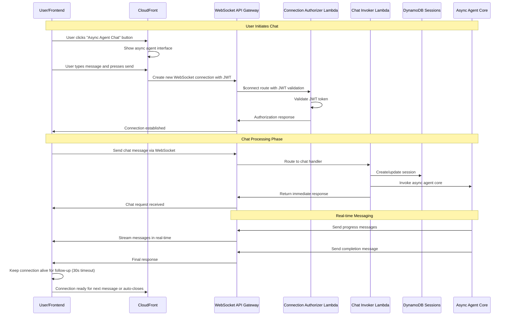
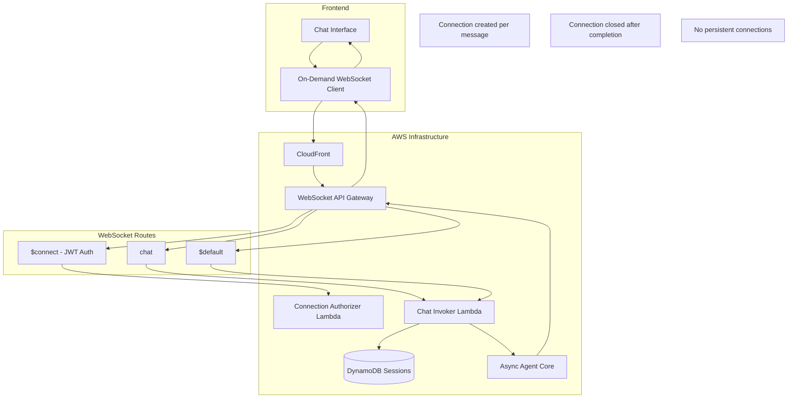

# Async Chat WebSocket Architecture Design

## Overview

This document outlines the design for implementing asynchronous chat processing using AWS API Gateway WebSocket APIs and real-time bidirectional communication. This approach eliminates API Gateway's 29-second timeout limitation while providing true real-time communication through WebSocket connections.

## Objectives

1. **Add Async Agent Support**: Introduce new WebSocket-based architecture for Bedrock Agent Core
2. **Preserve Existing Agents**: Keep current function URL-based Bedrock and Inline agents unchanged
3. **Unified API Gateway**: New async agent requests go through API Gateway WebSocket for consistent authentication
4. **Async Processing**: Long-running agent operations processed asynchronously with real-time messaging
5. **Real-time Experience**: Maintain real-time feel through WebSocket bidirectional communication
6. **Session Management**: Preserve existing DynamoDB session management and conversation history
7. **Scalability**: Design for high concurrency and message volume

## Architecture Overview

### High-Level Flow (On-Demand WebSocket)



### Component Architecture (On-Demand)



## WebSocket API Design

### Route Configuration

| Route Key | Purpose | Integration | Description |
|-----------|---------|-------------|-------------|
| `$connect` | Connection establishment | Connection Authorizer Lambda | JWT validation, connection setup |
| `chat` | Chat message processing | Chat Invoker Lambda | Process chat requests and invoke agent |
| `$default` | Fallback | Chat Invoker Lambda | Handle unknown message types |

**Note**: No `$disconnect` route needed since connections are closed immediately after completion.

### Route Selection Expression

```json
{
  "routeSelectionExpression": "$request.body.action"
}
```

### Message Format

#### Client to Server

```typescript
interface ChatMessage {
  action: 'chat';
  session_id?: string;
  message: string;
  model?: string;
  includeHistory?: boolean;
}

// JWT token passed in Authorization header during WebSocket connection
// Headers: { 'Authorization': 'Bearer <jwt_token>' }
```

#### Server to Client

```typescript
interface ServerMessage {
  type: 'start' | 'content' | 'trace' | 'complete' | 'error' | 'done';
  session_id: string;
  message_id?: string;
  content?: string;
  timestamp: string;
  sequence: number;
  metadata?: {
    model?: string;
    processing_time?: number;
  };
}
```

## Lambda Functions

### 1. Connection Authorizer Lambda

**Purpose**: JWT authentication for WebSocket connections

**Routes**: `$connect` (authorizer only)

**Responsibilities**:
- Validate JWT token from Authorization header using Cognito JWKS
- Return IAM policy for connection authorization
- Extract user_id from JWT for context
- Handle both authorizer and integration calls for $connect route

**Environment Variables**:
- `USER_POOL_CLIENT_ID`: Cognito User Pool Client ID for token validation
- `USER_POOL_ID`: Cognito User Pool ID for JWKS fetching

### 2. Chat Invoker Lambda

**Purpose**: Process chat messages and invoke async agent

**Routes**: `chat`, `$default`

**Responsibilities**:
- Validate chat message format
- Create or retrieve session from DynamoDB
- Invoke async agent core
- Send initial response via WebSocket
- Handle error cases (connection closed by frontend or timeout)

**Environment Variables**:
- `SESSION_TABLE_NAME`: DynamoDB sessions table
- `ASYNC_AGENT_ARN`: Bedrock Agent Core runtime ARN

### 3. Async Agent Core Integration

**Purpose**: Modified async agent to send messages via WebSocket

**Responsibilities**:
- Process chat requests asynchronously
- Send progress messages to WebSocket API
- Send completion messages (connection closed by frontend)
- Handle errors and timeouts

**WebSocket Integration**:
- Use AWS SDK to send messages via `@connections` API
- Send messages to specific connection_id
- Let frontend close connection on "done" message
- Handle connection errors gracefully

## Database Schema

**Note**: No connections table needed since connections are short-lived and closed immediately after completion.

### Sessions Table (Existing)

```typescript
interface Session {
  session_id: string;    // Primary key
  user_id: string;       // GSI
  created_at: string;
  expires_at: number;    // TTL
  model: string;
  messages: Message[];
}
```

## Frontend Implementation

### On-Demand WebSocket Client with Keep-Alive

Using `react-use-websocket` library with on-demand connections and configurable keep-alive:

```typescript
import useWebSocket, { ReadyState } from 'react-use-websocket';
import { useAuth } from '../auth/useAuth';

const useAsyncChat = () => {
  const { tokens } = useAuth();
  const [socketUrl, setSocketUrl] = useState<string | null>(null);
  const [isProcessing, setIsProcessing] = useState(false);
  const [canSendMessage, setCanSendMessage] = useState(false);
  const keepAliveTimeoutRef = useRef<NodeJS.Timeout | null>(null);
  
  const { sendJsonMessage, lastMessage, readyState, getWebSocket } = useWebSocket(
    socketUrl,
    {
      protocols: [],
      options: {
        headers: tokens?.accessToken ? {
          'Authorization': `Bearer ${tokens.accessToken}`
        } : {}
      },
      onOpen: () => {
        console.log('WebSocket connected for async chat');
        setCanSendMessage(true);
      },
      onMessage: (event) => {
        const message = JSON.parse(event.data);
        handleServerMessage(message);
        
        // Keep connection alive for follow-up messages
        if (message.type === 'done') {
          setIsProcessing(false);
          // Keep connection alive for 30 seconds
          keepAliveTimeoutRef.current = setTimeout(() => {
            getWebSocket()?.close();
            setSocketUrl(null);
            setCanSendMessage(false);
          }, 30000);
        }
      },
      onClose: () => {
        console.log('WebSocket connection closed');
        setSocketUrl(null);
        setIsProcessing(false);
        setCanSendMessage(false);
        if (keepAliveTimeoutRef.current) {
          clearTimeout(keepAliveTimeoutRef.current);
        }
      },
      shouldReconnect: () => false, // No reconnection for on-demand connections
    },
    !!socketUrl
  );

  const sendChatMessage = useCallback((message: string, sessionId?: string) => {
    if (isProcessing) {
      console.warn('Already processing a message');
      return;
    }

    setIsProcessing(true);
    
    // Clear any existing keep-alive timeout
    if (keepAliveTimeoutRef.current) {
      clearTimeout(keepAliveTimeoutRef.current);
      keepAliveTimeoutRef.current = null;
    }
    
    // If already connected, send message directly
    if (readyState === ReadyState.OPEN && canSendMessage) {
      sendJsonMessage({
        action: 'chat',
        message,
        session_id: sessionId,
        includeHistory: true
      });
      return;
    }
    
    // Create new WebSocket connection with JWT token in headers
    const wsUrl = `wss://${API_GATEWAY_URL}`;
    setSocketUrl(wsUrl);
  }, [sendJsonMessage, readyState, isProcessing, canSendMessage]);

  return {
    sendChatMessage,
    lastMessage,
    readyState,
    isProcessing,
    isConnected: readyState === ReadyState.OPEN,
    canSendMessage
  };
};
```

### Chat Interface Integration

```typescript
const AsyncChatInterface = () => {
  const { sendChatMessage, lastMessage, isConnected } = useAsyncChat();
  const [messages, setMessages] = useState<ServerMessage[]>([]);
  const [currentSession, setCurrentSession] = useState<string | null>(null);

  useEffect(() => {
    if (lastMessage) {
      const message = JSON.parse(lastMessage.data);
      setMessages(prev => [...prev, message]);
      
      if (message.type === 'done') {
        // Chat completed
        setCurrentSession(null);
      }
    }
  }, [lastMessage]);

  const handleSendMessage = (text: string) => {
    sendChatMessage(text, currentSession);
  };

  return (
    <div>
      <div className="connection-status">
        {isConnected ? '🟢 Connected' : '🔴 Disconnected'}
      </div>
      <MessageList messages={messages} />
      <MessageInput onSend={handleSendMessage} />
    </div>
  );
};
```

## Security Considerations

### Authentication

1. **JWT Validation**: Validate JWT tokens on WebSocket connection
2. **Connection Authorization**: Ensure users can only access their own connections
3. **Message Validation**: Validate all incoming messages for proper format
4. **Rate Limiting**: Implement rate limiting per connection

### Data Protection

1. **Message Encryption**: All WebSocket messages encrypted in transit
2. **Session Isolation**: Users can only access their own sessions
3. **Connection Cleanup**: Automatic cleanup of stale connections
4. **Audit Logging**: Log all WebSocket events for monitoring

## Monitoring and Observability

### CloudWatch Metrics

- **ConnectionCount**: Number of active WebSocket connections
- **MessageCount**: Number of messages sent/received
- **IntegrationError**: Errors from Lambda integrations
- **ClientError**: Client-side errors (4XX responses)

### Custom Metrics

- **ChatSessions**: Number of active chat sessions
- **AgentProcessingTime**: Time taken by async agent
- **ConnectionDuration**: Average connection lifetime
- **MessageLatency**: End-to-end message delivery time

### Logging

- **Connection Events**: Connect/disconnect with user context
- **Chat Messages**: All chat messages with session context
- **Agent Responses**: Async agent progress and completion
- **Error Events**: Detailed error logging with context

## Deployment Strategy

### CDK Infrastructure

1. **WebSocket API Gateway**: Create WebSocket API with routes
2. **Lambda Functions**: Deploy connection manager and chat invoker
3. **DynamoDB Tables**: Create connections table, update sessions table
4. **IAM Roles**: Proper permissions for WebSocket operations
5. **CloudWatch**: Log groups and custom metrics

### Environment Configuration

```typescript
interface WebSocketConfig {
  apiName: string;
  stage: string;
  routes: {
    connect: string;
    disconnect: string;
    chat: string;
    default: string;
  };
  lambda: {
    connectionManager: {
      timeout: Duration.seconds(30);
      memorySize: 256;
    };
    chatInvoker: {
      timeout: Duration.seconds(30);
      memorySize: 512;
    };
  };
  dynamodb: {
    connectionsTable: {
      ttl: Duration.days(1);
      gsi: ['user_id'];
    };
  };
}
```

## Migration Strategy

### Phase 1: Infrastructure Setup
1. Deploy WebSocket API Gateway
2. Create Lambda functions
3. Set up DynamoDB tables
4. Configure monitoring

### Phase 2: Agent Integration
1. Modify async agent to use WebSocket
2. Implement connection management
3. Add message routing logic
4. Test with simple messages

### Phase 3: Frontend Integration
1. Implement WebSocket client
2. Update chat interface
3. Add connection management
4. Implement error handling

### Phase 4: Production Rollout
1. Deploy to staging environment
2. Perform integration testing
3. Gradual rollout to production
4. Monitor and optimize

## Cost Optimization

### WebSocket API Costs
- **Connection Time**: $0.35 per million connection-minutes
- **Messages**: $1.00 per million messages
- **Data Transfer**: Standard AWS data transfer rates

### Lambda Costs
- **Connection Manager**: Minimal usage, small memory
- **Chat Invoker**: Moderate usage, standard memory
- **Async Agent**: Existing costs, no change

### DynamoDB Costs
- **Connections Table**: Minimal storage, TTL cleanup
- **Sessions Table**: Existing costs, no change

## Performance Considerations

### Connection Limits
- **API Gateway**: 10,000 concurrent connections per region
- **Lambda Concurrency**: Auto-scaling based on demand
- **DynamoDB**: On-demand scaling for connections table

### Message Throughput
- **WebSocket**: High throughput for real-time messaging
- **Lambda**: 1,000 concurrent executions per region
- **DynamoDB**: High throughput for session management

### Latency Optimization
- **WebSocket**: Low latency for real-time communication
- **Lambda**: Cold start mitigation with provisioned concurrency
- **DynamoDB**: Single-digit millisecond latency

## Error Handling

### Connection Errors
- **Authentication Failures**: Reject connection with error message
- **Rate Limiting**: Temporarily block connections
- **Service Unavailable**: Graceful degradation

### Message Errors
- **Invalid Format**: Return error message to client
- **Processing Failures**: Retry with exponential backoff
- **Agent Timeouts**: Send timeout message to client

### Recovery Strategies
- **Connection Drops**: Automatic reconnection with backoff
- **Message Loss**: Implement message acknowledgments
- **Service Outages**: Circuit breaker pattern

## Testing Strategy

### Unit Tests
- **Lambda Functions**: Test individual function logic
- **Message Parsing**: Validate message format handling
- **Error Scenarios**: Test error handling paths

### Integration Tests
- **WebSocket Connection**: Test connection lifecycle
- **Message Flow**: Test end-to-end message flow
- **Agent Integration**: Test async agent communication

### Load Tests
- **Connection Limits**: Test maximum concurrent connections
- **Message Throughput**: Test message processing capacity
- **Error Recovery**: Test system behavior under load

## Future Enhancements

### Advanced Features
- **Message Persistence**: Store messages for offline users
- **Presence Indicators**: Show user online/offline status
- **Message History**: Paginated message history
- **File Sharing**: Support for file attachments

### Scalability Improvements
- **Multi-Region**: Deploy across multiple AWS regions
- **Connection Pooling**: Optimize connection management
- **Message Queuing**: Add message queuing for reliability
- **Caching**: Implement Redis for session caching

### Monitoring Enhancements
- **Real-time Dashboards**: Live connection and message metrics
- **Alerting**: Proactive error detection and alerting
- **Analytics**: User behavior and usage analytics
- **Performance**: Detailed performance monitoring
