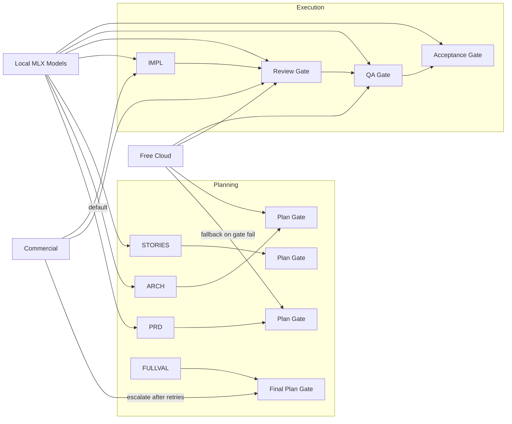
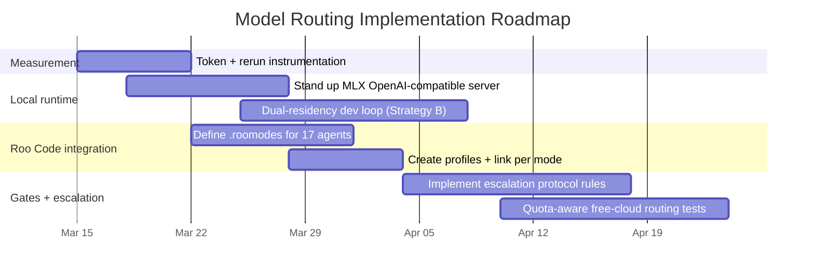

# Right-Fitting LLM Models for a 48GB Apple Silicon Multi-Agent SDLC

## Executive summary

The uploaded prompt defines a concrete engineering-and-research objective: redesign a 2-tier (“inherit/fast”) model assignment into a **tiered local + free-cloud + commercial escalation system** for a **17-subagent SDLC workflow** running **sequentially** on an **Apple Silicon Mac with 48GB unified memory**, and deliver (a) a complete per-agent assignment table, (b) a memory schedule, (c) a single recommended execution-loop strategy, (d) explicit escalation triggers integrating with existing gates, (e) a cost baseline vs optimized strategies, and (f) practical IDE configuration instructions. fileciteturn0file0

Deep-research findings strongly support a “dual residency + selective cloud” approach as the best fit for the constraints:

- **Local feasibility hinges on KV-cache growth**, not just weight size. For Qwen3-Coder-30B-A3B, **KV cache is ~3/6/12/24 GiB at 32K/64K/128K/262K**, which makes “native 262K” contexts unrealistic on a 48GB machine once you include weights + OS overhead. citeturn22view0turn17view1  
- **Hybrid / linear-attention MoE models** (e.g., Qwen3.5-122B-A10B) are structurally better for long contexts because the config indicates **full attention only every 4 layers**, which (in standard KV terms) reduces KV growth pressure relative to a fully-attentive transformer. citeturn20view0  
- **Roo Code can implement true per-agent multi-provider routing today** via (1) `.roomodes` project modes, and (2) **API Configuration Profiles linked per mode**, including OpenAI-compatible local endpoints and cloud providers. citeturn34view0turn34view1turn13view0  
- **Cursor can be integrated, but is operationally fragile** for a local multi-provider setup: (a) overriding OpenAI Base URL currently has global/HTTPS constraints and doesn’t support localhost/LAN directly, and (b) Cursor Agent mode has compatibility issues because it may send **Responses API–shaped payloads** rather than standard Chat Completions to some “OpenAI-compatible” endpoints. citeturn14search11turn14search1turn14search6turn14search0turn14search8turn14search13  

A practical “best overall” design for your workflow is:

- **Local primary**: Qwen3-Coder-30B-A3B for code generation; Qwen3-30B-A3B for most planning/doc writing; a smaller local verifier for fast checks. citeturn17view1turn17view0  
- **Free-cloud secondary**: use a small number of high-value free tiers for burst verification and/or long-context validation (with strict quota awareness). Examples: **Cloudflare Workers AI** (10,000 neurons/day) and **Groq free plan** (explicit RPM/TPM/TPD limits). citeturn5view0turn6view0  
- **Commercial tertiary**: Claude Sonnet/Opus for high-stakes failures and final validations; optionally GPT-4.1-mini class for cheap structured verification; Gemini 2.5 Pro for long-context checks when allowed by policy and quotas. citeturn31search1turn31search0turn31search9turn30view1turn32view1  

## Research objectives, scope, and assumptions

The file’s directives imply the following clarified research questions (paraphrased from the 11-step plan). fileciteturn0file0

The core research questions:

- Which **local** open(-weight) models can meet each SDLC agent tier’s requirements under **real** Apple Silicon constraints, including **KV-cache overhead** and MLX runtime behavior?
- Which **free cloud providers** can realistically cover a full SDLC session’s throughput needs, given explicit rate limits and daily quotas?
- What **commercial “escape hatches”** should be used per tier, and when should gate failures trigger escalation?
- Which **execution-loop strategy** minimizes total wall time and rework under a sequential orchestrator: sequential swapping, dual-residency, local+cloud hybrid, or MLX hot-swap?
- How do you **implement** per-agent model routing in practice in Roo Code and Cursor?

Assumptions I had to make (because the uploaded file is partially abbreviated/truncated in several tables and descriptions): fileciteturn0file0

- The Mac is “48GB unified memory” but the **exact SoC (M2/M3/M4)** is not specified; any tok/s figures are therefore treated as variable and best validated with your own microbenchmarks.
- Your “OS + IDE overhead ~8–10GB” is accepted as a working budget (matching the file). fileciteturn0file0  
- The workflow’s **dispatch counts** (~118–190) and context sizes are used as planning numbers; exact cost and quota fit depend on your real prompts, repo sizes, and artifact lengths.
- Your existing “gate validation system” is referenced but not defined in the file; escalation triggers are therefore expressed as **integration patterns** with explicit thresholds you can tune.

Missing information explicitly noted:

- Section 4’s “25-model inventory” and several tables appear **abbreviated with ellipses** in the uploaded document view; exact per-model memory and speed claims are not fully auditable from the file alone. fileciteturn0file0  
- The target “quality score” rubric (e.g., “90/100”) is not defined; I therefore recommend benchmark- and gate-pass-rate–based thresholds rather than relying on those numbers.

## Prioritized sources and search strategy

Because the request is (a) niche (Apple Silicon + MLX + agentic SDLC), and (b) time-sensitive (providers and quotas change), the search strategy prioritizes:

Primary/official sources (highest weight):

- **Model cards/configs** from Hugging Face (architecture parameters that drive KV/cache and feasibility), especially for Qwen MoE and Qwen3.5 hybrid models. citeturn17view0turn17view1turn22view0turn20view0  
- **Vendor pricing/quota docs**:  
  - Cloudflare Workers AI pricing + free allocation + per-model neuron↔token mapping. citeturn5view0turn5view1  
  - Groq official rate limit table for Free plan. citeturn6view0  
  - Google Gemini API pricing + tier mechanics (rate limits displayed in AI Studio; paid vs free semantics; 2.5 Pro and Flash pricing). citeturn32view0turn32view1turn8view0  
  - Anthropic model pricing and long-context rules for Sonnet/Opus/Haiku. citeturn31search1turn31search2turn31search0turn31search9turn23search8  
  - OpenAI model pages for GPT-4.1-mini/nano class pricing references, for cheap verification and structured outputs. citeturn30view0turn30view1turn30view2  
- **IDE/tooling docs**: Roo Code requirements (native tool calling only) and multi-profile routing; Cursor constraints and observed protocol mismatch issues. citeturn13view0turn34view1turn14search1turn14search11  

Secondary but still high-quality sources:

- **MLX serving** documentation (OpenAI-like server, but “not recommended for production”); and higher-level MLX servers (oMLX) that add multi-model serving, caching, and broader API compatibility. citeturn15search16turn16view0turn16view1  
- **Benchmark papers/blogs** for agentic coding performance (SWE-bench Verified; Qwen3-Coder-Next technical report and blog). citeturn11search4turn11search0turn11search7  

## Synthesis on local models, memory budgets, and tier fit

Your hardware constraint is dominated by two interacting facts:

- **Unified memory** is shared; there is no separate “VRAM pool,” so model + KV cache + runtime + IDE all compete in one space (your file’s 38–40GB available budget is a reasonable working envelope). fileciteturn0file0  
- **KV cache expands with context length** and can become the real limiter even when weights look “small enough.” The Qwen3-Coder model card explicitly warns that if you hit OOM, you should reduce context (e.g., to 32,768) for local use. citeturn17view1turn22view0  

### KV-cache pressure: concrete calculations that matter for 48GB

For a standard KV cache stored in 16-bit floats, a useful first-order estimate is:

- KV bytes per token ≈ 2 × layers × KV_heads × head_dim × 2 bytes

Using the published config for Qwen3-Coder-30B-A3B-Instruct (48 layers, 4 KV heads, head_dim 128): citeturn22view0  

- **32K context**: ~3 GiB KV  
- **64K context**: ~6 GiB KV  
- **128K context**: ~12 GiB KV  
- **262K context**: ~24 GiB KV  

This directly implies: even if the 4-bit weights are ~15–16GB, “native 262K context” is usually incompatible with keeping much else resident on a 48GB machine once you account for runtime overhead and safety headroom.

By contrast, Qwen3.5-122B-A10B’s config shows a **hybrid layer_types pattern** and **full_attention_interval=4**, implying only ~12 of 48 layers are full attention (and thus have “classic” per-token KV growth). citeturn20view0  
Under those assumptions, “classic KV” would be closer to:

- **32K**: ~0.75 GiB  
- **64K**: ~1.5 GiB  
- **128K**: ~3 GiB  
- **262K**: ~6 GiB  

This is the clearest architectural reason a large hybrid model can sometimes be *more* long-context practical than a smaller fully-attentive model—despite larger weights—if the quantized weight footprint fits.

### MoE “active parameters” do not eliminate weight residency

Several of your candidate models are MoE. The configs/model cards distinguish *total* vs *activated* parameters (e.g., Qwen3-30B-A3B has ~30.5B total, ~3.3B activated). citeturn17view0turn17view1  
In most inference runtimes, **the weights for all experts are still present**; “active parameters” reduces *compute per token*, but not necessarily memory footprint unless the runtime implements expert swapping/offloading. This point is widely emphasized in MoE explainers and practical inference discussions. citeturn1search2turn1search3turn1search4  

### Local tier recommendations from the most defensible evidence

Because the uploaded file’s 25-model inventory is not fully visible end-to-end, I limit “top picks” to models with auditable public cards/configs in the sources above, and treat others as candidates to benchmark locally. fileciteturn0file0  

- Tier 3 code generation (Implementer):  
  - **Qwen3-Coder-30B-A3B-Instruct** is the strongest “fits-in-48GB and is designed for agentic coding/tool calling” candidate with an openly published config and explicit tool-calling guidance. citeturn17view1turn22view0  
  - Qwen3-Coder-Next is a highly competitive coding model in benchmarks (SWE-bench Verified >70% in specific scaffolds), but whether a particular checkpoint/quantization is practical on 48GB depends on your actual weight format and serving stack; treat as “stretch goal.” citeturn11search4turn11search0  

- Tier 1–2 planning and architecture writing:  
  - **Qwen3-30B-A3B-Base/Instruct family** is a plausible local planning backbone because it has explicit published architecture parameters and a 32K context, which can be workable with summarization/RAG and disciplined prompt compaction. citeturn17view0turn18view0  
  - **Qwen3.5-122B-A10B** can be reserved for “deep planning / long-context synthesis” if—and only if—you validate stable residency under your OS overhead and your chosen quantization. Its hybrid config is specifically oriented toward long-context efficiency. citeturn20view0turn3search8  

- Tier 5 cross-plan validation (30–80K context):  
  - Local: Qwen3.5-122B-A10B is the most structurally plausible long-context local validator among the cited configs (still “tight” on 48GB). citeturn20view0  
  - Free-cloud: Gemini 2.5 Pro and Flash advertise free-tier token pricing and large contexts, though rate limits are tier-dependent and not fully enumerated in public docs; treat as quota-volatile and enforce fallbacks. citeturn32view1turn8view0  
  - Commercial: Claude Sonnet/Opus has explicit long-context rules and well-known strong performance on SWE-bench Verified class tasks. citeturn31search1turn31search2turn31search0  

## Recommended model assignment, execution strategy, escalation protocol, and cost model

### Comprehensive model assignment table for all 17 subagents

The table below is designed to be directly implementable in Roo Code (per-mode profile routing) and to align with your tiered escalation intent. fileciteturn0file0  

Conventions used:

- “Local” assumes MLX-native serving with tool calling (see IDE section).  
- “Free-cloud” is only assigned where there is at least one explicit free allocation or free-plan limit in official docs; otherwise it is labeled “quota-dependent” and you should treat it as “best-effort.” citeturn5view0turn6view0turn32view1  
- “Commercial” choices bias toward Claude tiers because Roo Code itself recommends Claude Sonnet for reliability, and Anthropic publishes clear tier rules and long-context pricing. citeturn13view2turn31search1turn31search2  

| Agent name | Agent slug | SDLC tier intent | Primary local model | Free-cloud fallback | Commercial escalation target | Context cap guidance | Memory budget guidance (48GB) | Execution mode |
|---|---|---|---|---|---|---|---|---|
| PRD Agent | sdlc-planner-prd | Tier 1 deep planning | Qwen3-30B-A3B (low-context disciplined) citeturn17view0turn18view0 | Gemini 2.5 Pro (free tier, quota-volatile) citeturn32view1turn8view0 | Claude Sonnet 4.5 citeturn31search2turn31search1 | Keep ≤32K local unless you swap to long-context model | ~16GB weights + ~3–6GB KV at 32–64K; keep ≥6GB headroom | Sequential |
| System Architecture Agent | sdlc-planner-architecture | Tier 1 deep planning | Qwen3-30B-A3B citeturn17view0 | Gemini 2.5 Pro (quota-volatile) citeturn32view1 | Claude Sonnet 4.5 (Opus if repeated failures) citeturn31search2turn31search0 | ≤32K local; rely on summaries/contracts | Same as above | Sequential |
| Story Decomposer | sdlc-planner-stories | Tier 1 deep planning | Qwen3-30B-A3B citeturn17view0 | Groq free (small/fast models; quota-limited) citeturn6view0 | Claude Sonnet 4.5 citeturn31search2 | Keep outputs chunked (stories/contracts) | Same as above | Sequential |
| HLD Agent | sdlc-planner-hld | Tier 2 domain planning | Qwen3-30B-A3B citeturn17view0 | Cloudflare Workers AI (10k neurons/day; pick lighter LLM SKU) citeturn5view0 | Claude Sonnet 4.5 citeturn31search1 | 16–32K usually sufficient per story | ~16GB + KV | Sequential |
| Security Agent | sdlc-planner-security | Tier 2 domain planning, high stakes | Qwen3-30B-A3B (local) citeturn17view0 | Avoid relying solely on free tiers for security-critical artifacts (quota + consistency risk) citeturn8view0turn6view0 | Claude Opus 4.5/4.6 for escalations citeturn31search0turn31search10 | Keep prompts narrow; validate against code and contracts | Same as above | Sequential |
| API Design Agent | sdlc-planner-api | Tier 2 domain planning | Qwen3-Coder-30B-A3B when tool-use/spec is heavy citeturn17view1 | Groq free for quick drafts (quota-limited) citeturn6view0 | Claude Sonnet 4.5 citeturn31search2 | Prefer ≤32K local to avoid KV blow-up citeturn17view1turn22view0 | If using Qwen3-Coder at 32K KV ≈3GiB; plan for it | Sequential |
| Data Architecture Agent | sdlc-planner-data | Tier 2 domain planning | Qwen3-30B-A3B citeturn17view0 | Cloudflare Workers AI for short validation checks citeturn5view0 | Claude Sonnet 4.5 citeturn31search1 | 16–32K | Same as above | Sequential |
| DevOps Agent | sdlc-planner-devops | Tier 2 domain planning | Qwen3-30B-A3B citeturn17view0 | Cloudflare Workers AI for small diffs/checklists citeturn5view0 | Claude Sonnet 4.5 citeturn31search1 | 16–32K | Same as above | Sequential |
| Design/UI-UX Agent | sdlc-planner-design | Tier 6 multimodal | Prefer cloud multimodal first if screenshots are large; Gemini Flash is explicitly priced with free tier tokens citeturn32view1 | Gemini 2.5 Flash (free tier tokens; quota-limited) citeturn32view1 | Claude Sonnet 4.5 (or GPT-4.1-class if you need structured UI checks) citeturn31search2turn30view0 | If local vision model is used, cap context hard; prefer “describe screenshot” compression | Reserve extra headroom for image tokens and runtime variance | Sequential |
| Testing Strategy Agent | sdlc-planner-testing | Tier 2 domain planning | Qwen3-30B-A3B citeturn17view0 | Cloudflare Workers AI for checklists citeturn5view0 | Claude Sonnet 4.5 citeturn31search1 | 16–32K | Same as above | Sequential |
| Plan Validator | sdlc-plan-validator | Tier 5 cross-plan validation | Option A: Qwen3.5-122B-A10B local only for “scheduled full validation” citeturn20view0 | Option B: Gemini 2.5 Pro (free tier tokens; quota-volatile) citeturn32view1turn8view0 | Claude Sonnet 4.5 as default escalation; Opus for “final gate” citeturn31search1turn31search0 | Run “light validations” at ≤32K; reserve 60–120K+ for final sweeps | If local Qwen3.5-122B: ~33GB weights plus KV; keep ≥3–5GB safety margin citeturn20view0 | Sequential |
| Implementer | sdlc-implementer | Tier 3 code generation | Qwen3-Coder-30B-A3B-Instruct citeturn17view1turn22view0 | Groq free for small patches only (quota-limited) citeturn6view0 | Claude Sonnet 4.5 for most escalations; Opus for repeated hard failures citeturn31search2turn31search0 | Default to 32K; treat larger contexts as “budgeted events” due KV growth citeturn17view1turn22view0 | Dual-residency strategy (recommended below) |
| Code Reviewer | sdlc-code-reviewer | Tier 4 fast verification | Local small verifier model under OpenAI-compatible tools (must support native tool calling) citeturn13view0 | Cloudflare Workers AI is explicit free allocation; pick a fast/cheap model SKU citeturn5view0 | Claude Haiku 4.5 (cheap, strong enough for structured pass/fail) citeturn31search9turn23search8 | Keep outputs structured and short | If dual-resident with coder, target ≤12GB weights for verifier | Dual-residency |
| QA Verifier | sdlc-qa | Tier 4 fast verification | Same local verifier as reviewer citeturn13view0 | Groq free can work within TPD/TPM if prompts are short citeturn6view0 | Claude Haiku 4.5 citeturn31search9 | Short evidence-based outputs | Same as above | Dual-residency |
| Acceptance Validator | sdlc-acceptance-validator | Tier 4 verification | Same local verifier as reviewer citeturn13view0 | Cloudflare Workers AI (checklists) citeturn5view0 | Claude Haiku 4.5 citeturn23search8 | Enforce checklist format | Same as above | Sequential |
| Project Research | sdlc-project-research | Tier 4 fast research summaries | Prefer free-cloud because it’s quota-shaped; keep outputs short | OpenRouter free-model router exists but is variable; use only for non-sensitive queries citeturn10view1turn10view0 | GPT-4.1 mini class for cheap summarization with structured outputs (if needed) citeturn30view1 | Keep prompts small; enforce citations | No local memory requirement if cloud-first | On-demand |
| Documentation Writer | sdlc-documentation-writer | Tier 2 writing/synthesis | Qwen3-30B-A3B citeturn17view0 | Cloudflare Workers AI for drafts (quota permitting) citeturn5view0 | Claude Sonnet 4.5 citeturn31search1 | 16–32K | Same as planning model | Sequential |

### Recommended execution strategy for the dev loop

From the four strategies defined in the file, the best match is:

**Strategy B: Dual-residency (keep Coder + small Reviewer loaded)** fileciteturn0file0  

Justification:

- Strategy A (swap every dispatch) adds repeated “cold-start” overhead and, on Apple Silicon, causes long tail latency especially when contexts are large (a known pain point addressed by SSD KV caching approaches like oMLX). citeturn16view0  
- Strategy C (Coder local, verification cloud) is attractive for cost, but **free tiers have hard daily/token caps** (Groq TPD; Cloudflare 10k neurons/day) and can break a 60–100-dispatch execution loop if not carefully budgeted. citeturn6view0turn5view0  
- Strategy D (hot-swap via memory mapping / KV-only swapping) is promising, but it’s not a guaranteed MLX feature end-to-end; it typically requires a specialized server architecture. Tools like oMLX explicitly implement “paged SSD KV caching” and multi-model serving to mitigate these issues, which is closer to D but is not “plain MLX.” citeturn16view0turn16view1turn15search16  

A “pure” Strategy B implementation typically looks like:

- Keep **Qwen3-Coder-30B-A3B** resident for Implementer. citeturn17view1turn22view0  
- Keep a **smaller verifier model** resident for Code Reviewer / QA / Acceptance Validator, constrained to short, structured outputs and strict tool usage (Roo Code requires native tool calling). citeturn13view0  
- Use cloud (free → paid → commercial) only when the verifier flags uncertainty or when gates fail (next section).

### Concrete escalation protocol aligned to planning and execution gates

The file requests explicit triggers with “retry counts” and target commercial models. fileciteturn0file0  

A practical protocol is to treat every gate as a classifier of “confidence” and “harm,” with a deterministic escalation ladder:

**Local → Free-cloud → Commercial (Sonnet) → Commercial (Opus)**

Planning-phase triggers:

- PRD gate: If PRD fails validation twice locally, rerun PRD once on a long-context cloud model (Gemini 2.5 Pro if quotas allow); if still failing, escalate to Claude Sonnet 4.5. citeturn32view1turn31search2  
- Architecture gate: If cross-references remain unresolved after one local retry, escalate directly to Claude Sonnet 4.5; if still inconsistent, escalate to Claude Opus 4.5/4.6 (higher cost, higher expected reasoning margin). citeturn31search1turn31search0turn31search10  
- Story-level gates: If Plan Validator flags >3 inconsistencies in a story’s HLD/API/Data alignment, rerun the minimum necessary subset locally (HLD/API/Data) once; if it fails again, escalate only that story’s domain agents to Sonnet. citeturn31search1  
- Full plan validation (30–80K tokens): Default to cloud long-context (Gemini 2.5 Pro) if you accept free-tier volatility and “used to improve products” semantics; otherwise, run on Claude Sonnet/Opus depending on how critical the release is. citeturn32view0turn32view1turn31search1turn23search8  

Execution-phase triggers:

- Implementer: If Code Reviewer rejects the same task twice, escalate that task to Claude Sonnet 4.5 (keeping the local coder as the default). If it still fails, escalate to Opus once, then stop and require human intervention. citeturn31search2turn31search0  
- Code review: If QA finds a “false pass” (reviewer missed a defect), rerun review on Claude Haiku 4.5 (cheap) and escalate to Sonnet only if Haiku cannot resolve. citeturn31search9turn31search2  

Complexity routing (needed to prevent quota blowups on free tiers): citeturn6view0turn5view0turn8view0  

- Simple: local only.  
- Moderate: local → free-cloud if local uncertainty flag set.  
- Complex: free-cloud first if quotas exist; else Sonnet first.  
- Critical (security + final validation): Sonnet/Opus first; do not burn time on free quotas.

### Token and cost savings model with baseline vs three strategies

The file asks you to “fill current per-token pricing as of March 2026.” The most defensible “commercial baseline” is Claude Sonnet 4.5 for “inherit” agents and Claude Haiku 4.5 for “fast” agents (pricing explicitly published). citeturn31search1turn31search2turn31search9turn23search8  

Because your real token usage varies by repo size and artifact verbosity, the table below expresses a **mid-scenario** consistent with the dispatch volumes in the file (≈118–190) and typical prompt sizes in your agent descriptions (1–80K input, 0.6–15K output). fileciteturn0file0  

Estimated **baseline spend per “5-story project”** (mid scenario): **≈ $13** using Sonnet for 13 “inherit” agents and Haiku for 4 “fast” agents. (Low/high sensitivity in practice is roughly **$6–$20** depending on output length and reruns.)

Comparative savings (mid scenario; excludes the engineering cost of running local inference):

| Scenario | What changes | Approx cost vs baseline | Key risk |
|---|---|---:|---|
| Current baseline | Commercial for most “inherit,” Haiku for “fast” | 1.00× | None (but highest recurring spend) |
| Strategy 1 conservative | Move Tier 4 verification to local/free; partial Tier 2 local | ~0.70× | Free-tier quotas may still bottleneck some verification bursts citeturn5view0turn6view0 |
| Strategy 2 aggressive | Tier 2+4 local/free; Tier 1+3 local-first with selective commercial reruns | ~0.20× | Local quality variability increases reruns; requires strong gates citeturn13view0 |
| Strategy 3 hybrid-optimal | Per-agent cheapest that clears thresholds; Plan validation mostly free-cloud with commercial fallback | ~0.10× | Free-tier volatility (rate limits can change and are not fully enumerated) citeturn8view0turn32view0 |

Why “free” is not automatically “viable” for full sessions:

- **Cloudflare Workers AI**: you get **10,000 neurons/day** free, and the docs provide explicit neuron↔token conversion tables per model (output tokens often “cost” more neurons than input). This is great for short verification bursts but can be exhausted by long outputs if you pick heavy models. citeturn5view0  
- **Groq Free**: rate limits are explicit (TPM/TPD); some models are capped at **100K TPD**, others up to **500K TPD**, which may or may not cover your “300K–1M tokens/session” working estimate depending on how much you push to Groq. citeturn6view0  
- **Gemini free tier**: pricing page claims free input/output tokens for some models, but rate limits are tier-dependent and can change; the rate-limit doc instructs users to view “active limits in AI Studio,” implying variability. citeturn32view0turn8view0turn32view1  

ChatGPT Pro calculus (as requested in the file): ChatGPT Pro is explicitly a $200/month plan with “scaled access” to top models inside ChatGPT, but it does **not** automatically translate to API metering for Roo Code/Cursor workflows. It can reduce cost only if you move substantive work *into ChatGPT UX* rather than API-driven agent dispatches. citeturn23search2turn23search6  

## Memory scheduling timeline and practical IDE integration

### Memory scheduling timeline with high-water marks

Below is a concrete schedule that matches the “sequential planning / tight execution loop” structure in your file, and highlights where memory gets tight. fileciteturn0file0  

Key memory anchors from cited configs:

- Qwen3-Coder-30B-A3B KV cache ≈ **3/6/12 GiB at 32K/64K/128K**; “reduce context to 32,768 if OOM” is explicitly recommended by the model card. citeturn22view0turn17view1  
- Qwen3.5-122B hybrid config suggests lower classic KV growth due to full-attention interval=4. citeturn20view0  

A practical schedule:

```
Planning Phase 1:
  Load Local Planner Model (Qwen3-30B-A3B ~16GB)
  Run PRD -> Light Validation (same model or small verifier)
  High-water: ~16GB weights + ~3GB KV (32K) + overhead  => ~19–22GB

Planning Phase 2:
  Keep same Planner Model resident
  Run Architecture -> Stories -> Light Validations
  High-water similar unless you push context >32K

Planning Phase 3 (per-story loop):
  Keep same Planner Model resident
  For API-heavy stories, optionally call local Qwen3-Coder for that agent only (swap or second model)
  If you swap: expect temporary high-water during transition; keep ≥6GB safety headroom

Planning Phase 4:
  Keep Planner Model resident (DevOps/Testing rollups)
  Light Validation

Planning Phase 5 (Full Validation):
  Option A (recommended for stability): Cloud long-context validator (Gemini/Claude) -> no local memory change
  Option B (local): swap to Qwen3.5-122B-A10B (~33GB) + KV (few GB) -> high-water ~36–39GB (tight)

Execution Phase (dev loop):
  Dual-residency:
    Keep Qwen3-Coder-30B-A3B (~16GB) resident
    Keep Small Verifier (~8–12GB) resident
  High-water: ~24–28GB weights + KV (coder ~3GB @32K) + verifier KV + overhead => ~30–35GB
```

### Visual timeline and relationships diagram

A minimal mermaid view of the routing relationships (local → free-cloud → commercial) and where gates sit:



A mermaid Gantt roadmap (see next section) is also provided below.

### IDE integration that works in practice

Roo Code (recommended “control plane”)

Roo Code is currently the most straightforward way to implement your required three-tier routing because:

- It supports project modes via `.roomodes` and shows explicit YAML/JSON structure examples. citeturn34view0  
- It supports multiple **API Configuration Profiles**, and explicitly notes that each profile can have different providers/models and that profiles can be linked to modes. citeturn34view1  
- It requires **native tool calling exclusively**—so your local server + model must support OpenAI-compatible tools/function calling. citeturn13view0  

A practical Roo Code setup pattern:

1) Create three API profiles:

- “Local-MLX” → OpenAI Compatible → Base URL = your local server  
- “Free-Cloud” → provider of choice (Cloudflare / Groq / OpenRouter as available)  
- “Commercial” → Anthropic (Claude) or OpenAI, depending on your preference

Roo Code explicitly documents OpenAI-compatible configuration fields (Base URL, API key, Model ID, context window). citeturn13view0  

2) Create/override modes for your 17 agents in `.roomodes` (one per slug). Roo Code’s docs show `.roomodes` can be YAML or JSON and demonstrate fileRegex-based tool restrictions. citeturn34view0  

3) Link modes to profiles (per-mode provider routing). Roo Code’s profile system explicitly supports associating a configuration profile with each mode. citeturn34view1  

Local serving layer options (for Roo Code)

If you need MLX-native serving with OpenAI-compatible endpoints:

- `mlx_lm.server` provides an HTTP API “similar to the OpenAI chat API,” but is explicitly “not recommended for production” (fine for a single-developer workstation). citeturn15search16  
- oMLX advertises multi-model serving, SSD KV caching, and “OpenAI + Anthropic drop-in,” plus it has release notes indicating broader compatibility work (including `/v1/responses` support, relevant for Cursor). citeturn16view0turn16view1  

Cursor (treat as “best-effort,” not your routing backbone)

Cursor’s routing limitations matter directly for your plan:

- Cursor currently requires a **public HTTPS endpoint** for overridden base URLs and does not directly support localhost/LAN in the standard configuration path. citeturn14search11turn12search4  
- Multiple Cursor forum threads document that in Agent mode Cursor may send **Responses API** formatted payloads; proxies that only implement `/v1/chat/completions` can fail. citeturn14search1turn14search6turn14search0turn14search13  
- The override may apply broadly and can interfere with switching between built-in and custom models. citeturn14search8  

Pragmatic recommendation:

- Use Roo Code to run the 17-agent SDLC workflow with per-mode routing.  
- Use Cursor primarily for interactive editing and its native agent features, but avoid depending on Cursor for the entire multi-provider orchestration unless you standardize on a server that supports the endpoints/protocols Cursor actually sends (including Responses API) and can be exposed over HTTPS. citeturn14search1turn14search11turn14search13  

## Recommended next steps, timelines, and deliverables

### Prioritized implementation roadmap

This roadmap is ordered for maximum savings with minimum workflow risk, consistent with the file’s requested deliverables. fileciteturn0file0  

Immediate (days)

- Instrument your current workflow to capture: per-agent input/output tokens, gate failure rates, and rerun counts. This is essential because your cost and free-tier feasibility depend more on *real token volumes* than on dispatch counts alone. citeturn8view0turn32view0  
- Stand up a local OpenAI-compatible MLX server (start with `mlx_lm.server` for development, or oMLX if you want multi-model serving + caching). citeturn15search16turn16view0  

Short term (weeks)

- Implement Strategy B dual-residency locally:  
  - Qwen3-Coder-30B-A3B as coder  
  - Small local verifier model for review/QA/acceptance  
  - Enforce tight context ceilings (default 32K for coder) to prevent KV cache blowups. citeturn22view0turn17view1  
- Configure Roo Code profiles and link them to per-agent modes (local vs free-cloud vs commercial) using `.roomodes` + API Configuration Profiles. citeturn34view0turn34view1turn13view0  

Medium term (month)

- Add the escalation protocol as code (or deterministic rules) in your orchestrator: escalation is triggered by gate failures + retry counts, with explicit model targets (Haiku/Sonnet/Opus; Gemini where acceptable). citeturn31search1turn31search0turn32view1  
- Validate free-tier fit against your real throughput using only providers with explicit limits in docs: Cloudflare neurons/day, Groq TPM/TPD. Keep cloud routing “quota-aware” to avoid mid-session failures. citeturn5view0turn6view0  

### Roadmap visual



### Deliverables checklist mapped to the file’s requirements

- Completed model assignment table for all 17 agents: included above. fileciteturn0file0  
- Memory scheduling timeline with GB figures: included above with KV cache concrete numbers. citeturn22view0turn20view0  
- Single recommended execution strategy: Strategy B with justification. fileciteturn0file0  
- Escalation protocol with triggers and model targets: included above. fileciteturn0file0  
- Cost comparison baseline vs strategies: included with a sensitivity-bounded approach. citeturn31search1turn31search9turn32view1turn6view0turn5view0  
- Practical IDE configuration instructions: Roo Code-first, Cursor best-effort with documented limitations. citeturn34view0turn34view1turn14search1turn14search11turn13view0  

